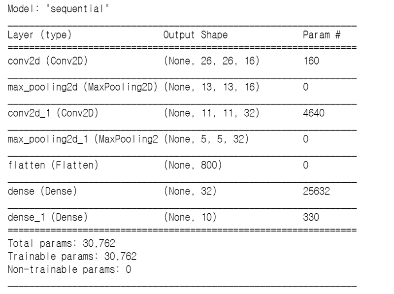
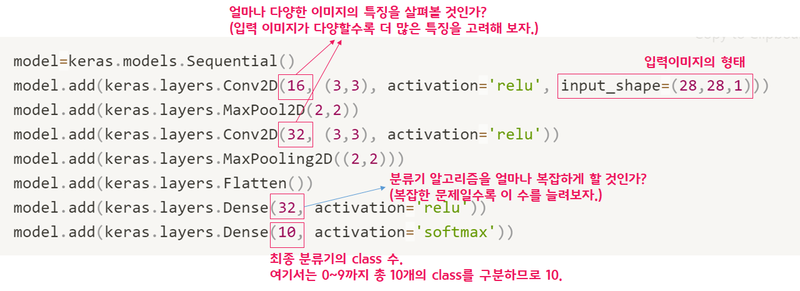

# Exploration 1. 인공지능과 가위바위보 하기

# 1-1 . 인공지능과 가위바위보 하기

사전 순서 

<aside>
💡 데이터 준비 → 딥러닝 네트워크 설계 → 학습 → 테스트(평가)

</aside>

# 1-2. 데이터를 준비하자!

mnist data

```python
import tensorflow as tf
from tensorflow import keras

import numpy as np
import matplotlib.pyplot as plt
import os

print(tf.__version__)   # Tensorflow의 버전을 출력

mnist = keras.datasets.mnist

# MNIST 데이터를 로드. 다운로드하지 않았다면 다운로드까지 자동으로 진행됩니다. 
(x_train, y_train), (x_test, y_test) = mnist.load_data()   

```

<aside>
💡 MINST data?
크기 → 28x28크기의 train 데이터 60000장,  test 10000장
구성 → x_train : 이미지

            y_train : x_train에 대한 정답

      x_test : test 이미지

y_test : x_test에 대한 정답 

</aside>

### validation set

<aside>
💡 validation set이란?
이미 학습된 set이며 머신러닝 학습 과정이 정상적으로 진행되고 있는지, 오버피팅이 발생하고 있지 않은지. 학습을 중단해도 되는지 등을 확인하고 싶을 때 사용

</aside>

### 데이터 전처리 하기

정규화 하기

```python
x_train_norm, x_test_norm = x_train / 255.0, x_test / 255.0
```

# 1-3. 딥러닝 네트워크 설계하기

텐서플로우 케라스의 Sequential API 활용

```python
model=keras.models.Sequential()
model.add(keras.layers.Conv2D(16, (3,3), activation='relu', input_shape=(28,28,1)))
model.add(keras.layers.MaxPool2D(2,2))
model.add(keras.layers.Conv2D(32, (3,3), activation='relu'))
model.add(keras.layers.MaxPooling2D((2,2)))
model.add(keras.layers.Flatten())
model.add(keras.layers.Dense(32, activation='relu'))
model.add(keras.layers.Dense(10, activation='softmax'))

print('Model에 추가된 Layer 개수: ', len(model.layers))
# >>> Model에 추가된 Layer 개수: 7 

model.summary() # 모델 확인
```





# 1-4.딥러닝 네트워크 학습시키기

### reshape

```python
print("Before Reshape - x_train_norm shape: {}".format(x_train_norm.shape))
print("Before Reshape - x_test_norm shape: {}".format(x_test_norm.shape))

# 데이터갯수에 -1을 쓰면 reshape시 자동계산됩니다.
x_train_reshaped=x_train_norm.reshape( -1, 28, 28, 1)  
x_test_reshaped=x_test_norm.reshape( -1, 28, 28, 1)

print("After Reshape - x_train_reshaped shape: {}".format(x_train_reshaped.shape))
print("After Reshape - x_test_reshaped shape: {}".format(x_test_reshaped.shape))

# >>>
# Before Reshape - x_train_norm shape: (60000, 28, 28)
# Before Reshape - x_test_norm shape: (10000, 28, 28)
# After Reshape - x_train_reshaped shape: (60000, 28, 28, 1)
# After Reshape - x_test_reshaped shape: (10000, 28, 28, 1)
```

### 학습 시키기

```python
model.compile(optimizer='adam',
             loss='sparse_categorical_crossentropy',
             metrics=['accuracy'])

model.fit(x_train_reshaped, y_train, epochs=10)
```

# 1-5. 얼마나 잘 만들렀는지 확인하기

### 성능 테스트 하기

```python
test_loss, test_accuracy = model.evaluate(x_test_reshaped,y_test, verbose=2)
print("test_loss: {} ".format(test_loss))
print("test_accuracy: {}".format(test_accuracy))
```

### 잘 못 된 데이터 확인

```python
predicted_result = model.predict(x_test_reshaped)  # model이 추론한 확률값. 
predicted_labels = np.argmax(predicted_result, axis=1)

idx=0  #1번째 x_test를 살펴보자. 
print('model.predict() 결과 : ', predicted_result[idx])
print('model이 추론한 가장 가능성이 높은 결과 : ', predicted_labels[idx])
print('실제 데이터의 라벨 : ', y_test[idx])
```

```python
import random
wrong_predict_list=[]
for i, _ in enumerate(predicted_labels):
    # i번째 test_labels과 y_test이 다른 경우만 모아 봅시다. 
    if predicted_labels[i] != y_test[i]:
        wrong_predict_list.append(i)

# wrong_predict_list 에서 랜덤하게 5개만 뽑아봅시다.
samples = random.choices(population=wrong_predict_list, k=5)

for n in samples:
    print("예측확률분포: " + str(predicted_result[n]))
    print("라벨: " + str(y_test[n]) + ", 예측결과: " + str(predicted_labels[n]))
    plt.imshow(x_test[n], cmap=plt.cm.binary)
    plt.show()
```

# 1-6. 더 좋은 네트워크 만들어 보기

### 하이퍼파라미터들을 변화시켜 성능 확인

```python
# 바꿔 볼 수 있는 하이퍼파라미터들
n_channel_1=16
n_channel_2=64
n_dense=64
n_train_epoch=10

model=keras.models.Sequential()
model.add(keras.layers.Conv2D(n_channel_1, (3,3), activation='relu', input_shape=(28,28,1)))
model.add(keras.layers.MaxPool2D(2,2))
model.add(keras.layers.Conv2D(n_channel_2, (3,3), activation='relu'))
model.add(keras.layers.MaxPooling2D((2,2)))
model.add(keras.layers.Flatten())
model.add(keras.layers.Dense(n_dense, activation='relu'))
model.add(keras.layers.Dense(10, activation='softmax'))

model.summary()
model.compile(optimizer='adam',
             loss='sparse_categorical_crossentropy',
             metrics=['accuracy'])

# 모델 훈련
model.fit(x_train_reshaped, y_train, epochs=n_train_epoch)

# 모델 시험
test_loss, test_accuracy = model.evaluate(x_test_reshaped, y_test, verbose=2)
print("test_loss: {} ".format(test_loss))
print("test_accuracy: {}".format(test_accuracy))
```