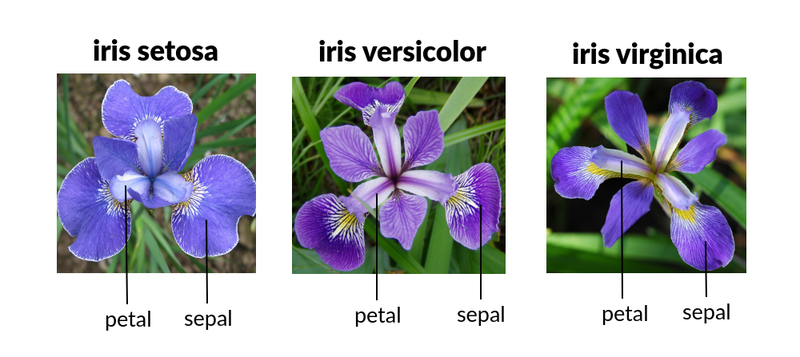

# Exploration 2 Iris의 세 가지 품종, 분류해볼 수 있겠어요?

# 1. Iris의 세 가지 품종, 분류해 볼까요?

### 붓꽃 분류 문제



# 2. 데이터 다루기

## 0. Iris plants 데이터 셋 확인


> 목표 → 꽃잎, 꽃받침의 길이와 폭 정보를 입력했을 때 붓꽃의 품종을 출력
> 

## 1. 데이터 준비

```python
from sklearn.datasets import load_iris

iris = load_iris()

print(dir(iris)) # dir()는 객체가 어떤 변수와 메서드를 가지고 있는지 나열함
#>>> ['DESCR', 'data', 'data_module', 'feature_names', 'filename', 'frame', 'target', 'target_names']

iris.key() # iris에 담긴 정보 확인 
#>>> dict_keys(['data', 'target', 'frame', 'target_names', 'DESCR', 'feature_names', 'filename', 'data_module'])

iris_data = iris.data # iris객체를 변수에 저장 후 크기정보 출력
print(iris_data.shape) 
#>>> (150, 4)

iris_data[0] # 샘플데이터 확인 
#>>> array([5.1, 3.5, 1.4, 0.2]) 왼쪽부터(sepal length, sepal width, petal length, petal width) 
```

```python
iris_label = iris.target # target(label) 확인 (머신러닝이 출력해야 하는 정답)
iris.target_names # label 이름 확인
print(iris.DESCR) # iris의 나머지 변수들 확인
```

### pandas로 데이터 다루기

```python
# 데이터프레임에 iris데이터 넣고 컬럼에는 frature_names(sepal length, sepal width, petal length, petal width)넣기
iris_df = pd.DataFrame(data=iris_data, columns=iris.feature_names)
# 정답 라벨 컬럼 추가
iris_df["label"] = iris.target
```

> 문제지 : 머신러닝 모델에게 입력되는 데이터 (feature)
정답지 : 머신러닝 모델이 맞혀야 하는 데이터 (label, target)
> 

### training dataset, test dataset 준비

사이킷 런의 train_test_split()을 이용해 150개의 데이터셋을 train 120, test 30으로 나누기

```python
from sklearn.model_selection import train_test_split

X_train, X_test, y_train, y_test = train_test_split(iris_data, 
                                                    iris_label, 
                                                    test_size=0.2, 
                                                    random_state=7)

print('X_train 개수: ', len(X_train),', X_test 개수: ', len(X_test))
'''
>>> X_train 개수:  120 , X_test 개수:  30
'''
```

train. test set 확인

```python
X_train.shape, y_train.shape
X_test.shape, y_test.shape

y_train, y_test
```

> 머신러닝은 크게 **지도학습, 비지도 학습**으로 나눠진다. 
지도학습은 **정답이 있는 문제**에 대해 학습하는 것, 비지도 학습은 **정답이 없는 문제**를 학습하는 것
> 

> 지도학습은 **분류, 회귀**로 나눠진다.
**분류는 특정 카테고리 중 하나로 분류하는 문제**이고, **회귀는 입력받은 데이터에 따라 특정 필드의 수치를 맞히는 문제**이다.
> 

## 2. 데이터 학습 시키기

> Decision Tree model 
Decision Tree는 직관적이면서도 간단하게 사용할 수 있어 분류 문제를 풀 때 가장 기본적으로 쓰이는 모델

단점 → **결정경계가 데이터 축에 수직이어서 특정 데이터에만 잘 작동할 수 있다는 문제가 있다. 이를 극복하기 위해 제안된 모델이 Random Forest이며, 여러 개의 Decision Tree를 합쳐서 만들어놓은 개념이다.**
> 

```python
# 사이킷 런의 DecisionTreeClassifier이라는 모델 불러와 변수에 저장하기
from sklearn.tree import DecisionTreeClassifier

decision_tree = DecisionTreeClassifier(random_state=32) 
```

### 모델 학습

```python
decision_tree.fit(X_train, y_train)
```

<aside>
💡 새로운 데이터에 대해서도 잘 맞추기 위해서는 training set이 어떻게 구성되어 있는지가 매우 중요
**더 일반화된 데이터로 학습**이 될수록 새로운 데이터에 대해서도 잘 맞출 수 있다.

</aside>

## 3. 모델 평가하기

```python
y_pred = decision_tree.predict(X_test) # test셋을 입력으로 넣어 예측 후 변수의 저장
```

정확도 계산

```python
from sklearn.metrics import accuracy_score

accuracy = accuracy_score(y_test, y_pred)
"""
>>> 0.9
"""
```

## 4. 정리

```python
# (1) 필요한 모듈 import
from sklearn.datasets import load_iris
from sklearn.model_selection import train_test_split
from sklearn.tree import DecisionTreeClassifier
from sklearn.metrics import classification_report

# (2) 데이터 준비
iris = load_iris()
iris_data = iris.data
iris_label = iris.target

# (3) train, test 데이터 분리
X_train, X_test, y_train, y_test = train_test_split(iris_data, 
                                                    iris_label, 
                                                    test_size=0.2, 
                                                    random_state=7)

# (4) 모델 학습 및 예측
decision_tree = DecisionTreeClassifier(random_state=32)
decision_tree.fit(X_train, y_train)
y_pred = decision_tree.predict(X_test)

print(classification_report(y_test, y_pred))
"""
>>>
							precision    recall  f1-score   support

           0       1.00      1.00      1.00         7
           1       0.91      0.83      0.87        12
           2       0.83      0.91      0.87        11

    accuracy                           0.90        30
   macro avg       0.91      0.91      0.91        30
weighted avg       0.90      0.90      0.90        30
"""
```

# 3. 다른 모델들로 학습하기

## 1. Random Forest Model 학습

> **Random Forest Model** 
Random Foreat 모델은 Decision Tree 모델을 여러 개 합쳐놓아 Decision Tree의 단점을 극복한 모델이다. 이러한 기법을 **앙상블 기법(단일 모델을 여러 개 사용하는 방법)**이라고 한다.

Random Forest는 각각의 의사 결정 트리를 만드는데 있어 쓰이는 요소들을 무작위적으로 선정
> 

```python
from sklearn.ensemble import RandomForestClassifier

X_train, X_test, y_train, y_test = train_test_split(iris_data, 
                                                    iris_label, 
                                                    test_size=0.2, 
                                                    random_state=21)

random_forest = RandomForestClassifier(random_state=32)
random_forest.fit(X_train, y_train)
y_pred = random_forest.predict(X_test)

print(classification_report(y_test, y_pred))
"""
>>>
							precision    recall  f1-score   support

           0       1.00      1.00      1.00        11
           1       1.00      0.83      0.91        12
           2       0.78      1.00      0.88         7

    accuracy                           0.93        30
   macro avg       0.93      0.94      0.93        30
weighted avg       0.95      0.93      0.93        30
"""
```

## 2. Support Vector Machine (SVM)

> Support Vector Machine (SVM)
SVM은 Support Vector와 Hyperplane(초평면)을 이용해 분류를 수핼하게 되는 대표적인 선형분류 모델
> 
> 
> **Decision Boundary(결정 경계): 두 개의 클래스를 구분해 주는 선**
> 
> **Support Vector: Decision Boundary에 가까이 있는 데이터**
> 
> **Margin: Decision Boundary와 Support Vector 사이의 거리**
> 


```python
from sklearn import svm
svm_model = svm.SVC()

svm_model.fit(X_train, y_train)
y_pred = svm_model.predict(X_test)

print(classification_report(y_test, y_pred))
"""
>>>
							precision    recall  f1-score   support

           0       1.00      1.00      1.00        11
           1       0.91      0.83      0.87        12
           2       0.75      0.86      0.80         7

    accuracy                           0.90        30
   macro avg       0.89      0.90      0.89        30
weighted avg       0.91      0.90      0.90        30
"""

```

## 3. Stochastic Gradient Descent Classifier (SGDClassifier)

> Stochastic Gradient Descent Classifier (SGDClassifier)
SGD는 배치 크기가 1인 경사하강법 알고리즘이다. 
확률적 경사하강법은 데이터 세트에서 무작위로 균일하게 선태한 하나의 례흫 의존하여 각 단계의 예측 경사를 계산합니다.

단점 → **반복이 충분하면 SGD가 효과는 있지만 노이즈가 매우 심하다. 확률적 경사하강법의 여러 변형 함수의 최저점에 가까운 점을 찾을 가능성이 높지만 항상 보장되지는 않는다. (최저점을 찾지 못할 수 있음)
단점 극복 →미니 배치 확률적 경사하강법(미니 배치 SGD)사용**
> 


```python
from sklearn.linear_model import SGDClassifier
sgd_model = SGDClassifier()

sgd_model.fit(X_train, y_train)
y_pred = sgd_model.predict(X_test)

print(classification_report(y_test, y_pred))
"""
>>>
							precision    recall  f1-score   support

           0       1.00      1.00      1.00        11
           1       1.00      0.83      0.91        12
           2       0.78      1.00      0.88         7

    accuracy                           0.93        30
   macro avg       0.93      0.94      0.93        30
weighted avg       0.95      0.93      0.93        30
"""
```

## 4. **Logistic Regression**

> **Logistic Regression
Logistic Regression은 가장 널리 알려진 선형 분류 알고리즘이다.
소프트맥스 함수를 사용한 다중 클래스 분류 알고리즘이다. 
이름은 회귀지만 실제로는 분류를 수행**
> 


```python
from sklearn.linear_model import LogisticRegression
logistic_model = LogisticRegression()

logistic_model.fit(X_train, y_train)
y_pred = logistic_model.predict(X_test)

print(classification_report(y_test, y_pred))
"""
>>>
							precision    recall  f1-score   support

           0       1.00      1.00      1.00        11
           1       1.00      0.83      0.91        12
           2       0.78      1.00      0.88         7

    accuracy                           0.93        30
   macro avg       0.93      0.94      0.93        30
weighted avg       0.95      0.93      0.93        30
"""
```

# 4. 불균형한 데이테의 정확도

### 손글씨 데이터를 불러와 학습실행

기존 라벨을 다 찾는것이 아니라 3만 맞히는 라벨 작성

```python
# 코드를 입력하세요
from sklearn.metrics import accuracy_score
from sklearn.model_selection import train_test_split
from sklearn.tree import DecisionTreeClassifier

X_train, X_test, y_train, y_test = train_test_split(digits_data,
                                                    new_label,
                                                    test_size=0.2,
                                                    random_state=15)

decision_tree = DecisionTreeClassifier(random_state=15)
decision_tree.fit(X_train, y_train)
y_pred = decision_tree.predict(X_test)

accuracy = accuracy_score(y_test, y_pred)
accuracy
"""
>>> 0.9388888888888889
"""
```

모두 0인 라벨을 넣어서 정확도 측정

```python
fake_pred = [0] * len(y_pred)

accuracy = accuracy_score(y_test, fake_pred)
accuracy
"""
>>> 0.925
"""
```

<aside>
💡 불균형 데이터를 다룰 때 정확도는 정답의 분포에 따라 모델의 서을을 잘 평가하지 못하는 척도가될 수 있다.

</aside>

### 오차 행렬

<aside>
💡 오차행렬이란?
→ 정답과 오답을 구분하여표현하는 방법

</aside>

