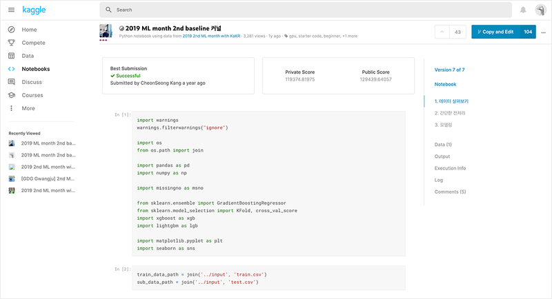

# Exploration 5 나의 첫 번째 캐글 경진대회, 무작정 따라해보기

# 1. Baseline 세팅하기

Baseline은 기본적으로 문제 해결을 시작할 때 쉽게 사용해볼 수 있는 샘플이다.

보통 대회에서 Baseline은 제공이 되는 경우도, 아닌 경우도 있는데 이번 대회는 특히 교육적인 성격도 있어서 제공이 되었다.



다음과 같은 페이지에서 ipynb파일을 다운 받아 로컬에 저장하자.

```python
# 데이터 시각화를 위한 import
import matplotlib.pyplot as plt
%matplotlib inline
%config InlineBackend.figure_format = 'retina'
```

# 2. 라이브러리, 데이터 가져오기

```python
# 필요한 라이브러리 import
import warnings
warnings.filterwarnings("ignore")

import os
from os.path import join

import pandas as pd
import numpy as np

import missingno as msno

from sklearn.ensemble import GradientBoostingRegressor
from sklearn.model_selection import KFold, cross_val_score
import xgboost as xgb
import lightgbm as lgb

import matplotlib.pyplot as plt
import seaborn as sns
```

# 3. 데이터 이해하기

### 데이터 살펴보기


### 데이터 불러오기

```python
data = pd.read_csv(train_data_path)
sub = pd.read_csv(sub_data_path)
print('train data dim : {}'.format(data.shape))
print('sub data dim : {}'.format(sub.shape))
'''
train data dim : (15035, 21)
sub data dim : (6468, 20)
'''
```

### 학습 데이터에서 라벨 제거하기

```python
y = data['price']
del data['price']

print(data.columns)
```

### 학습 데이터와 테스트 데이터 합치기

```python
train_len = len(data)
data = pd.concat((data, sub), axis=0)

print(len(data))
```

### 간단한 전처리

**결측치**와 **전체 데이터의 분포 확인**

```python
msno.matrix(data) # 데이터의 결측 상태를 시각화를 통래 살펴볼 수 있다.
```


만약 각각의 col에 결측치가 존재한다면 해당 부분이 하얗게 나온다.

직접 결측치의 개수 출력하기

```python
# 1. id 컬럼이 결측치인지 확인합니다.
null_check = pd.isnull(data['id'])
print(null_check)

# 2. 결측치인 데이터만 뽑아냅니다.
null_data = data.loc[null_check, 'id']
null_data.head()

# 3. 결측치인 데이터의 개수를 셉니다.
print('{}: {}'.format('id', len(null_data.values)))

# 한 번에 작성 
print('{} : {}'.format('id', len(data.loc[pd.isnull(data['id']), 'id'].values)))

# 'id'컬럼 말고 전체에 적용
for c in data.columns:
    print('{} : {}'.format(c, len(data.loc[pd.isnull(data[c]), c].values)))

'''
id : 0
date : 0
bedrooms : 0
bathrooms : 0
sqft_living : 0
sqft_lot : 0
floors : 0
waterfront : 0
view : 0
condition : 0
grade : 0
sqft_above : 0
sqft_basement : 0
yr_built : 0
yr_renovated : 0
zipcode : 0
lat : 0
long : 0
sqft_living15 : 0
sqft_lot15 : 0
'''
```

id, date 변수 정리

```python
# 필요없는 id컬럼 제거
sub_id = data['id'][train_len:]
del data['id']

print(data.columns)

# 필요한 부분만 잘라내기
data['date'] = data['date'].apply(lambda x : str(x[:6]))

data.head()
```

각 변수들의 분포 확인 

너무 치우친 분호를 가지는 컬럼ㅇ의 경우 모델이 결과를 예측하는 데에 좋지 않은 영향을 미친다.

```python
# 분포확인
fig, ax = plt.subplots(9, 2, figsize=(12, 50))   # 가로스크롤 때문에 그래프 확인이 불편하다면 figsize의 x값을 조절해 보세요. 

# id 변수(count==0인 경우)는 제외하고 분포를 확인합니다.
count = 1
columns = data.columns
for row in range(9):
    for col in range(2):
        sns.kdeplot(data=data[columns[count]], ax=ax[row][col])
        ax[row][col].set_title(columns[count], fontsize=15)
        count += 1
        if count == 19 :
            break
```


`bedrooms`, `sqft_living`, `sqft_lot`, `sqft_above`, `sqft_basement`, `sqft_living15`, `sqft_lot15` 변수가 한쪽으로 치우친 경향을 보인다.

```python
# 로그 변환을 통해 치우침 줄이기
skew_columns = ['bedrooms', 'sqft_living', 'sqft_lot', 'sqft_above', 'sqft_basement', 'sqft_lot15', 'sqft_living15']

for c in skew_columns:
    data[c] = np.log1p(data[c].values)

# 확인
fig, ax = plt.subplots(4, 2, figsize=(12, 24))

count = 0
for row in range(4):
    for col in range(2):
        if count == 7:
            break
        sns.kdeplot(data=data[skew_columns[count]], ax=ax[row][col])
        ax[row][col].set_title(skew_columns[count], fontsize=15)
        count += 1
```


```python
# label 로그변환
y_log_transformation = np.log1p(y)

sns.kdeplot(y_log_transformation)
plt.show()
```


```python
# 전처리한 데이터를 다시 train, test 나누기
sub = data.iloc[train_len:, :]
x = data.iloc[:train_len, :]

print(x.shape)
print(sub.shape)
```

# 4. 모델 설계

### 모델링

Baseline 커널에서는 여러 가지 모델을 함께 사용해서 결과를 섞는, **블랜딩(blending)**이라는 기법을 활용한다.

블랜딩 기법은 **앙상블 기법**이라고도 불린다.

> **앙상블(Ensemble)** 학습은 여러 개의 학습 알고리즘을 사용하고, 그 예측을 결합함으로써 보다 정확한 최종 예측을 도출하는 기법입니다. ***하나의 강한 머신러닝 알고리즘보다 여러 개의 약한 머신러닝 알고리즘이 낫다*** 라는 아이디어를 가지고 이해하면 좋습니다. 이미지, 영상, 음성 등의 비정형 데이터의 분류는 딥러닝이 뛰어난 성능을 보이고 있지만, **대부분의 정형 데이터 분류 시에는 앙상블이 뛰어난 성능을 나타내고 있습니다**.
> 

### Average Blending

```python
gboost = GradientBoostingRegressor(random_state=2019)
xgboost = xgb.XGBRegressor(random_state=2019)
lightgbm = lgb.LGBMRegressor(random_state=2019)

models = [{'model':gboost, 'name':'GradientBoosting'}, {'model':xgboost, 'name':'XGBoost'},
          {'model':lightgbm, 'name':'LightGBM'}]
```

### Cross Validation

```python
def get_cv_score(models):
    kfold = KFold(n_splits=5).get_n_splits(x.values)
    for m in models:
        CV_score = np.mean(cross_val_score(m['model'], X=x.values, y=y, cv=kfold))
        print(f"Model: {m['name']}, CV score:{CV_score:.4f}")

get_cv_score(models)
'''
Model: GradientBoosting, CV score:0.8598
Model: XGBoost, CV score:0.8860
Model: LightGBM, CV score:0.8819
'''
```

### Make submission File

```python
def AveragingBlending(models, x, y, sub_x):
    for m in models : 
        m['model'].fit(x.values, y)
    
    predictions = np.column_stack([
        m['model'].predict(sub_x.values) for m in models
    ])
    return np.mean(predictions, axis=1)

y_pred = AveragingBlending(models, x, y, sub)
print(len(y_pred))
y_pred
'''
6468
array([ 529966.66304912,  430726.21272617, 1361676.91242777, ...,
        452081.69137012,  341572.97685942,  421725.1231835 ])
'''
```

```python
# kaggle에 제출하기위해 sample_submission 파일 확인 후 csv파일 만들기
# sample_submission 파일 확인
result = pd.DataFrame({
    'id' : sub_id, 
    'price' : y_pred
})

result.head()

# csv파일 만들기
my_submission_path = join(data_dir, 'submission.csv')
result.to_csv(my_submission_path, index=False)

print(my_submission_path)
```

---

# 1. 데이터 준비하기

### 최적의 모델을 찾아서, 하이퍼파라미터 튜닝

```python
data_dir = os.getenv('HOME')+'/aiffel/kaggle_kakr_housing/data'

train_data_path = join(data_dir, 'train.csv')
test_data_path = join(data_dir, 'test.csv') 

train = pd.read_csv(train_data_path)
test = pd.read_csv(test_data_path)
```

### 데이터 전처리

```python
# date컬럼을 int로 바꾸기
train['date'] = train['date'].apply(lambda i: i[:6]).astype(int)
train.head()

# train data에 price 컬럼 지우기
y = train['price']
del train['price']

# id 컬럼 삭제
del train['id']
b# test data에도 똑같이 적용
test['date'] = test['date'].apply(lambda i: i[:6]).astype(int)

del test['id']
```

```python
# 로그 변환 
# np.explm()은 np.loglp()와 반대 개념이다.
y = np.log1p(y)

sns.kdeplot(y)
plt.show()

# 전체 데이터의 자료형 확인 
train.info()
'''
<class 'pandas.core.frame.DataFrame'>
RangeIndex: 15035 entries, 0 to 15034
Data columns (total 19 columns):
 #   Column         Non-Null Count  Dtype  
---  ------         --------------  -----  
 0   date           15035 non-null  int64  
 1   bedrooms       15035 non-null  int64  
 2   bathrooms      15035 non-null  float64
 3   sqft_living    15035 non-null  int64  
 4   sqft_lot       15035 non-null  int64  
 5   floors         15035 non-null  float64
 6   waterfront     15035 non-null  int64  
 7   view           15035 non-null  int64  
 8   condition      15035 non-null  int64  
 9   grade          15035 non-null  int64  
 10  sqft_above     15035 non-null  int64  
 11  sqft_basement  15035 non-null  int64  
 12  yr_built       15035 non-null  int64  
 13  yr_renovated   15035 non-null  int64  
 14  zipcode        15035 non-null  int64  
 15  lat            15035 non-null  float64
 16  long           15035 non-null  float64
 17  sqft_living15  15035 non-null  int64  
 18  sqft_lot15     15035 non-null  int64  
dtypes: float64(4), int64(15)
memory usage: 2.2 MB
'''
```

# 2. 함수화 시키기

### RMSE 계산

```python
from sklearn.model_selection import train_test_split
from sklearn.metrics import mean_squared_error

def rmse(y_test, y_pred):
    return np.sqrt(mean_squared_error(np.expm1(y_test), np.expm1(y_pred)))
```

### 모델

```python
from xgboost import XGBRegressor
from lightgbm import LGBMRegressor
from sklearn.ensemble import GradientBoostingRegressor, RandomForestRegressor

# random_state는 모델초기화나 데이터셋 구성에 사용되는 랜덤 시드값입니다. 
#random_state=None    # 이게 초기값입니다. 아무것도 지정하지 않고 None을 넘겨주면 모델 내부에서 임의로 선택합니다.  
random_state=2020        # 하지만 우리는 이렇게 고정값을 세팅해 두겠습니다. 

gboost = GradientBoostingRegressor(random_state=random_state)
xgboost = XGBRegressor(random_state=random_state)
lightgbm = LGBMRegressor(random_state=random_state)
rdforest = RandomForestRegressor(random_state=random_state)

models = [gboost, xgboost, lightgbm, rdforest]
```

### 학습

```python
df = {}

for model in models:
    # 모델 이름 획득
    model_name = model.__class__.__name__

    # train, test 데이터셋 분리 - 여기에도 random_state를 고정합니다. 
    X_train, X_test, y_train, y_test = train_test_split(train, y, random_state=random_state, test_size=0.2)

    # 모델 학습
    model.fit(X_train, y_train)
    
    # 예측
    y_pred = model.predict(X_test)

    # 예측 결과의 rmse값 저장
    df[model_name] = rmse(y_test, y_pred)
    
    # data frame에 저장
    score_df = pd.DataFrame(df, index=['RMSE']).T.sort_values('RMSE', ascending=False)
    
df
'''
{'GradientBoostingRegressor': 128360.19649691365,
 'XGBRegressor': 110318.66956616656,
 'LGBMRegressor': 111920.36735892233,
 'RandomForestRegressor': 125487.07102453562}
'''

# 함수화 
def get_scores(models, train, y):
    df = {}
    
    for model in models:
        model_name = model.__class__.__name__
        
        X_train, X_test, y_train, y_test = train_test_split(train, y, random_state=random_state, test_size=0.2)
        model.fit(X_train, y_train)
        y_pred = model.predict(X_test)
        
        df[model_name] = rmse(y_test, y_pred)
        score_df = pd.DataFrame(df, index=['RMSE']).T.sort_values('RMSE', ascending=False)
            
    return score_df
```

# 3. 그리드 탐색

다양한 하이퍼파라미터 실험

```python
from sklearn.model_selection import GridSearchCV
```


Grid search & Random search

- **그리드 탐색**은 사람이 먼저 탐색할 하이퍼 파라미터의 값들을 정해두고, 그 값들로 만들어질 수 있는 모든 조합을 탐색한다. (특정 값에 대한 하이퍼 파라미터 조합을 모두 탐색하고자 할 때 유리)
- **랜덤 탐색**은 사람이 탐색할 하이퍼 파라미터의 공간만 정해두고, 그 안에서 랜덤으로 조합을 선택해서 탐색하는 방법이다.

Grid search vs Random search

- 그리드 탐색에서는 사람이 정해둔 값들로 이루어지는 조합만 탐색하기 때문에 최적의 조합을 놓칠 수 있다.
- 랜덤 탐색에서는 말 그대로 랜덤으로 탐색하기 때문에 최적의 조합을 찾을 수 있는 가능성이 언제나 열려 있다. 하지만 그 가능성 또한 랜덤성에 의존하기 때문에 언제나 최적을 찾는다는 보장은 없다.

사이킷 런의 GridSearchCV()메소드 이용

- **`param_grid` : 탐색할 파라미터의 종류 (딕셔너리로 입력)**
- **`scoring` : 모델의 성능을 평가할 지표**
- **`cv` : cross validation을 수행하기 위해 train 데이터셋을 나누는 조각의 개수**
- **`verbose` : 그리드 탐색을 진행하면서 진행 과정을 출력해서 보여줄 메세지의 양 (숫자가 클수록 더 많은 메세지를 출력합니다.)**
- **`n_jobs` : 그리드 탐색을 진행하면서 사용할 CPU의 개수**

```python
# param_grid에 탐색할 xgboost 관련 하이퍼파라미터 넣기
param_grid = {
    'n_estimators': [50, 100],
    'max_depth': [1, 10],
}

# 모델 준비
model = LGBMRegressor(random_state=random_state)
```

```python
# grid_model 초기화 & 모델 학습 
grid_model = GridSearchCV(model, param_grid=param_grid, \
                        scoring='neg_mean_squared_error', \
                        cv=5, verbose=1, n_jobs=5)

grid_model.fit(train, y)
'''
Fitting 5 folds for each of 4 candidates, totalling 20 fits
GridSearchCV(cv=5, estimator=LGBMRegressor(random_state=2020), n_jobs=5,
             param_grid={'max_depth': [1, 10], 'n_estimators': [50, 100]},
             scoring='neg_mean_squared_error', verbose=1)
'''
'''
추가 설명 
totalling 20 fits = param_grid{ n_estimator=2개 x max_depth=2개 = 4개} x cross_validation 5번 = 20
'''
```

```python
# 실험의 대한 결과 확인 
grid_model.cv_results_
'''
{'mean_fit_time': array([0.12214141, 0.25635862, 0.44570303, 0.48289981]),
 'std_fit_time': array([0.00669188, 0.07362066, 0.15612282, 0.06461702]),
 'mean_score_time': array([0.01201539, 0.02118664, 0.02877827, 0.03170781]),
 'std_score_time': array([0.0100621 , 0.00786995, 0.01480545, 0.01164687]),
 'param_max_depth': masked_array(data=[1, 1, 10, 10],
              mask=[False, False, False, False],
        fill_value='?',
             dtype=object),
 'param_n_estimators': masked_array(data=[50, 100, 50, 100],
              mask=[False, False, False, False],
        fill_value='?',
             dtype=object),
 'params': [{'max_depth': 1, 'n_estimators': 50},
  {'max_depth': 1, 'n_estimators': 100},
  {'max_depth': 10, 'n_estimators': 50},
  {'max_depth': 10, 'n_estimators': 100}],
 'split0_test_score': array([-0.0756974 , -0.05555652, -0.02885847, -0.02665428]),
 'split1_test_score': array([-0.07666447, -0.057876  , -0.03041465, -0.02795896]),
 'split2_test_score': array([-0.07354904, -0.05546079, -0.03068533, -0.02834112]),
 'split3_test_score': array([-0.07510863, -0.05582109, -0.02987609, -0.02774809]),
 'split4_test_score': array([-0.06595281, -0.05038773, -0.02605217, -0.02443328]),
 'mean_test_score': array([-0.07339447, -0.05502043, -0.02917734, -0.02702714]),
 'std_test_score': array([0.00385583, 0.00247946, 0.00168295, 0.00141292]),
 'rank_test_score': array([4, 3, 2, 1], dtype=int32)}
'''
```

**`params`에는 각 파라미터의 조합이, `score`에는 각 조합에 대한 점수**

params, score로 데이터 프레임 만들기


```python
results = pd.DataFrame(params)
results['score'] = score

results
```

RMSE점수로 변환

```python
results['RMSE'] = np.sqrt(-1 * results['score'])
results
'''
 max_depth	n_estimators	 score	  RMSE
0	   1	        50	    -0.073394	0.270914
1	   1	        100	    -0.055020	0.234564
2	   10	        50	    -0.029177	0.170814
3	   10	        100	    -0.027027	0.164399
'''
```

그리드 서치 함수화

```python
def my_GridSearch(model, train, y, param_grid, verbose=2, n_jobs=5):
    # GridSearchCV 모델로 초기화
    grid_model = GridSearchCV(model, param_grid=param_grid, scoring='neg_mean_squared_error', \
                              cv=5, verbose=verbose, n_jobs=n_jobs)
    
    # 모델 fitting
    grid_model.fit(train, y)

    # 결과값 저장
    params = grid_model.cv_results_['params']
    score = grid_model.cv_results_['mean_test_score']
    
    # 데이터 프레임 생성
    results = pd.DataFrame(params)
    results['score'] = score
    
    # RMSLE 값 계산 후 정렬
    results['RMSLE'] = np.sqrt(-1 * results['score'])
    results = results.sort_values('RMSLE')

    return results
```