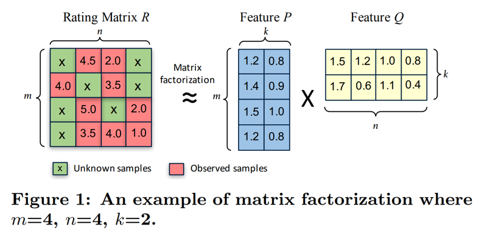

# Exploration 14 아이유팬이 좋아할 만한 다른 아티스트 찾기

# 추천 시스템이란 게 뭔가요?

### 협업 필터링 vs 콘텐츠 기반 필터링

- 협업 필터링은 다수의 사용자의 아이템 구매 이력 정보만으로 사용자간 유사성 및 아이템 간 유사성을 파악하지만, 콘텐츠 기반 필터링은 아이템의 고유의 정보를 바탕으로 아이템 간 유사성을 파악한다.

다시 말해, 협업 필터링에서는 아이템과 사용자 간의 행동 또는 관계에만 주목할 뿐 아이템 자체의 고유한 속성에 주목하지 않고 콘텐츠 기반 필터링에서는 아이템 자체의 속성에만 주목하고 사용자와 아이템 간의 관련성에는 주목하지 않는다.

### 협업 필터링을 바로 사용할 수 없게 만드는 세가지 제약 조건

- 시스템이 충분한 정보를 모으지 못한 사용자나 아이템에 대한 추론을 할 수 없는 상태인 콜드 스타트(Cold Start) 상황
- 계산량이 너무 많아 추천의 효율이 떨어지는 상황
- 롱테일의 꼬리 부분, 즉 사용자의 관심이 저조한 항목의 정보가 부족하여 추천에서 배제되는 상황

# 데이터 탐색하기와 전처리

### 데이터 준비

```python
import pandas as pd
import os

fname = os.getenv('HOME') + '/aiffel/recommendata_iu/data/lastfm-dataset-360K/usersha1-artmbid-artname-plays.tsv'
col_names = ['user_id', 'artist_MBID', 'artist', 'play']   # 임의로 지정한 컬럼명
data = pd.read_csv(fname, sep='\t', names= col_names)      # sep='\t'로 주어야 tsv를 열 수 있습니다.  
data.head(10)
```

artist_MBID col 제거

```python
# 사용하는 컬럼만 남겨줍니다.
using_cols = ['user_id', 'artist', 'play']
data = data[using_cols]
data.head(10)
```

아티스트 문자열을 소문자로 바꾸기

```python
data['artist'] = data['artist'].str.lower() # 검색을 쉽게 하기 위해 아티스트 문자열을 소문자로 바꿔줍시다.
data.head(10)
```

### 데이터 탐색

데이터의 기본정보 확인 

- 유저수, 아티스트 수, 인기 많은 아티스트
- 유저들이 몇 명의 아티스트를 듣고 있는지에 대한 통계
- 유저 play횟수 중앙값에 대한 통계

(padas.DataFrame.nunique(): 특정 컬럼에 포함된 유니크한 데이터의 개수를 알아보는데 유용함)

```python
# 유저 수
data['user_id'].nunique()
'''
358868
'''

# 아티스트 수
data['artist'].nunique()
'''
291346
'''

# 인기 많은 아티스트
artist_count = data.groupby('artist')['user_id'].count()
artist_count.sort_values(ascending=False).head(30)
'''
artist
radiohead                77254
the beatles              76245
coldplay                 66658
red hot chili peppers    48924
muse                     46954
metallica                45233
pink floyd               44443
the killers              41229
linkin park              39773
nirvana                  39479
system of a down         37267
queen                    34174
u2                       33206
daft punk                33001
the cure                 32624
led zeppelin             32295
placebo                  32072
depeche mode             31916
david bowie              31862
bob dylan                31799
death cab for cutie      31482
arctic monkeys           30348
foo fighters             30144
air                      29795
the rolling stones       29754
nine inch nails          28946
sigur rós                28901
green day                28732
massive attack           28691
moby                     28232
Name: user_id, dtype: int64
'''

# 유저별 몇 명의 아티스트를 듣고 있는지에 대한 통계
user_count = data.groupby('user_id')['artist'].count()
user_count.describe()
'''
count    358868.000000
mean         48.863234
std           8.524272
min           1.000000
25%          46.000000
50%          49.000000
75%          51.000000
max         166.000000
Name: artist, dtype: float64
'''

# 유저별 play횟수 중앙값에 대한 통계
user_median = data.groupby('user_id')['play'].median()
user_median.describe()
'''
count    358868.000000
mean        142.187676
std         213.089902
min           1.000000
25%          32.000000
50%          83.000000
75%         180.000000
max       50142.000000
Name: play, dtype: float64
'''
```

### 모델 검증을 위한 사용자 초기 정보 세팅

추천을 하기위해선는 사용자의 취향과 유사한 아티스트 정보를 5개 이상 입력받는 과정을 거치는 경우가 많다. 따라서 울리도 위 데이터셋에 5개 이상 추가해 주어야 한다.

```python
# 본인이 좋아하시는 아티스트 데이터로 바꿔서 추가하셔도 됩니다! 단, 이름은 꼭 데이터셋에 있는 것과 동일하게 맞춰주세요. 
my_favorite = ['black eyed peas' , 'maroon5' ,'jason mraz' ,'coldplay' ,'beyoncé']

# 'zimin'이라는 user_id가 위 아티스트의 노래를 30회씩 들었다고 가정하겠습니다.
my_playlist = pd.DataFrame({'user_id': ['zimin']*5, 'artist': my_favorite, 'play':[30]*5})

if not data.isin({'user_id':['zimin']})['user_id'].any():  # user_id에 'zimin'이라는 데이터가 없다면
    data = data.append(my_playlist)                           # 위에 임의로 만든 my_favorite 데이터를 추가해 줍니다. 

data.tail(10)       # 잘 추가되었는지 확인해 봅시다.
```

### 모델에 활용하기 위한 전처리 (실습)

indexing

```python
# 고유한 유저, 아티스트를 찾아내는 코드
user_unique = data['user_id'].unique()
artist_unique = data['artist'].unique()

# 유저, 아티스트 indexing 하는 코드 idx는 index의 약자입니다.
user_to_idx = {v:k for k,v in enumerate(user_unique)}
artist_to_idx = {v:k for k,v in enumerate(artist_unique)}
```

```python
# 인덱싱이 잘 되었는지 확인해 봅니다. 
print(user_to_idx['zimin'])    # 358869명의 유저 중 마지막으로 추가된 유저이니 358868이 나와야 합니다. 
print(artist_to_idx['black eyed peas'])
'''
358868
376
'''
```

```python
# indexing을 통해 데이터 컬럼 내 값을 바꾸는 코드
# dictionary 자료형의 get 함수는 https://wikidocs.net/16 을 참고하세요.

# user_to_idx.get을 통해 user_id 컬럼의 모든 값을 인덱싱한 Series를 구해 봅시다. 
# 혹시 정상적으로 인덱싱되지 않은 row가 있다면 인덱스가 NaN이 될 테니 dropna()로 제거합니다. 
temp_user_data = data['user_id'].map(user_to_idx.get).dropna()
if len(temp_user_data) == len(data):   # 모든 row가 정상적으로 인덱싱되었다면
    print('user_id column indexing OK!!')
    data['user_id'] = temp_user_data   # data['user_id']을 인덱싱된 Series로 교체해 줍니다. 
else:
    print('user_id column indexing Fail!!')

# artist_to_idx을 통해 artist 컬럼도 동일한 방식으로 인덱싱해 줍니다. 
temp_artist_data = data['artist'].map(artist_to_idx.get).dropna()
if len(temp_artist_data) == len(data):
    print('artist column indexing OK!!')
    data['artist'] = temp_artist_data
else:
    print('artist column indexing Fail!!')

data
```

# 사용자의 명시적/암묵적 평가

우리의 추천 시스템은 사용자들이 아이템을 얼마나 선호하는지를 모델링 하기를 원한다.

암묵적 피드백 데이터셋의 특징 

- 부정적인 피드백이 없다.(No Negative Feedback)
- 애초에 잡음이 많다.(Inherently Noisy)
- 수치는 신뢰도를 의미한다.(The numerical value of implicit feedback indicates confidence)
- Implicit-feedback Recommender System의 평가는 적절한 방법을 고민해봐야 한다.(Evaluation of implicit-feedback recommender requires appropriate measures)

암묵적 평가가 될 수 있는 데이터의 사례

- 플레이 횟수, 플레이 시간, 클릭 수, 구매 여부, 플레이 스킵 여부, 검색 기록, 방문 페이지 이력, 구매 내역, 마우스 움직임 기록 등등

1회만 플레이한 데이터의 비율

```python
# 1회만 play한 데이터의 비율을 보는 코드
only_one = data[data['play']<2]
one, all_data = len(only_one), len(data)
print(f'{one},{all_data}')
print(f'Ratio of only_one over all data is {one/all_data:.2%}')  # f-format에 대한 설명은 https://bit.ly/2DTLqYU
'''
147740,17535660
Ratio of only_one over all data is 0.84%
'''
```

암묵적 데이터의 해석을 위해 규칙 설정

- 한 번이라도 들었으면 선호한다고 판단한다.
- 많이 재생한 아티스트에 대해 가중치를 주어서 더 확실히 좋아한다고 판단한다.

# Matrix Factorization(MF)



- m명의 사용자들이 n명의 아티스트에 대해 평가한 데이터
- MF모델은 큰 평가 행렬 R을 두 개의 Feature Matrix P와 Q로 분해한다.
- (m, k)사이즈의 Feature Matrix P는 k차원의 벡터를 사용자 수만큼 모아놓은 행렬이다.


- 첫 번째 벡터 $P_0$=(1, 0.1)은 빨간 모자를 쓴 첫 번째 사용자의 특성(Feature)벡터이다.
- 같은 방식으로 Q 행렬의 첫 번째 벡터 $Q_0$=(0.9, -0.2)는 해리포터 영화의 특성 벡터가 된다.

모델의 목표는 모든 유저와 아이템에 대해 k-dimension의 벡터를 잘 만드는 것이다. 이때 벡터를 잘 만드는 기준은 유저 i의 벡터($U_i$)와 아이템 j의 벡터($I_j$)르 내적했을 때 유저 i가 아이템 j에 대해 평가한 수치($M_{ij}$)와 비슷한지 이다.

# CSR(Compressed Sparse Row) Matrix

평가행렬은 Sparse Matrix를 사용하기 때문에 많은 저장공간을 요구한다. 따라서 그 대안책인 CSR(Compressed Sparse Row) Matrix를 사용한다.

CSR Matrix는 Spars한 matrix에서 0이 아닌 유효한 데이터로 채워지는 데이터의 값과 좌표정보만으로 구성하여 메모리 사용량을 최소화하면서도 Sparse한 matrix와 동일한 행렬을 표현할 수 있도록 하는 데이터 구조이다.

CSR Matrix는 data, indices, indptr로 행렬을 압축하여 표현한다.


- data = [1,2,3,4,5,6]
- indices = [0, 4, 1, 3, 0, 3], data의 각 요소가 어느 열(column)에 있는지을 표현
- indptr = [0, 2, 4, 4, 6], data 리스트에서의 몇 번째에 해당하는지와 마지막에 data 벡터의 길이를 추가한 값이다. 다만 예시의 세 번째 행처럼 0이 아닌 원소가 없는 경우엔 그 다음 행의 값과 같은 값을 넣는다.

```python
# 실습 위에 설명보고 이해해서 만들어보기
from scipy.sparse import csr_matrix

num_user = data['user_id'].nunique()
num_artist = data['artist'].nunique()

csr_data = csr_matrix((data.play, (data.user_id, data.artist)), shape= (num_user, num_artist))
csr_data
```

# MF 모델 학습하기

implicit패키지 사용하기

- implicit 패키지: 암묵적(implicit) dataset을 사용하는 다양한 모델을 굉장히 빠르게 학습할 수 있는 패키지
- als (AlternatingLeastSquares): MF에서 쪼개진 두 Feature Matrix를 한꺼번에 훈련하는 것은 잘 수렴하지 않기 때문에, 한쪽을 고정시키고 다른 쪽을 학습하는 방식을 번갈아 수행하는 방식

```python
from implicit.als import AlternatingLeastSquares
import os
import numpy as np

# implicit 라이브러리에서 권장하고 있는 부분입니다. 학습 내용과는 무관합니다.
os.environ['OPENBLAS_NUM_THREADS']='1'
os.environ['KMP_DUPLICATE_LIB_OK']='True'
os.environ['MKL_NUM_THREADS']='1'
```

AlternatingLeastSquares클래스의 __init__파라미터

- factors : 유저와 아이템의 벡터를 몇 차원으로 할 것인지
- regularization : 과적합을 방지하기 위해 정규화 값을 얼마나 사용할 것인지
- use_gpu : GPU를 사용할 것인지
- iterations : epochs와 같은 의미, 데이터를 몇 번 반복해서 학습할 것인지

```python
# Implicit AlternatingLeastSquares 모델의 선언
als_model = AlternatingLeastSquares(factors=100, regularization=0.01, use_gpu=False, iterations=15, dtype=np.float32)
```

```python
# als 모델은 input으로 (item X user 꼴의 matrix를 받기 때문에 Transpose해줍니다.)
csr_data_transpose = csr_data.T
csr_data_transpose
'''
<291347x358869 sparse matrix of type '<class 'numpy.int64'>'
	with 17535578 stored elements in Compressed Sparse Column format>
'''
```

```python
# 모델 훈련
als_model.fit(csr_data_transpose)
```

훈련된 벡터 확인

- Zimin 벡터와 black eyed peas의 벡터를 어떻게 만들고 있는지
- 두 벡터를 곱하면 어떤 값이 나오는 지

```python
zimin, black_eyed_peas = user_to_idx['zimin'], artist_to_idx['black eyed peas']
zimin_vector, black_eyed_peas_vector = als_model.user_factors[zimin], als_model.item_factors[black_eyed_peas]
```

```python
zimin_vector
'''
array([-0.18892261, -1.1288848 , -0.27632907, -0.6358739 , -0.15390797,
        0.57104135, -1.361291  ,  0.23934144,  0.23907532, -0.08800209,
        0.49867427,  0.6321084 , -1.21958   ,  0.35320264,  0.46437374,
       -0.47621098, -0.1335494 , -0.32478544,  0.17289136,  0.17952198,
       -0.11487906, -0.13854605, -1.1793399 ,  0.95387244,  0.7336498 ,
        0.06708383,  0.7961757 ,  0.25303683,  0.8117689 ,  1.0726346 ,
       -0.00547407, -1.0655309 ,  0.82107794, -0.10014252, -0.34469375,
       -1.0438786 , -0.01948514,  0.39087147,  0.9540937 , -0.08125313,
       -0.12700671,  0.25797457, -0.31712437,  0.72174937, -0.44568974,
        0.96711594,  1.2315369 , -0.0876018 ,  0.19923161, -0.00567119,
        0.7140953 , -1.3250434 ,  0.48119175, -0.04125547, -0.4537122 ,
       -0.75697726,  0.6438937 ,  0.9350697 ,  0.25746387,  0.9918665 ,
        0.6958152 ,  0.09106147,  0.36301568,  0.71185875, -0.46061558,
        0.21541966, -0.99508387, -1.2685326 , -0.2967349 , -0.4438158 ,
       -0.29887587,  1.2808076 , -1.1588188 , -0.91588765, -0.25423113,
        0.36278817,  0.607783  ,  1.2952487 ,  1.0611922 ,  1.0014004 ,
        0.32532457, -0.3485537 , -0.01783847, -0.77435577, -0.01375036,
        0.11577672, -1.472981  ,  0.29613113, -0.27858186, -0.08969575,
       -0.5756543 , -0.7022014 , -0.06212138,  0.05766995,  1.082403  ,
        0.06814101,  0.20608874, -0.04549751,  0.1477912 , -0.022258  ],
      dtype=float32)
'''
black_eyed_peas_vector
'''
array([-7.05120983e-05,  7.50652794e-03,  1.02133239e-02, -1.02033862e-03,
        8.40622932e-03,  7.08490564e-03, -1.29979625e-02,  3.91824357e-03,
        1.49404572e-03,  2.35939544e-04,  1.42801506e-02,  1.92287397e-02,
       -1.97608173e-02, -1.99819729e-03,  1.37817645e-02,  7.71191204e-03,
        5.11685247e-03,  1.18079390e-02,  7.44282082e-03,  8.10481259e-04,
       -1.57727604e-03,  1.92313991e-03, -1.12476069e-02,  2.51988787e-02,
        1.27508156e-02,  1.24551663e-02,  1.09985070e-02,  3.84721835e-03,
        1.93550773e-02,  6.62792660e-03, -8.29372555e-03, -1.90290925e-03,
        2.77039708e-05,  1.14451516e-02,  5.64237265e-03, -9.56752431e-03,
        1.16737932e-02,  1.50741208e-02,  2.17324328e-02,  6.98889745e-03,
        1.70557164e-02,  9.70078539e-03,  7.30487052e-03,  2.17013527e-02,
       -1.65552795e-02,  5.87355345e-03,  1.42161576e-02,  1.27721112e-02,
        1.20709874e-02, -6.83431840e-03,  6.33459445e-03, -4.54198290e-03,
        2.36118063e-02,  1.95679590e-02, -5.41027030e-03,  7.79724913e-03,
        6.84976764e-03,  2.82672159e-02,  6.41372288e-03,  1.56432018e-02,
        1.28173418e-02, -4.01807809e-03,  2.69422643e-02,  1.74105261e-02,
        8.47322308e-03,  9.11330618e-03, -1.23723205e-02,  1.50342577e-03,
        1.53839989e-02, -1.09606916e-02,  4.84974706e-04,  2.84135938e-02,
       -6.45790715e-03, -5.18772379e-03, -1.30259898e-02,  2.91487947e-02,
        1.90673321e-02,  1.51926512e-02,  5.81360236e-03,  2.22780313e-02,
        3.54754436e-03, -2.14779675e-02,  1.54598011e-03, -7.04658590e-03,
        2.13315664e-03,  1.54136764e-02, -8.25115759e-03,  2.99176876e-03,
        5.69384499e-03,  6.78071519e-03, -7.77032319e-03,  1.17684169e-04,
        1.96900535e-02, -1.50453227e-04,  3.04073654e-02,  6.95737917e-03,
        1.77987274e-02, -1.45479804e-03,  5.45257237e-03,  2.47671362e-03],
      dtype=float32)
'''
```

```python
# zimin과 black_eyed_peas를 내적하는 코드
np.dot(zimin_vector, black_eyed_peas_vector)
'''
0.50871706
'''
```

- 1이 나와야하는데 0.5정도 밖에 나오지 않았다.

보지 못한 데이터에 대한 선호도 예측

```python
queen = artist_to_idx['queen']
queen_vector = als_model.item_factors[queen]
np.dot(zimin_vector, queen_vector)
'''
0.3148263
'''
```

선호도에 대한 판단은 모델을 만드는 사람이 정하기 나름이다. 객관적인 지표로 만들어서 기준을 정할 수도 있고 도메인 경험을 통해 정할 수도 있다. 추천시스템은 다른 머신러닝 task보다 객관적인 평가가 어려운 분야이다. 사람을 도통 알 수 없기 때문에 객관적인 지표를 어렵기 때문이다.

# 비슷한 아티스트 찾기 + 유저에게 추천하기

### 비슷한 아티스트 찾기

AlternatingLeastSquares클래스에 구현되어 있는 similar_item메서드를 통해 비슷한 아티스트를 찾는다.

```python
favorite_artist = 'coldplay'
artist_id = artist_to_idx[favorite_artist]
similar_artist = als_model.similar_items(artist_id, N=15)
similar_artist
'''
[(62, 1.0000001),
 (277, 0.98805106),
 (5, 0.97911423),
 (28, 0.9783942),
 (473, 0.968873),
 (490, 0.96384186),
 (217, 0.9615459),
 (694, 0.9545659),
 (418, 0.95352584),
 (247, 0.9529642),
 (910, 0.9507397),
 (268, 0.9384866),
 (1018, 0.938369),
 (782, 0.93187594),
 (75, 0.93178827)]
'''
```

- (아티스트의 id, 유사도)

아티스트의 id를 다시 아티스트의 이름으로 매핑

```python
#artist_to_idx 를 뒤집어, index로부터 artist 이름을 얻는 dict를 생성합니다. 
idx_to_artist = {v:k for k,v in artist_to_idx.items()}
[idx_to_artist[i[0]] for i in similar_artist]
'''
['coldplay',
 'muse',
 'red hot chili peppers',
 'the killers',
 'placebo',
 'oasis',
 'radiohead',
 'foo fighters',
 'u2',
 'the beatles',
 'nirvana',
 'pink floyd',
 'the smashing pumpkins',
 'the white stripes',
 'queen']
'''
```

함수화

```python
def get_similar_artist(artist_name: str):
    artist_id = artist_to_idx[artist_name]
    similar_artist = als_model.similar_items(artist_id)
    similar_artist = [idx_to_artist[i[0]] for i in similar_artist]
    return similar_artist
```

확인 

```python
get_similar_artist('2pac')
'''
['2pac',
 'dr. dre',
 'the game',
 'jay-z',
 'nas',
 'notorious b.i.g.',
 'snoop dogg',
 '50 cent',
 'bone thugs-n-harmony',
 'ludacris']
'''
```

```python
get_similar_artist('lady gaga')
'''
['lady gaga',
 'britney spears',
 'rihanna',
 'beyoncé',
 'katy perry',
 'the pussycat dolls',
 'christina aguilera',
 'justin timberlake',
 'leona lewis',
 'timbaland']
'''
```

### 유저에게 아티스트 추천하기

AlternatingLeastSquares클래스에 구현되어 있는 recommend 메서드를 통해 좋아할 만한 아티스트를 추천받는다. filter_already_liked_items는 유저가 이미 평가한 아이템은 제외하는 Argument이다.

```python
user = user_to_idx['zimin']
# recommend에서는 user*item CSR Matrix를 받습니다.
artist_recommended = als_model.recommend(user, csr_data, N=20, filter_already_liked_items=True)
artist_recommended
'''
[(369, 0.4586963),
 (350, 0.45615104),
 (550, 0.43747556),
 (1800, 0.42679584),
 (354, 0.41788706),
 (2249, 0.4083736),
 (274, 0.40182954),
 (627, 0.4015898),
 (391, 0.39846036),
 (409, 0.3894912),
 (621, 0.38763678),
 (355, 0.38402483),
 (564, 0.38321346),
 (901, 0.38158095),
 (5555, 0.3807943),
 (724, 0.36373407),
 (618, 0.3605733),
 (2902, 0.3555621),
 (944, 0.35481703),
 (382, 0.35167181)]
'''
```

```python
[idx_to_artist[i[0]] for i in artist_recommended]
'''
['justin timberlake',
 'rihanna',
 'britney spears',
 'lady gaga',
 'nelly furtado',
 'katy perry',
 'michael jackson',
 'maroon 5',
 'christina aguilera',
 'amy winehouse',
 'alicia keys',
 'madonna',
 'kanye west',
 'pink',
 'timbaland',
 'lily allen',
 'the pussycat dolls',
 'james blunt',
 'avril lavigne',
 'mika']
'''
```

AlternatingLeastSquares클래스에 구현된 explain메서드를 사용하면 사용자가 기록을 남긴 데이터 중 추천에 기여한 정도를 확인할 수있다.

```python
rihanna = artist_to_idx['rihanna']
explain = als_model.explain(user, csr_data, itemid=rihanna)
```

```python
[(idx_to_artist[i[0]], i[1]) for i in explain[1]]
'''
[('beyoncé', 0.23027710290923806),
 ('black eyed peas', 0.13198871742165139),
 ('jason mraz', 0.05384487420215318),
 ('coldplay', 0.042754405794920694),
 ('maroon5', -0.0001553312321680982)]
'''
```