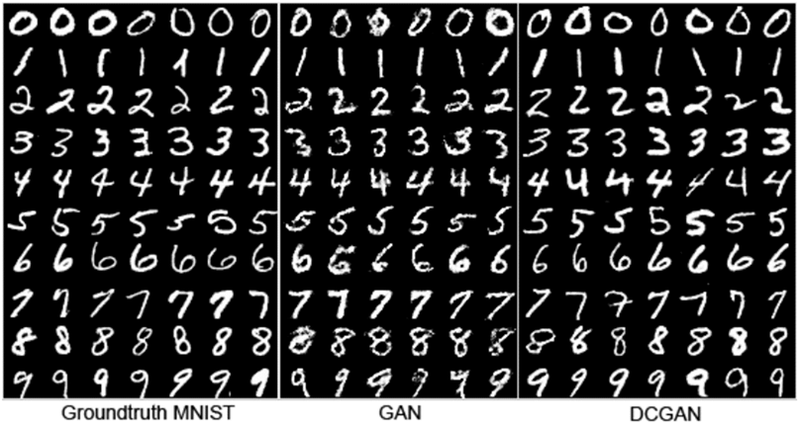

# Exprolation 17 난 스케치를 할 테니 너는 채색을 하거라

# 조건 없는 생성모델(Unconditional Generative Model), GAN

만약 GAN으로 MNIST data를 생성해낸다면 아래와 같이 생성될 것이다. 



- 여기서 우리는 7이라는 숫자가 생성되기를 원하지만 GAN은 일정 확률로 0~9까지의 숫자를 만든다.
- 따라서 우리가 원하는 7이라는 값을 얻기 위해서는 수많은 노이즈를 생성해 넣어야할지도 모른다.
- 즉 일반적인 GAN과 같은 unconditioned generative model은 내가 생성하고자 하는 데이터에 대해 제어하기 힘들었다.

# 조건 있는 생성모델(Conditional Generative model), cGAN

> **Conditional Generative Adversarial Nets (cGAN)이란?**
내가 원하는 종류의 이미지를 생성하고자 할때 GAN이 가진 생성 과정의 불편함을 해소하여, 내가 원라는 종류의 이미지를 생성할 수 있도록 고안된 방법
> 

## GAN의 목적 함수

GAN 구조는 Generator 및 Discriminator라 불리는 두 신경망이 minimax game을 통해 경쟁하며 발전한다.

Generator는 최소화, Discriminator는 최대화하려 학습한다. 


용어 

z: 임의 노이즈

D: Discriminator

G: Generator

Discriminator 입장에서 식

- 실제 이미지를 1, 가짜이미지를 0으로 두었을 때 $D$는 이 식을 최대화해야 하며, 우변의 +를 기준으로 양쪽항 $log(D(x))$및 $log(1-D(G(z)))$이 모두 최대가 되게 해야한다.
- 따라서 log가 1이 되게 해야함으로 $D(x)$는 1이 되도록, $D(G(z))$는 0이 되도록 해야한다. 즉 진짜 데이터(x)를 진짜로, 가자 데이터($G(z)$)를 가자로 정확히 에측하도록 학습한다는 뜻이다.

Generator 입장에서 식

- $D$와 반대로 $G$는 위 식을 최소화해야하고 위 수식에서 마지막항 $log(1-D(G(z)))$만을 최소화하면 된다.
- log가 0이 되야 함으로, $D(G(z))$가 1이 되도록 해야한다. 즉, $G$는 z를 입력받아 생성한 데이터 $G(z)$를 $D$가 진짜 데이터라고 에측할 만큼 진짜 같은 가짜 데이터를 만들도록 학습한다는 뜻이다.

## cGAN의 목적 함수


- G,D의 입력에 특정 조건을 나타내는 정보인 y를 같이 입력한다는 것이다.
- 여기서 y는 label정보를 가지고 있고 Generator가 어떠한 노이즈 z를 입력받았을 때, 특정 조건 y가 함께 입력되기 때문에, y를 통해 z를 어떠한 이미지로 만들어야 할지에 대한 방향을 제어할 수 있게 된다.

## 그림으로 이해하기

GAN의 학습과정


- Generator: 노이즈 z(파란색)가 입력되고 특정 representation(검정색)으로 변환된 후 가짜 데이터 $G(z)$(빨간색)를 생성해 낸다.
- Discriminator: 실제 데이터 x와 Generator가 생성한 가자 데이터 $G(z)$를 각각 입력받아 $D(x)$및 $D(G(z))$(보라색)를 계산하여 진짜와 가짜를 식별해 낸다.

cGAN의 학습과정


- Generator: 노이즈 z(파란색)와 추가 정보 y(녹색)을 함께 입력받아 Generator 내부에서 결합되어 representation(검정색)으로 변환되며 가짜 데이터 G(z∣y)*G*(*z*∣*y*)를 생성한다. MNIST나 CIFAR-10 등의 데이터셋에 대해 학습시키는 경우 y는 레이블 정보이며, 일반적으로 one-hot 벡터를 입력으로 넣는다.
- Discriminator: 실제 데이터 x와 Generator가 생성한 가짜 데이터 G(z∣y)를 각각 입력받으며, 마찬가지로 y정보가 각각 함께 입력되어 진짜와 가짜를 식별한다. MNIST나 CIFAR-10 등의 데이터셋에 대해 학습시키는 경우 실제 데이터 x와 y는 알맞은 한 쌍("7"이라 쓰인 이미지의 경우 레이블도 7)을 이뤄야 하며, 마찬가지로 Generator에 입력된 y와 Discriminator에 입력되는 y는 동일한 레이블을 나타내야 한다.

# Generator 구성하기

## 데이터 준비하기

tensorflow-datasets라이브러리에서 MNIST 데이터셋을 불러와 확인

```python
import tensorflow_datasets as tfds

mnist, info =  tfds.load(
    "mnist", split="train", with_info=True
)

fig = tfds.show_examples(mnist, info)
```


```python
import tensorflow as tf

BATCH_SIZE = 128

def gan_preprocessing(data):
    image = data["image"]
    image = tf.cast(image, tf.float32)
    image = (image / 127.5) - 1
    return image

def cgan_preprocessing(data):
    image = data["image"]
    image = tf.cast(image, tf.float32)
    image = (image / 127.5) - 1
    
    label = tf.one_hot(data["label"], 10)
    return image, label

gan_datasets = mnist.map(gan_preprocessing).shuffle(1000).batch(BATCH_SIZE)
cgan_datasets = mnist.map(cgan_preprocessing).shuffle(100).batch(BATCH_SIZE)
```

- 이미지 픽셀 값을 -1~1 사이의 범위로 변경
- 레이블 정보를 원-핫 인코딩(one-hot encoding)

변경내용 확인

```python
import matplotlib.pyplot as plt

for i,j in cgan_datasets : break

# 이미지 i와 라벨 j가 일치하는지 확인해 봅니다.     
print("Label :", j[0])
print("Image Min/Max :", i.numpy().min(), i.numpy().max())
plt.imshow(i.numpy()[0,...,0], plt.cm.gray)
'''
Label : tf.Tensor([0. 0. 0. 1. 0. 0. 0. 0. 0. 0.], shape=(10,), dtype=float32)
Image Min/Max : -1.0 1.0
'''
```


## GAN Generator 구성하기

Tensorflow2의 Subclassing방법 이용

```python
from tensorflow.keras import layers, Input, Model

class GeneratorGAN(Model):
    def __init__(self):
        super(GeneratorGAN, self).__init__()

        self.dense_1 = layers.Dense(128, activation='relu')
        self.dense_2 = layers.Dense(256, activation='relu')
        self.dense_3 = layers.Dense(512, activation='relu')
        self.dense_4 = layers.Dense(28*28*1, activation='tanh')

        self.reshape = layers.Reshape((28, 28, 1))

    def call(self, noise):
        out = self.dense_1(noise)
        out = self.dense_2(out)
        out = self.dense_3(out)
        out = self.dense_4(out)
        return self.reshape(out)
```

- init(): 모든 레이러를 정의, 4개의 fully-connected 레이어 중 한개를제외하고 모두 ReLU를 사용
- call(): 노이즈를 입력받아 init()에서 정의된 레이어들을 순서대로 통과한다. Generator는 숫자가 스인 이미지를 출력해야 하므로 마지막 출력은 layers.Reshape()를 이용해 (28,28,1)크기로 변환

## cGAN Generator 구성

```python
class GeneratorCGAN(Model):
    def __init__(self):
        super(GeneratorCGAN, self).__init__()
        
        self.dense_z = layers.Dense(256, activation='relu')
        self.dense_y = layers.Dense(256, activation='relu')
        self.combined_dense = layers.Dense(512, activation='relu')
        self.final_dense = layers.Dense(28 * 28 * 1, activation='tanh')
        self.reshape = layers.Reshape((28, 28, 1))

    def call(self, noise, label):
        noise = self.dense_z(noise)
        label = self.dense_y(label)
        out = self.combined_dense(tf.concat([noise, label], axis=-1))
        out = self.final_dense(out)
        return self.reshape(out)
```

과정

- 노이즈 입력 및 레이블 입력은 각각 1개의 fully-connected 레이어와 ReLU 활성화를 통과한다. (dense_z, dense_y)
- 1번 문항의 각 결과가 서로 연결되어 다시 한번 1개의 fully-connected 레이어와 ReLU 활성화를 통과한다 (tf.concat, conbined_dense)
- 2번 문항의 결과가 1개의 fully-connected 레이어 및 Hyperbolic tangent 활성화를 거쳐 28x28 차원의 결과가 생성되고 (28,28,1) 크기의 이미지 형태로 변환되어 출력된다 (final_dense, reshape)

# Discrminator 구성하기

## GAN discriminator 구성하기

```python
class DiscriminatorGAN(Model):
    def __init__(self):
        super(DiscriminatorGAN, self).__init__()
        self.flatten = layers.Flatten()
        
        self.blocks = []
        for f in [512, 256, 128, 1]:
            self.blocks.append(
                layers.Dense(f, activation=None if f==1 else "relu")
            )
        
    def call(self, x):
        x = self.flatten(x)
        for block in self.blocks:
            x = block(x)
        return x
```

- Discriminator의 입력은 Generator가 생성한 (28,28,1)크기의 이미지이며 FC-layer로 학습하기위해 call()에서는 가장 먼저 layers.Flastten()을 수행한다.
- 이후 layer등이 쌓여있는 block에 대해 for loop을 이용하여 layer들을 순서대로 하나씩 꺼내 입력 데이터를 통과시킨다.
- 마지막 FC-layer를 통과하면 진짜 및 가짜 이미지를 나타내는 1개의 값이 출력된다.

## cGAN discriminator 구성하기

cGAN의 Discriminator는 Maxout이라는 특별한 레이어가 사용된다.

> Maxout이란?
두 레이어 사이를 연결할 때, 여러 개의 FC-layer를 통과시켜 그 중 가장 큰 값을 가져오도록 한다.
> 

1차원의 FC-layer를 2개 사용한다면 다음과같이 나타낼 수 있다.


이후 FC-layer의 갯수가 늘어난다면 점점 곡선 형태인 activation function이 될 수 있다.


Maxout 구현

```python
class Maxout(layers.Layer):
    def __init__(self, units, pieces):
        super(Maxout, self).__init__()
        self.dense = layers.Dense(units*pieces, activation="relu")
        self.dropout = layers.Dropout(.5)    
        self.reshape = layers.Reshape((-1, pieces, units))
    
    def call(self, x):
        x = self.dense(x)
        x = self.dropout(x)
        x = self.reshape(x)
        return tf.math.reduce_max(x, axis=2)
```

- units 차원 수를 가진 fc-layer를 pieces개만큼 만들고 그중 최댓값을 출력한다.
- ex) units=100, pieces=10 → 100차원의 representation을 10개 만들고 10개 중에서 최대값을 가져와 최종 1개의 100차원 representation이 출력된다.

```python
class DiscriminatorCGAN(Model):
    def __init__(self):
        super(DiscriminatorCGAN, self).__init__()
        self.flatten = layers.Flatten()
        
        self.image_block = Maxout(240, 5)
        self.label_block = Maxout(50, 5)
        self.combine_block = Maxout(240, 4)
        
        self.dense = layers.Dense(1, activation=None)
    
    def call(self, image, label):
        image = self.flatten(image)
        image = self.image_block(image)
        label = self.label_block(label)
        x = layers.Concatenate()([image, label])
        x = self.combine_block(x)
        return self.dense(x)
```

# 학습 및 테스트하기

## Loss function, optimizer

- 진짜 및 가짜를 구별하기 위해 Binary Cross Entropy를 사용
- optimizer로 Adam을 사용

```python
from tensorflow.keras import optimizers, losses

bce = losses.BinaryCrossentropy(from_logits=True)

def generator_loss(fake_output):
    return bce(tf.ones_like(fake_output), fake_output)

def discriminator_loss(real_output, fake_output):
    return bce(tf.ones_like(real_output), real_output) + bce(tf.zeros_like(fake_output), fake_output)

gene_opt = optimizers.Adam(1e-4)
disc_opt = optimizers.Adam(1e-4)
```

## GAN으로 MNIST 학습하기

```python
gan_generator = GeneratorGAN()
gan_discriminator = DiscriminatorGAN()

@tf.function()
def gan_step(real_images):
    noise = tf.random.normal([real_images.shape[0], 100])
    
    with tf.GradientTape(persistent=True) as tape:
        # Generator를 이용해 가짜 이미지 생성
        fake_images = gan_generator(noise)
        # Discriminator를 이용해 진짜 및 가짜이미지를 각각 판별
        real_out = gan_discriminator(real_images)
        fake_out = gan_discriminator(fake_images)
        # 각 손실(loss)을 계산
        gene_loss = generator_loss(fake_out)
        disc_loss = discriminator_loss(real_out, fake_out)
    # gradient 계산
    gene_grad = tape.gradient(gene_loss, gan_generator.trainable_variables)
    disc_grad = tape.gradient(disc_loss, gan_discriminator.trainable_variables)
    # 모델 학습
    gene_opt.apply_gradients(zip(gene_grad, gan_generator.trainable_variables))
    disc_opt.apply_gradients(zip(disc_grad, gan_discriminator.trainable_variables))
    return gene_loss, disc_loss
```

```python
EPOCHS = 10
for epoch in range(1, EPOCHS+1):
    for i, images in enumerate(gan_datasets):
        gene_loss, disc_loss = gan_step(images)

        if (i+1) % 100 == 0:
            print(f"[{epoch}/{EPOCHS} EPOCHS, {i+1} ITER] G:{gene_loss}, D:{disc_loss}")
```

테스트 

```python
import numpy as np

noise = tf.random.normal([10, 100])

output = gan_generator(noise)
output = np.squeeze(output.numpy())

plt.figure(figsize=(15,6))
for i in range(1, 11):
    plt.subplot(2,5,i)
    plt.imshow(output[i-1])
```


500 epoch학습한 가중치 사용

```python
import os
weight_path = os.getenv('HOME')+'/aiffel/conditional_generation/gan/GAN_500'

noise = tf.random.normal([10, 100]) 

gan_generator = GeneratorGAN()
gan_generator.load_weights(weight_path)

output = gan_generator(noise)
output = np.squeeze(output.numpy())

plt.figure(figsize=(15,6))
for i in range(1, 11):
    plt.subplot(2,5,i)
    plt.imshow(output[i-1])
```


## cGAN으로 MNIST 학습하기

```python
cgan_generator = GeneratorCGAN()
cgan_discriminator = DiscriminatorCGAN()

@tf.function()
def cgan_step(real_images, labels):
    noise = tf.random.normal([real_images.shape[0], 100])
    
    with tf.GradientTape(persistent=True) as tape:
        fake_images = cgan_generator(noise, labels)
        
        real_out = cgan_discriminator(real_images, labels)
        fake_out = cgan_discriminator(fake_images, labels)
        
        gene_loss = generator_loss(fake_out)
        disc_loss = discriminator_loss(real_out, fake_out)
    
    gene_grad = tape.gradient(gene_loss, cgan_generator.trainable_variables)
    disc_grad = tape.gradient(disc_loss, cgan_discriminator.trainable_variables)
    
    gene_opt.apply_gradients(zip(gene_grad, cgan_generator.trainable_variables))
    disc_opt.apply_gradients(zip(disc_grad, cgan_discriminator.trainable_variables))
    return gene_loss, disc_loss

EPOCHS = 1
for epoch in range(1, EPOCHS+1):
    
    for i, (images, labels) in enumerate(cgan_datasets):
        gene_loss, disc_loss = cgan_step(images, labels)
    
        if (i+1) % 100 == 0:
            print(f"[{epoch}/{EPOCHS} EPOCHS, {i} ITER] G:{gene_loss}, D:{disc_loss}")
```

500 epoch 학습한 가중치 사용

```python
number =   7# TODO : 생성할 숫자를 입력해 주세요!!

weight_path = os.getenv('HOME')+'/aiffel/conditional_generation/cgan/CGAN_500'

noise = tf.random.normal([10, 100])

label = tf.one_hot(number, 10)
label = tf.expand_dims(label, axis=0)
label = tf.repeat(label, 10, axis=0)

generator = GeneratorCGAN()
generator.load_weights(weight_path)

output = generator(noise, label)
output = np.squeeze(output.numpy())

plt.figure(figsize=(15,6))
for i in range(1, 11):
    plt.subplot(2,5,i)
    plt.imshow(output[i-1])
```


# GAN의 입력에 이미지를 넣는다면? Pix2Pix

> **Pix2Pix란?**
기존 노이즈 입력을 이미지로 변환하는 일반적인 GAN이 아니라, 이미지를 입려그로 하여 원하는 다른 형태의 이미지로 변환시킬 수 있는 GAN모델이다.
> 

논문: **[Image-to-Image Translation with Conditional Adversarial Networks](https://arxiv.org/pdf/1611.07004.pdf)**

여기서 Conditional Adversarial Networks는 cGAN을 의미하고 Image-to-Image Translation은 이미지 간변환을 말한다.

Pix2Pix 수행 결과


- 첫 번째 Labels to Street Scene 이미지는 픽셀 별로 레이블 정보만 존재하는 segmentation map을 입력으로 실제 거리 사진을 생성해 내었고, 이 외에 흑백 사진을 컬러로 변환하거나, 낮에 찍은 사진을 밤에 찍을 사진으로 변환하거나, 가방 스케치를 이용해 채색된 가방을 만들기도 한다.

노이즈와 레이블 정보를 함께 입력했던 cGAN은 fc-layer를 연속적으로 쌓아 만들었지만, 이미지 변환이 목적인 Pix2Pix는 이미지를 다루는데 효율적인 Conv-layer를 활용한다. 또한 GAN구조를 기반으로 하기 때문에 크게 Generator와 Discriminator 두 가지 구성 요소로 이루어 진다.

## Pix2Pix (Generator)

Generator는 어떠한 이미지를 입력받아 변환된 이미지를 출력하기 위해 사용된다. 여기서 입력 이미지와 변환된 이미지의 크기는 동일해야 하며, 이러한 문제에서 흔히 사용되는 구조는 아래 그림과 같은 Encoder-Decoder 구조이다.


- Encoder: 입력 이미지(x)를 받으면 단계적으로 이미지를 down-sampling 하면서 입력 이미지의 중요한 representation을 학습한다.
- Decoder: 반대로 다시 이미지를 up-sampling하여 입력 이미지와 동일한 크기의 변환된 이미지(y)를 생성해낸다.
- 이 과정들은 모두 Conv-layer로 진행되며 Encoder의 최종 출력은 중간에 위치한 가장 작은 사각형이다. 이것은 bottleneck이라고도 불리며 입력 이미지의 가장 중요한 특징만을 담고있다.

이 작은 특징은 변환된 이미지를 생성한는데 충분한 정보를 가지고 있지 않다. 따라서 논문에서는 이 점을 보완하기 위해 U-Net구조를 제안한다.


- 위에서본 Encoder-Decoder구조와 다른점은 각 레이어마다 Encoder와 Decoder가 연결(skip connection)되어 있다는 것이다.
- skip-connection으로 Decoder는 Encoder의 더 많은 추가 정보를 이용하는 방법이다.


## Pix2Pix (Loss function)

Q. Generator만을 사용한 이미지 변환, 가능할까?

→ 답은 가능하다

변환하고자 하는 이미지를 Encoder에 입력하여 Decoder의 출력으로 변환된 이미지를 얻을 수 있다. 또한 출력된 이미지와 실제 이미지의 차이로 L2(MSE), L1(MAE)같은 손실을 계산한 후 이를 역전파하여 네트워크를 학습시키면된다.

하지만 문제는 품질이 떨어진다는 것이다.


- L1, L2 손실만을 이용해서 학습하는경우 결과가 흐릿해지는 경향이 있다. 이는 Generator가 단순히 이미지의 편균적인 손실만을 줄이고자 파라미터를 학습하기 때문이다.
- 반면 cGAN 학습 방법은 훨씬 더 세밀한 정보를 잘 표현하고 있다. 이는 Discriminator를 잘 속이려면 Generator가 진짜 같은 이미지를 만들어야 하기 때문이다.

## Pix2Pix (Disciminator)

DCGAN의 Discriminator


- DCGAN의 Discriminator는 생성된 가짜 이미지 혹은 진짜 이미지를 하나씩 입력받아 Conv-layer를 이용해 점점 크기를 줄여나가면서, 최종적으로 하나의 이미지에 대해 하나의 호가률 값을 출력한다.

Q. 하나의 전체 이미지에 대해 하나의 확률 값만을 도출하는 것이 진짜 혹은 가짜를 판별하는 데 좋은 것일까?

Pix2Pix의 Discriminator


- Pix2Pix의 Discriminator는 하나의 이미지가 Discriminator의 입력으로 들어오면, Conv-layer를 거쳐 확률 값을 나타내는 최종 결과를 생성한는데, 그 결과는 하나의 값이 아닌 여러 개의 값을 갖는다.
- 위 이미지의 파란색 점선은 여러개의 출력 중 하나의 출력을 계산하기 위한 입력 이미지의 receptive field영역을 나타낸다. 즉 전체 영역을 다 보는 것이 아닌 일부 영역(파란색 영역)에 대해서만 진짜 /가짜를 판별하는 하나의 확률값을 도출한다는 것이다.
- 마지막에는 여러개의 확률값을 평균하여 최종 Discriminator의 출력을 생성한다.
- 이러한 방법은 PatchGAN이라고 불리며 일반적으로 이미지에서 거리가 먼 두 픽셀은 서로 연관성이 없기 대문에 특정 크기를 가진 일부 영역에 대해서 세부적으로 진짜/가짜를 판별하는 것이 Generator로 하여금 더 진짜 같은 이미지를 만들도록 하는 방법이다.


# 프로젝트: 데이터 준비하기

### 데이터

- 830개의 이미지
- 각 이미지 (256x256)크기의 이미지 쌍이 나란히 붙어 (256x512)로 구성

```python
import os

data_path = os.getenv('HOME')+'/aiffel/conditional_generation/data/pokemon_pix2pix_dataset/train/'
print("number of train examples :", len(os.listdir(data_path)))
'''
number of train examples : 830
'''
```

### 학습용 데이터 셋 임의의 6장 선택 후 시각화

```python
import cv2
import numpy as np
import matplotlib.pyplot as plt

plt.figure(figsize=(20,15))
for i in range(1, 7):
    f = data_path + os.listdir(data_path)[np.random.randint(800)]
    img = cv2.imread(f, cv2.IMREAD_COLOR)
    plt.subplot(3,2,i)
    plt.imshow(img)
```


### 이미지 크기 확인

```python
f = data_path + os.listdir(data_path)[0]
img = cv2.imread(f, cv2.IMREAD_COLOR)
print(img.shape)
'''
(256, 512, 3)
'''
```

### 이미지 나누기

```python
import tensorflow as tf

def normalize(x):
    x = tf.cast(x, tf.float32)
    return (x/127.5) - 1

def denormalize(x):
    x = (x+1)*127.5
    x = x.numpy()
    return x.astype(np.uint8)

def load_img(img_path):
    img = tf.io.read_file(img_path)
    img = tf.image.decode_image(img, 3)
    
    w = tf.shape(img)[1] // 2
    sketch = img[:, :w, :] 
    sketch = tf.cast(sketch, tf.float32)
    colored = img[:, w:, :] 
    colored = tf.cast(colored, tf.float32)
    return normalize(sketch), normalize(colored)

f = data_path + os.listdir(data_path)[1]
sketch, colored = load_img(f)

plt.figure(figsize=(10,7))
plt.subplot(1,2,1); plt.imshow(denormalize(sketch))
plt.subplot(1,2,2); plt.imshow(denormalize(colored))
```


## augmentation기법 적용

```python
from tensorflow import image
from tensorflow.keras.preprocessing.image import random_rotation

@tf.function() # 빠른 텐서플로 연산을 위해 @tf.function()을 사용합니다. 
def apply_augmentation(sketch, colored):
    stacked = tf.concat([sketch, colored], axis=-1)
    
    _pad = tf.constant([[30,30],[30,30],[0,0]])
    if tf.random.uniform(()) < .5:
        padded = tf.pad(stacked, _pad, "REFLECT")
    else:
        padded = tf.pad(stacked, _pad, "CONSTANT", constant_values=1.)

    out = image.random_crop(padded, size=[256, 256, 6])
    
    out = image.random_flip_left_right(out)
    out = image.random_flip_up_down(out)
    
    if tf.random.uniform(()) < .5:
        degree = tf.random.uniform([], minval=1, maxval=4, dtype=tf.int32)
        out = image.rot90(out, k=degree)
    
    return out[...,:3], out[...,3:]   
```

과정

- 두 이미지가 채널 축으로 연결됩니다. (tf.concat). 두 이미지가 각각 3채널인 경우 6채널이 됩니다.
- 1.의 결과에 각 50% 확률로 Refection padding 또는 constant padding이 30픽셀의 pad width 만큼적용됩니다. (tf.pad)
- 2.의 결과에서 (256,256,6) 크기를 가진 이미지를 임의로 잘라냅니다. (tf.image.random_crop)
- 3.의 결과를 50% 확률로 가로로 뒤집습니다. (tf.image.random_flip_left_right)
- 4.의 결과를 50% 확률로 세로로 뒤집습니다. (tf.image.random_flip_up_down)5.의 결과를 50% 확률로 회전시킵니다. (tf.image.rot90)

### 데이터에 augmentation 적용

```python
plt.figure(figsize=(15,13))
img_n = 1
for i in range(1, 13, 2):
    augmented_sketch, augmented_colored = apply_augmentation(sketch, colored)
    
    plt.subplot(3,4,i)
    plt.imshow(denormalize(augmented_sketch)); plt.title(f"Image {img_n}")
    plt.subplot(3,4,i+1); 
    plt.imshow(denormalize(augmented_colored)); plt.title(f"Image {img_n}")
    img_n += 1
```


### 최종 이미지 확인

```python
from tensorflow import data

def get_train(img_path):
    sketch, colored = load_img(img_path)
    sketch, colored = apply_augmentation(sketch, colored)
    return sketch, colored

train_images = data.Dataset.list_files(data_path + "*.jpg")
train_images = train_images.map(get_train).shuffle(100).batch(4)

sample = train_images.take(1)
sample = list(sample.as_numpy_iterator())
sketch, colored = (sample[0][0]+1)*127.5, (sample[0][1]+1)*127.5

plt.figure(figsize=(10,5))
plt.subplot(1,2,1); plt.imshow(sketch[0].astype(np.uint8))
plt.subplot(1,2,2); plt.imshow(colored[0].astype(np.uint8))
```


# 프로젝트: Generator 구성하기


### Encoder Block 구현

```python
from tensorflow.keras import layers, Input, Model

class EncodeBlock(layers.Layer):
    def __init__(self, n_filters, use_bn=True):
        super(EncodeBlock, self).__init__()
        self.use_bn = use_bn       
        self.conv = layers.Conv2D(n_filters, 4, 2, "same", use_bias=False)
        self.batchnorm = layers.BatchNormalization()
        self.lrelu= layers.LeakyReLU(0.2)

    def call(self, x):
        x = self.conv(x)
        if self.use_bn:
            x = self.batchnorm(x)
        return self.lrelu(x)
```

### Encoder 구현

```python
class Encoder(layers.Layer):
    def __init__(self):
        super(Encoder, self).__init__()
        filters = [64,128,256,512,512,512,512,512]
        
        self.blocks = []
        for i, f in enumerate(filters):
            if i == 0:
                self.blocks.append(EncodeBlock(f, use_bn=False))
            else:
                self.blocks.append(EncodeBlock(f))
    
    def call(self, x):
        for block in self.blocks:
            x = block(x)
        return x
    
    def get_summary(self, input_shape=(256,256,3)):
        inputs = Input(input_shape)
        return Model(inputs, self.call(inputs)).summary()
```

```python
Encoder().get_summary()
'''
Model: "model"
_________________________________________________________________
Layer (type)                 Output Shape              Param #   
=================================================================
input_1 (InputLayer)         [(None, 256, 256, 3)]     0         
_________________________________________________________________
encode_block (EncodeBlock)   (None, 128, 128, 64)      3072      
_________________________________________________________________
encode_block_1 (EncodeBlock) (None, 64, 64, 128)       131584    
_________________________________________________________________
encode_block_2 (EncodeBlock) (None, 32, 32, 256)       525312    
_________________________________________________________________
encode_block_3 (EncodeBlock) (None, 16, 16, 512)       2099200   
_________________________________________________________________
encode_block_4 (EncodeBlock) (None, 8, 8, 512)         4196352   
_________________________________________________________________
encode_block_5 (EncodeBlock) (None, 4, 4, 512)         4196352   
_________________________________________________________________
encode_block_6 (EncodeBlock) (None, 2, 2, 512)         4196352   
_________________________________________________________________
encode_block_7 (EncodeBlock) (None, 1, 1, 512)         4196352   
=================================================================
Total params: 19,544,576
Trainable params: 19,538,688
Non-trainable params: 5,888
_________________________________________________________________
'''
```

### Decoder Block & Decoder 구현

```python
class DecodeBlock(layers.Layer):
    def __init__(self, f, dropout=True):
        super(DecodeBlock, self).__init__()
        self.dropout = dropout
        self.Transconv = layers.Conv2DTranspose(f, 4, 2, "same", use_bias=False)
        self.batchnorm = layers.BatchNormalization()
        self.relu = layers.ReLU()
        
    def call(self, x):
        x = self.Transconv(x)
        x = self.batchnorm(x)
        if self.dropout:
            x = layers.Dropout(.5)(x)
        return self.relu(x)

    
class Decoder(layers.Layer):
    def __init__(self):
        super(Decoder, self).__init__()
        filters = [512,512,512,512,256,128,64]
        
        self.blocks = []
        for i, f in enumerate(filters):
            if i < 3:
                self.blocks.append(DecodeBlock(f))
            else:
                self.blocks.append(DecodeBlock(f, dropout=False))
                
        self.blocks.append(layers.Conv2DTranspose(3, 4, 2, "same", use_bias=False))
        
    def call(self, x):
        for block in self.blocks:
            x = block(x)
        return x
            
    def get_summary(self, input_shape=(1,1,512)):
        inputs = Input(input_shape)
        return Model(inputs, self.call(inputs)).summary()
```

```python
Decoder().get_summary()
'''
Model: "model_1"
_________________________________________________________________
Layer (type)                 Output Shape              Param #   
=================================================================
input_2 (InputLayer)         [(None, 1, 1, 512)]       0         
_________________________________________________________________
decode_block (DecodeBlock)   (None, 2, 2, 512)         4196352   
_________________________________________________________________
decode_block_1 (DecodeBlock) (None, 4, 4, 512)         4196352   
_________________________________________________________________
decode_block_2 (DecodeBlock) (None, 8, 8, 512)         4196352   
_________________________________________________________________
decode_block_3 (DecodeBlock) (None, 16, 16, 512)       4196352   
_________________________________________________________________
decode_block_4 (DecodeBlock) (None, 32, 32, 256)       2098176   
_________________________________________________________________
decode_block_5 (DecodeBlock) (None, 64, 64, 128)       524800    
_________________________________________________________________
decode_block_6 (DecodeBlock) (None, 128, 128, 64)      131328    
_________________________________________________________________
conv2d_transpose_7 (Conv2DTr (None, 256, 256, 3)       3072      
=================================================================
Total params: 19,542,784
Trainable params: 19,537,792
Non-trainable params: 4,992
_________________________________________________________________
'''
```

### Generator 구현

```python
class EncoderDecoderGenerator(Model):
    def __init__(self):
        super(EncoderDecoderGenerator, self).__init__()
        self.encoder = Encoder()
        self.decoder = Decoder()
    
    def call(self, x):
        x = self.encoder(x)
        x = self.decoder(x)
        return x
   
    def get_summary(self, input_shape=(256,256,3)):
        inputs = Input(input_shape)
        return Model(inputs, self.call(inputs)).summary()
        

EncoderDecoderGenerator().get_summary()
'''
Model: "model_2"
_________________________________________________________________
Layer (type)                 Output Shape              Param #   
=================================================================
input_3 (InputLayer)         [(None, 256, 256, 3)]     0         
_________________________________________________________________
encoder_1 (Encoder)          (None, 1, 1, 512)         19544576  
_________________________________________________________________
decoder_1 (Decoder)          (None, 256, 256, 3)       19542784  
=================================================================
Total params: 39,087,360
Trainable params: 39,076,480
Non-trainable params: 10,880
_________________________________________________________________
'''
```

# 프로젝트: Generator 재구성하기

위에서 구현한 Generator는 Encoder-Decoder구조이다. 이것을 U-Net의 구조로 변경해보자.


### Encoder Block & Decoder block

```python
class EncodeBlock(layers.Layer):
    def __init__(self, n_filters, use_bn=True):
        super(EncodeBlock, self).__init__()
        self.use_bn = use_bn       
        self.conv = layers.Conv2D(n_filters, 4, 2, "same", use_bias=False)
        self.batchnorm = layers.BatchNormalization()
        self.lrelu = layers.LeakyReLU(0.2)

    def call(self, x):
        x = self.conv(x)
        if self.use_bn:
            x = self.batchnorm(x)
        return self.lrelu(x)

    
class DecodeBlock(layers.Layer):
    def __init__(self, f, dropout=True):
        super(DecodeBlock, self).__init__()
        self.dropout = dropout
        self.Transconv = layers.Conv2DTranspose(f, 4, 2, "same", use_bias=False)
        self.batchnorm = layers.BatchNormalization()
        self.relu = layers.ReLU()
        
    def call(self, x):
        x = self.Transconv(x)
        x = self.batchnorm(x)
        if self.dropout:
            x = layers.Dropout(.5)(x)
        return self.relu(x)
```

- 변경내용 없음

### U-Net Generator

```python
class UNetGenerator(Model):
    def __init__(self):
        super(UNetGenerator, self).__init__()
        encode_filters = [64,128,256,512,512,512,512,512]
        decode_filters = [512,512,512,512,256,128,64]
        
        self.encode_blocks = []
        for i, f in enumerate(encode_filters):
            if i == 0:
                self.encode_blocks.append(EncodeBlock(f, use_bn=False))
            else:
                self.encode_blocks.append(EncodeBlock(f))
        
        self.decode_blocks = []
        for i, f in enumerate(decode_filters):
            if i < 3:
                self.decode_blocks.append(DecodeBlock(f))
            else:
                self.decode_blocks.append(DecodeBlock(f, dropout=False))
        
        self.last_conv = layers.Conv2DTranspose(3, 4, 2, "same", use_bias=False)
    
    def call(self, x):
        features = []
        for block in self.encode_blocks:
            x = block(x)
            features.append(x)
        
        features = features[:-1]
                    
        for block, feat in zip(self.decode_blocks, features[::-1]):
            x = block(x)
            x = layers.Concatenate()([x, feat])
        
        x = self.last_conv(x)
        return x
                
    def get_summary(self, input_shape=(256,256,3)):
        inputs = Input(input_shape)
        return Model(inputs, self.call(inputs)).summary()

print("✅")
```

```python
UNetGenerator().get_summary()
'''
Model: "model_3"
__________________________________________________________________________________________________
Layer (type)                    Output Shape         Param #     Connected to                     
==================================================================================================
input_4 (InputLayer)            [(None, 256, 256, 3) 0                                            
__________________________________________________________________________________________________
encode_block_16 (EncodeBlock)   (None, 128, 128, 64) 3072        input_4[0][0]                    
__________________________________________________________________________________________________
encode_block_17 (EncodeBlock)   (None, 64, 64, 128)  131584      encode_block_16[0][0]            
__________________________________________________________________________________________________
encode_block_18 (EncodeBlock)   (None, 32, 32, 256)  525312      encode_block_17[0][0]            
__________________________________________________________________________________________________
encode_block_19 (EncodeBlock)   (None, 16, 16, 512)  2099200     encode_block_18[0][0]            
__________________________________________________________________________________________________
encode_block_20 (EncodeBlock)   (None, 8, 8, 512)    4196352     encode_block_19[0][0]            
__________________________________________________________________________________________________
encode_block_21 (EncodeBlock)   (None, 4, 4, 512)    4196352     encode_block_20[0][0]            
__________________________________________________________________________________________________
encode_block_22 (EncodeBlock)   (None, 2, 2, 512)    4196352     encode_block_21[0][0]            
__________________________________________________________________________________________________
encode_block_23 (EncodeBlock)   (None, 1, 1, 512)    4196352     encode_block_22[0][0]            
__________________________________________________________________________________________________
decode_block_14 (DecodeBlock)   (None, 2, 2, 512)    4196352     encode_block_23[0][0]            
__________________________________________________________________________________________________
concatenate (Concatenate)       (None, 2, 2, 1024)   0           decode_block_14[0][0]            
                                                                 encode_block_22[0][0]            
__________________________________________________________________________________________________
decode_block_15 (DecodeBlock)   (None, 4, 4, 512)    8390656     concatenate[0][0]                
__________________________________________________________________________________________________
concatenate_1 (Concatenate)     (None, 4, 4, 1024)   0           decode_block_15[0][0]            
                                                                 encode_block_21[0][0]            
__________________________________________________________________________________________________
decode_block_16 (DecodeBlock)   (None, 8, 8, 512)    8390656     concatenate_1[0][0]              
__________________________________________________________________________________________________
concatenate_2 (Concatenate)     (None, 8, 8, 1024)   0           decode_block_16[0][0]            
                                                                 encode_block_20[0][0]            
__________________________________________________________________________________________________
decode_block_17 (DecodeBlock)   (None, 16, 16, 512)  8390656     concatenate_2[0][0]              
__________________________________________________________________________________________________
concatenate_3 (Concatenate)     (None, 16, 16, 1024) 0           decode_block_17[0][0]            
                                                                 encode_block_19[0][0]            
__________________________________________________________________________________________________
decode_block_18 (DecodeBlock)   (None, 32, 32, 256)  4195328     concatenate_3[0][0]              
__________________________________________________________________________________________________
concatenate_4 (Concatenate)     (None, 32, 32, 512)  0           decode_block_18[0][0]            
                                                                 encode_block_18[0][0]            
__________________________________________________________________________________________________
decode_block_19 (DecodeBlock)   (None, 64, 64, 128)  1049088     concatenate_4[0][0]              
__________________________________________________________________________________________________
concatenate_5 (Concatenate)     (None, 64, 64, 256)  0           decode_block_19[0][0]            
                                                                 encode_block_17[0][0]            
__________________________________________________________________________________________________
decode_block_20 (DecodeBlock)   (None, 128, 128, 64) 262400      concatenate_5[0][0]              
__________________________________________________________________________________________________
concatenate_6 (Concatenate)     (None, 128, 128, 128 0           decode_block_20[0][0]            
                                                                 encode_block_16[0][0]            
__________________________________________________________________________________________________
conv2d_transpose_23 (Conv2DTran (None, 256, 256, 3)  6144        concatenate_6[0][0]              
==================================================================================================
Total params: 54,425,856
Trainable params: 54,414,976
Non-trainable params: 10,880
__________________________________________________________________________________________________
'''
```

# 프로젝트: Discriminator 구성하기


### Discriminator Block

```python
class DiscBlock(layers.Layer):
    def __init__(self, n_filters, stride=2, custom_pad=False, use_bn=True, act=True):
        super(DiscBlock, self).__init__()
        self.custom_pad = custom_pad
        self.use_bn = use_bn
        self.act = act
        
        if custom_pad:
            self.padding = layers.ZeroPadding2D()
            self.conv = layers.Conv2D(n_filters, 4, stride, "valid", use_bias=False)
        else:
            self.conv = layers.Conv2D(n_filters, 4, stride, "same", use_bias=False)
        
        self.batchnorm = layers.BatchNormalization() if use_bn else None
        self.lrelu = layers.LeakyReLU(0.2) if act else None
        
    def call(self, x):
        if self.custom_pad:
            x = self.padding(x)
            x = self.conv(x)
        else:
            x = self.conv(x)
                
        if self.use_bn:
            x = self.batchnorm(x)
            
        if self.act:
            x = self.lrelu(x)
        return x 
```

과정

- 패딩 레이어 통과 layers.ZeroPadding2D() → (130,130,32)
- Convolution 레이어 통과 layers.Conv2D(64,4,1,"valid") → (127,127,64)
- BatchNormalization 레이어 통과 layers.BatchNormalization() → (127,127,64)
- LeakyReLU 활성화 레이어 통과 layers.LeakyReLU(0.2) → (127,127,64)

```python
inputs = Input((128,128,32))
out = layers.ZeroPadding2D()(inputs)
out = layers.Conv2D(64, 4, 1, "valid", use_bias=False)(out)
out = layers.BatchNormalization()(out)
out = layers.LeakyReLU(0.2)(out)

Model(inputs, out).summary()
'''
Model: "model_4"
_________________________________________________________________
Layer (type)                 Output Shape              Param #   
=================================================================
input_5 (InputLayer)         [(None, 128, 128, 32)]    0         
_________________________________________________________________
zero_padding2d (ZeroPadding2 (None, 130, 130, 32)      0         
_________________________________________________________________
conv2d_24 (Conv2D)           (None, 127, 127, 64)      32768     
_________________________________________________________________
batch_normalization_45 (Batc (None, 127, 127, 64)      256       
_________________________________________________________________
leaky_re_lu_24 (LeakyReLU)   (None, 127, 127, 64)      0         
=================================================================
Total params: 33,024
Trainable params: 32,896
Non-trainable params: 128
_________________________________________________________________
'''
```

### Discriminator

```python
class Discriminator(Model):
    def __init__(self):
        super(Discriminator, self).__init__()
        
        self.block1 = layers.Concatenate()
        self.block2 = DiscBlock(n_filters=64, stride=2, custom_pad=False, use_bn=False, act=True)
        self.block3 = DiscBlock(n_filters=128, stride=2, custom_pad=False, use_bn=True, act=True)
        self.block4 = DiscBlock(n_filters=256, stride=2, custom_pad=False, use_bn=True, act=True)
        self.block5 = DiscBlock(n_filters=512, stride=1, custom_pad=True, use_bn=True, act=True)
        self.block6 = DiscBlock(n_filters=1, stride=1, custom_pad=True, use_bn=False, act=False)
        self.sigmoid = layers.Activation("sigmoid")
        
        # filters = [64,128,256,512,1]
        # self.blocks = [layers.Concatenate()]
        # for i, f in enumerate(filters):
        #     self.blocks.append(DiscBlock(
        #         n_filters=f,
        #         strides=2 if i<3 else 1,
        #         custom_pad=False if i<3 else True,
        #         use_bn=False if i==0 and i==4 else True,
        #         act=True if i<4 else False
        #     ))
    
    def call(self, x, y):
        out = self.block1([x, y])
        out = self.block2(out)
        out = self.block3(out)
        out = self.block4(out)
        out = self.block5(out)
        out = self.block6(out)
        return self.sigmoid(out)
    
    def get_summary(self, x_shape=(256,256,3), y_shape=(256,256,3)):
        x, y = Input(x_shape), Input(y_shape) 
        return Model((x, y), self.call(x, y)).summary()
```

```python
Discriminator().get_summary()
'''
Model: "model_5"
__________________________________________________________________________________________________
Layer (type)                    Output Shape         Param #     Connected to                     
==================================================================================================
input_6 (InputLayer)            [(None, 256, 256, 3) 0                                            
__________________________________________________________________________________________________
input_7 (InputLayer)            [(None, 256, 256, 3) 0                                            
__________________________________________________________________________________________________
concatenate_7 (Concatenate)     (None, 256, 256, 6)  0           input_6[0][0]                    
                                                                 input_7[0][0]                    
__________________________________________________________________________________________________
disc_block (DiscBlock)          (None, 128, 128, 64) 6144        concatenate_7[0][0]              
__________________________________________________________________________________________________
disc_block_1 (DiscBlock)        (None, 64, 64, 128)  131584      disc_block[0][0]                 
__________________________________________________________________________________________________
disc_block_2 (DiscBlock)        (None, 32, 32, 256)  525312      disc_block_1[0][0]               
__________________________________________________________________________________________________
disc_block_3 (DiscBlock)        (None, 31, 31, 512)  2099200     disc_block_2[0][0]               
__________________________________________________________________________________________________
disc_block_4 (DiscBlock)        (None, 30, 30, 1)    8192        disc_block_3[0][0]               
__________________________________________________________________________________________________
activation (Activation)         (None, 30, 30, 1)    0           disc_block_4[0][0]               
==================================================================================================
Total params: 2,770,432
Trainable params: 2,768,640
Non-trainable params: 1,792
__________________________________________________________________________________________________
'''
```

임의의 (256,256,3)크기의 입력을 넣어 확인

```python
x = tf.random.normal([1,256,256,3])
y = tf.random.uniform([1,256,256,3])

disc_out = Discriminator()(x, y)
plt.imshow(disc_out[0, ... ,0])
plt.colorbar()
```


# 프로젝트: 학습 및 테스트하기

### 손실한수: L1 + cGAN

```python
from tensorflow.keras import losses

bce = losses.BinaryCrossentropy(from_logits=False)
mae = losses.MeanAbsoluteError()

def get_gene_loss(fake_output, real_output, fake_disc):
    l1_loss = mae(real_output, fake_output)
    gene_loss = bce(tf.ones_like(fake_disc), fake_disc)
    return gene_loss, l1_loss

def get_disc_loss(fake_disc, real_disc):
    return bce(tf.zeros_like(fake_disc), fake_disc) + bce(tf.ones_like(real_disc), real_disc)
```

Generator 및 Discriminator의 손실 계산

- Generator의 손실 함수 (위 코드의 `get_gene_loss`)는 총 3개의 입력이 있습니다. 이 중 `fake_disc`는 Generator가 생성한 가짜 이미지를 Discriminator에 입력하여 얻어진 값이며, 실제 이미지를 뜻하는 "1"과 비교하기 위해 `tf.ones_like()`를 사용합니다. 또한 L1 손실을 계산하기 위해 생성한 가짜 이미지(`fake_output`)와 실제 이미지(`real_output`) 사이의 MAE(Mean Absolute Error)를 계산합니다.
- Discriminator의 손실 함수 (위 코드의 `get_disc_loss`)는 2개의 입력이 있으며, 이들은 가짜 및 진짜 이미지가 Discriminator에 각각 입력되어 얻어진 값입니다. Discriminator는 실제 이미지를 잘 구분해 내야 하므로 `real_disc`는 "1"로 채워진 벡터와 비교하고, `fake_disc`는 "0"으로 채워진 벡터와 비교합니다.

### Optimizer

```python
from tensorflow.keras import optimizers

gene_opt = optimizers.Adam(2e-4, beta_1=.5, beta_2=.999)
disc_opt = optimizers.Adam(2e-4, beta_1=.5, beta_2=.999)
```

### Update

```python
@tf.function
def train_step(sketch, real_colored):
    with tf.GradientTape() as gene_tape, tf.GradientTape() as disc_tape:
        # Generator 예측
        fake_colored = generator(sketch, training=True)
        # Discriminator 예측
        fake_disc = discriminator(sketch, fake_colored, training=True)
        real_disc = discriminator(sketch, real_colored, training=True)
        # Generator 손실 계산
        gene_loss, l1_loss = get_gene_loss(fake_colored, real_colored, fake_disc)
        gene_total_loss = gene_loss + (100 * l1_loss) ## <===== L1 손실 반영 λ=100
        # Discrminator 손실 계산
        disc_loss = get_disc_loss(fake_disc, real_disc)
                
    gene_gradient = gene_tape.gradient(gene_total_loss, generator.trainable_variables)
    disc_gradient = disc_tape.gradient(disc_loss, discriminator.trainable_variables)
    
    gene_opt.apply_gradients(zip(gene_gradient, generator.trainable_variables))
    disc_opt.apply_gradients(zip(disc_gradient, discriminator.trainable_variables))
    return gene_loss, l1_loss, disc_loss
```

최종 Generator의 손실함수


### Train

```python
EPOCHS = 10

generator = UNetGenerator()
discriminator = Discriminator()

for epoch in range(1, EPOCHS+1):
    for i, (sketch, colored) in enumerate(train_images):
        g_loss, l1_loss, d_loss = train_step(sketch, colored)
                
        # 10회 반복마다 손실을 출력합니다.
        if (i+1) % 10 == 0:
            print(f"EPOCH[{epoch}] - STEP[{i+1}] \
                    \nGenerator_loss:{g_loss.numpy():.4f} \
                    \nL1_loss:{l1_loss.numpy():.4f} \
                    \nDiscriminator_loss:{d_loss.numpy():.4f}", end="\n\n")
```

### Test

```python
test_ind = 1

f = data_path + os.listdir(data_path)[test_ind]
sketch, colored = load_img(f)

pred = generator(tf.expand_dims(sketch, 0))
pred = denormalize(pred)

plt.figure(figsize=(20,10))
plt.subplot(1,3,1); plt.imshow(denormalize(sketch))
plt.subplot(1,3,2); plt.imshow(pred[0])
plt.subplot(1,3,3); plt.imshow(denormalize(colored))
```

