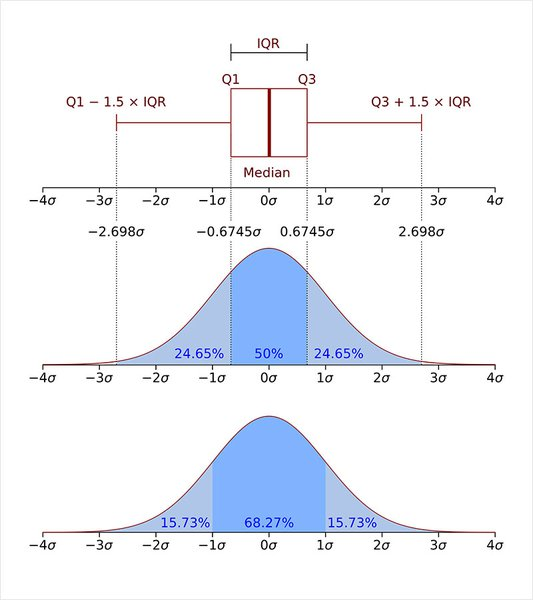

# Findamental 10 다양한 데이터 전처리 기법

## 10-1. 들어가며

데이터 전처리 

<aside>
💡 데이터 분석의 8할은 데이터 전처리이다.

</aside>

데이터 준비

```python
import pandas as pd
import numpy as np
import matplotlib.pyplot as plt
import os

csv_file_path = os.getenv('HOME')+'/aiffel/data_preprocess/data/trade.csv'
trade = pd.read_csv(csv_file_path) 
trade.head()
```

## 10-2. **결측치(Missing Data)**

결측치를 처리하는 방법 

1. 결측치가 있는 데이터를 제거
2. 결측치를 어떤 값으로 대체

결측치 처리 전 결측치 확인

```python
print('컬럼별 결측치 개수')
len(trade) - trade.count()

>>>
컬럼별 결측치 개수
기간        0
국가명       0
수출건수      3
수출금액      4
수입건수      3
수입금액      3
무역수지      4
기타사항    199
dtype: int64

# 기타사항에는 199개의 결측치가 있음 
```

큰 결측치인 부분 제거 

```python
trade = trade.drop('기타사항', axis=1)
trade.head()
```

작은 결측치 확인 

```python
DataFrame.isnull() # 데이터마다 결측치 여부를 True, False로 반환
DataFrame.any(axis=1) # 행마다 하나라도 True가 있으면 True반환

trade.isnull().any(axis=1) # 한 번에 확인

trade[trade.isnull().any(axis=1)] # 위에 코드를 다시 데이터에 넣어주면 
																	# 값이 True인것들(결측치)만 추출함
# 결측치를 제거 
trade.dropna(how='all', subset=['수출건수', '수출금액', '수입건수', '수입금액', '무역수지'], inplace=True)
```

<aside>
💡 결측치가 있는 행에서 하나이상의 데이터가 존재할 경우 제거보다는 대체하는것이 좋음

대체방법 
1. 근처 데이터의 평균, 중앙값으로 대체 
2. 머신러닝 모델로 예측

</aside>

```python
trade.loc[[188, 191, 194]] # 해당 라벨을 가진 데이터 출력
```

데이터가 범주형인 경우 결측치 대체 방법

1. 새로운 범주를 만들어 대체
2. 최빈값으로 대체 (결측치가 많을 경우 X)
3. 예측값
4. 시계열 데이터(날짜별)는 앞뒤 데이터를 보고 보완 

## 10-3. **중복된 데이터**

중복데이터 확인

```python
trade.duplicated() # 중복데이터 확인
trade[trade.duplicated()] # 중복데이터 추출
trade[(trade['기간']=='2020년 03월')&(trade['국가명']=='중국')] # 다른 중복데이터 확인
```

중복데이터 삭제

```python
trade.drop_duplicates(inplace=True) # 중복데이터 삭제
df.drop_duplicates(subset=['id'], keep='first') # subset으로 id지정, keep으로 지울 순서 지정
```

## 10-4. 이상치(Outlier)

<aside>
💡 이상치란 ?
→ 대부분 값의 범위레서 벗어나 극단적으로 크거나 작은 값

</aside>

이상치 찾는 방법 (anomaly detection)

### 1. z score방법 (평균과 표준편차 이용)

$$
(데이터 - 평균) / 표준편차 -> z score({\frac {X-\mu }{\sigma }})
$$

→ z score가 특정 기준을 넘어서는 데이터에 대해 이상치라고 판단

이상치 처리 방법

1. 이상치 삭제 후 이상치끼리 따로 분석
2. 이상치를 다른 값으로 대체 
3. 예측 모델을 활용해 예측값으로 대체
4. binning을 통해 수치형 데이터를 범주형으로 대체

실전 z-score method 

```python
def outlier(df, col, z):
    return df[abs(df[col] - np.mean(df[col]))/np.std(df[col])>z].index
# 데이터에서 평균을 뺀 뒤 표준편차로 나누고 기준(z)이상인 값의 index추출 
# '>z' -> '<=z'로 바꾸면 이상치가 아닌값만 추출 

# 활용
trade.loc[outlier(trade, '무역수지', 1.5)] # 무역수지행에 기준(1.5)이상인 값의 index추출
```

### 2. IQR method 활용(사분위 범위수)

$$
IQR=Q3​−Q1​

$$



실전 IQR method 

```python
# IQR 구하기
Q3, Q1 = np.percentile(data, [75 ,25])
IQR = Q3 - Q1

# 이상치 구하기
data[(Q1-1.5*IQR > data)|(Q3+1.5*IQR < data)]
```

z-score method의 단점 

1. 평균과 표준편차가 이상치 존재에 영향을 받는다.
2. 작은 데이터의 경우 이상치를 찾기 어렵다

## 10-5. **정규화(Normalization)**

정규화의 필요성 

<aside>
💡 데이터의 col마다 단위가 다르다 
예를 들어) **데이터의 범위가 0에서 1 사이인 컬럼 A과 1000에서 10000 사이인 컬럼 B가 있고 이런 데이터를 클러스터링 한다고 가정하면 데이터 간의 거리를 잴 때, 범위가 큰 컬럼 B의 값에만 영향을 크게 받는다**

</aside>

정규화 방법

### 1. 표준화(standardization)

데이터의 평균은 0, 분산은 1로 변환

$$
\frac{X−μ}{σ} 
$$

### 2. Min-Max Scaling

데이터의 최솟값은 0, 최댓값은 1로 변환

$$
\frac{X−Xmin}{Xmax−Xmin}
$$

표준화, Min-Max Scaling 활용

```python
# 데이터 x를 Standardization 기법으로 정규화합니다. 
x_standardization = (x - x.mean())/x.std()
# 데이터 x를 min-max scaling 기법으로 정규화합니다. 
x_min_max = (x-x.min())/(x.max()-x.min())

```

### 주의!

<aside>
💡 **train 데이터와 test 데이터가 나눠져 있는 경우 train 데이터를 정규화시켰던 기준 그대로 test 데이터도 정규화 시켜줘야 한다.**

</aside>

scikit-learn 패키지 활용

```python
#form sklearn.preprocessing.StandarrScaler()
from sklearn.preprocessing import MinMaxScaler
train = [[10, -10], [30, 10], [50, 0]]
test = [[0, 1]]
scaler = MinMaxScaler()

scaler.fit_transform(train)
scaler.transform(test)

# fit_transform은 training data, transform은 test data
# fit_transform으로 mean값과 variance값을 학습 후 transform로 test data에 적용
```

## 10-6. **원-핫 인코딩(One-Hot Encoding)**

<aside>
💡 원-핫 인코딩이란? 
→ 카테고리별 이진 특성을 만들어 해당하느 특성만 1, 나머지는 0으로 만드는 방법

</aside>

활용

```python
#trade 데이터의 국가명 컬럼 원본
print(trade['국가명'].head())  

# get_dummies를 통해 국가명 원-핫 인코딩
country = pd.get_dummies(trade['국가명'])

# 원본 데이터와 원-핫 인코딩 데이터 합치기
trade = pd.concat([trade, country], axis=1)

# 컬럼 삭제
trade.drop(['국가명'], axis=1, inplace=True)
```

## 10-7. **구간화(Binning)**

<aside>
💡 구간화란? 
→ 수치형 데이터를 범주형 데이터로 바꿀 때 사용하는 방법

</aside>

활용

```python
# 구간 설정
bins = [0, 2000, 4000, 6000, 8000, 10000]

# cut()함수를 이용해 구간 나누기
ctg = pd.cut(salary, bins=bins)

# 확인 
print('salary[0]:', salary[0])
print('salary[0]가 속한 카테고리:', ctg[0])

# 구간별 value cnt 확인
ctg.value_counts().sort_index()

# qcut()을 이용해 데이터의 분포를 비슷한 크기의 그룹으로 나눔
ctg = pd.qcut(salary, q=5)
```