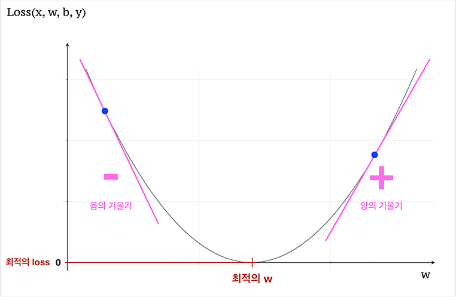

# Fundamental 05 

## 1. 맥북의 중고가 맞춰보기

### 데이터 확인 
---


```python
import pandas as pd
```


```python
macbook = pd.read_csv('~/aiffel/bike_regression/data/macbook.csv')
print(macbook.shape)
macbook.head()
```

    (80, 2)


<div>
<table border="1" class="dataframe">
  <thead>
    <tr style="text-align: right;">
      <th></th>
      <th>used_years</th>
      <th>price</th>
    </tr>
  </thead>
  <tbody>
    <tr>
      <th>0</th>
      <td>2.65</td>
      <td>175</td>
    </tr>
    <tr>
      <th>1</th>
      <td>3.80</td>
      <td>63</td>
    </tr>
    <tr>
      <th>2</th>
      <td>0.95</td>
      <td>273</td>
    </tr>
    <tr>
      <th>3</th>
      <td>4.50</td>
      <td>133</td>
    </tr>
    <tr>
      <th>4</th>
      <td>4.45</td>
      <td>106</td>
    </tr>
  </tbody>
</table>
</div>


data : macbook.csv (실습을 위한 간의 데이터)          
shape : 데이터는 used_years(사용한 연도), price(가격) 두 개의 col을 갖는 80개의 데이터 셋이다.

### 데이터 시각화
---


```python
import matplotlib.pyplot as plt
# 실행한 브라우저에서 바로 그림을 볼 수 있게 해줌
%matplotlib inline 
%config InlineBackend.figure_format = 'retina' # 더 높은 해상도로 출력한다.
```


```python
plt.scatter(macbook['used_years'], macbook['price'])
plt.show()
```


    

    


x축(사용한 연도)으로 갈 수록 y축(가격)이 내려간다. 

### 상관관계 
---


상관관계와 상관계수는 두 변수 간의 패턴을 나타내는 것이 아닌, 각 값의 증가 또는 감소에 대한 관계만을 나타낸다.        
이러한 상관관계를 볼 때 macbook데이터는 음의 상관관계를 갖는다고 할 수 있다.

### 상관계수 구해보기 
---


```python
import numpy as np

# np.corrcoef(x, y)를 사용합니다.
np.corrcoef(macbook['used_years'], macbook['price'])
```


    array([[ 1.        , -0.78972238],
           [-0.78972238,  1.        ]])


(0,0), (1,1)은 자기자신의 상관관계를 나타내고 나머지는 둘의 상관관게를 나타낸다.      
-0.78972238로 큰 음의 상관관계를 나타내는 것을 볼 수 있다.

### 모델 구현하기 
---


```python
x = macbook["used_years"].values
y = macbook["price"].values
```


```python
def model(x, w, b):
    y = w * x + b
    return y

model(5, 2, 1)
```


    11


```python
# x축, y축 그리기
plt.axvline(x=0, c='black')
plt.axhline(y=0, c='black')

# y = wx + b 일차함수 그리기
x = np.linspace(0, 8, 9)
y = model(x, w=-20, b=140) # y = -20x + 140
plt.plot(y)

# 나의 (x, y) 점 찍기
x_data = [2, 5, 6]
y_data = [100, 40, 20]
plt.scatter(x_data, y_data, c='r', s=50)

plt.show()
```


    

    


지금 구현한 모델은 일차함수로 구현하였다. 하지만 우리의 데이터는 일차함수처럼 일직선 상에 놓이지 않는다. 그렇기 때문에 가장 오차가 적은 일차함수를 구현해야한다.

### 정답과 예측값 간의 차이
---


```python
w = 3.1
b = 2.3

x = np.linspace(0, 5, 6)
y = model(x, w, b) # y = 3.1x + 2.3

x = macbook["used_years"].values
prediction = model(x, w, b) # 현재 w = 3.1, b = 2.3
macbook['prediction'] = prediction

macbook['error'] = macbook['price'] - macbook['prediction']
macbook.head()
```


<div>
<style scoped>
    .dataframe tbody tr th:only-of-type {
        vertical-align: middle;
    }

    .dataframe tbody tr th {
        vertical-align: top;
    }

    .dataframe thead th {
        text-align: right;
    }
</style>
<table border="1" class="dataframe">
  <thead>
    <tr style="text-align: right;">
      <th></th>
      <th>used_years</th>
      <th>price</th>
      <th>prediction</th>
      <th>error</th>
    </tr>
  </thead>
  <tbody>
    <tr>
      <th>0</th>
      <td>2.65</td>
      <td>175</td>
      <td>10.515</td>
      <td>164.485</td>
    </tr>
    <tr>
      <th>1</th>
      <td>3.80</td>
      <td>63</td>
      <td>14.080</td>
      <td>48.920</td>
    </tr>
    <tr>
      <th>2</th>
      <td>0.95</td>
      <td>273</td>
      <td>5.245</td>
      <td>267.755</td>
    </tr>
    <tr>
      <th>3</th>
      <td>4.50</td>
      <td>133</td>
      <td>16.250</td>
      <td>116.750</td>
    </tr>
    <tr>
      <th>4</th>
      <td>4.45</td>
      <td>106</td>
      <td>16.095</td>
      <td>89.905</td>
    </tr>
  </tbody>
</table>
</div>


우리는 오차를 줄이기 위해 몇 가지의 지표를 사용할 수 있는데 이것은 정답 라벨에서 우리가 예측한 값들을 뺀값을 사용하는 방법이다.

모델이 얼마나 틀렸는지 평가하는 지표에는 MAE, MSE, RMSE, R-squared등이 있는데 우리는 RMSE를 사용할 것이다.


```python
def RMSE(a, b):
    mse = ((a - b) ** 2).mean()  # 두 값의 차이의 제곱의 평균
    rmse = mse ** 0.5        # MSE의 제곱근
    return rmse
```


```python
x = macbook["used_years"].values
y = macbook["price"].values

predictions = model(x, w, b)
rmse = RMSE(predictions, y)
rmse
```


    188.81322969819274


모델이 너무 부정확하기 때문에 rmse값이 매우 크게 나온것을 확인할 수 있다.

### 손실 함수
---


```python
def loss(x, w, b, y):
    predictions = model(x, w, b)
    L = RMSE(predictions, y)
    return L
```

모델의 예측값과 정답값에 대한 차이를 계산하는 함수를 손실함수라고 한다.

### 기울기와 경사하강법(Gradient Descent)
---

손실 함수를 줄이기 위해 우리가 바꿀 수 있는 변수는 w, b이 두 개뿐이다.




왼쪽 점은 자기 자신의 위치보다 오른쪽으로 갈수록 손실함수값이 점점 작아지기 때문에 그 점에서 그린 접선은 오른쪽 아래로 향하는 방향 이고, 그 기울기는 음수 입니다.        
오른쪽 점은 자기 자신의 위치보다 왼쪽으로 갈수록 손실함수값이 점점 작아지기 때문에 그 점에서 그린 접선은 왼쪽 아래로 향하는 방향이고, 그 기울기는 양수 입니다.


```python
def gradient(x, w, b, y):
    dw = (loss(x, w + 0.0001, b, y) - loss(x, w, b, y)) / 0.0001
    db = (loss(x, w, b + 0.0001, y) - loss(x, w, b, y)) / 0.0001
    return dw, db
```

### 하이퍼파라미터 
---

하이퍼파라미터란 학습률과 같이 모델이 스스로 학습해나가는 파라미터가 아니라, 사람이 직접 사전에 정하고 시작해야하는 파라미터이다.


```python
LEARNING_RATE = 1
```

### 모델 최적화 
---

학습을 하면서 손실 함수의 값을 저장할 배열 선언 


```python
losses = []
```

학습을 진행하면서 loss구하기


```python
for i in range(1, 2001):
    dw, db = gradient(x, w, b, y)   # 3, 4번: 모델이 prediction을 예측하고, 손실함수값을 계산함과 동시에 기울기 계산
    w -= LEARNING_RATE * dw         # 5번: w = w - η * dw 로 업데이트
    b -= LEARNING_RATE * db         # 5번: b = b - η * db 로 업데이트 
    L = loss(x, w, b, y)            # 현재의 loss 값 계산
    losses.append(L)                # loss 값 기록
    if i % 100 == 0:
        print('Iteration %d : Loss %0.4f' % (i, L))
```

    Iteration 100 : Loss 107.8708
    Iteration 200 : Loss 94.4397
    Iteration 300 : Loss 81.7335
    Iteration 400 : Loss 70.0698
    Iteration 500 : Loss 59.8849
    Iteration 600 : Loss 51.6766
    Iteration 700 : Loss 45.7883
    Iteration 800 : Loss 42.1201
    Iteration 900 : Loss 40.1217
    Iteration 1000 : Loss 39.1354
    Iteration 1100 : Loss 38.6763
    Iteration 1200 : Loss 38.4689
    Iteration 1300 : Loss 38.3766
    Iteration 1400 : Loss 38.3358
    Iteration 1500 : Loss 38.3178
    Iteration 1600 : Loss 38.3098
    Iteration 1700 : Loss 38.3063
    Iteration 1800 : Loss 38.3048
    Iteration 1900 : Loss 38.3041
    Iteration 2000 : Loss 38.3038


그래프 그리기


```python
plt.plot(losses)
plt.show()
```


    

    


그래프를 보니 학습을 진행할 수록 오차가 줄어드는 것을 볼 수 있다.


```python
w, b
```


    (-44.92802735596856, 293.082887486003)


```python
# 모델에 넣을 x 값들 준비
x = np.linspace(0, 5, 6)

# x, w, b를 모델에 넣어 y값 출력
y = model(x, w, b)

# 일차함수 y 그리기
plt.plot(y, c="r")


# 원본 데이터 점찍기
plt.scatter(macbook['used_years'], macbook['price'])
plt.show()
```


    

    


### Unseen data에 적용하기
---


```python
# 새로운 데이터 macbook_test 가져오기 
test = pd.read_csv("~/aiffel/bike_regression/data/macbook_test.csv")
print(test.shape)
test.head()
```

    (20, 2)


<div>
<style scoped>
    .dataframe tbody tr th:only-of-type {
        vertical-align: middle;
    }

    .dataframe tbody tr th {
        vertical-align: top;
    }

    .dataframe thead th {
        text-align: right;
    }
</style>
<table border="1" class="dataframe">
  <thead>
    <tr style="text-align: right;">
      <th></th>
      <th>used_years</th>
      <th>price</th>
    </tr>
  </thead>
  <tbody>
    <tr>
      <th>0</th>
      <td>1.20</td>
      <td>203</td>
    </tr>
    <tr>
      <th>1</th>
      <td>1.85</td>
      <td>206</td>
    </tr>
    <tr>
      <th>2</th>
      <td>2.40</td>
      <td>191</td>
    </tr>
    <tr>
      <th>3</th>
      <td>2.85</td>
      <td>164</td>
    </tr>
    <tr>
      <th>4</th>
      <td>3.05</td>
      <td>176</td>
    </tr>
  </tbody>
</table>
</div>


```python
test_x = test['used_years'].values
test_y = test['price'].values

prediction = model(test_x, w, b)
test['prediction'] = prediction
test
```


<div>
<style scoped>
    .dataframe tbody tr th:only-of-type {
        vertical-align: middle;
    }

    .dataframe tbody tr th {
        vertical-align: top;
    }

    .dataframe thead th {
        text-align: right;
    }
</style>
<table border="1" class="dataframe">
  <thead>
    <tr style="text-align: right;">
      <th></th>
      <th>used_years</th>
      <th>price</th>
      <th>prediction</th>
    </tr>
  </thead>
  <tbody>
    <tr>
      <th>0</th>
      <td>1.20</td>
      <td>203</td>
      <td>239.169255</td>
    </tr>
    <tr>
      <th>1</th>
      <td>1.85</td>
      <td>206</td>
      <td>209.966037</td>
    </tr>
    <tr>
      <th>2</th>
      <td>2.40</td>
      <td>191</td>
      <td>185.255622</td>
    </tr>
    <tr>
      <th>3</th>
      <td>2.85</td>
      <td>164</td>
      <td>165.038010</td>
    </tr>
    <tr>
      <th>4</th>
      <td>3.05</td>
      <td>176</td>
      <td>156.052404</td>
    </tr>
    <tr>
      <th>5</th>
      <td>3.35</td>
      <td>136</td>
      <td>142.573996</td>
    </tr>
    <tr>
      <th>6</th>
      <td>2.55</td>
      <td>133</td>
      <td>178.516418</td>
    </tr>
    <tr>
      <th>7</th>
      <td>2.60</td>
      <td>181</td>
      <td>176.270016</td>
    </tr>
    <tr>
      <th>8</th>
      <td>2.50</td>
      <td>181</td>
      <td>180.762819</td>
    </tr>
    <tr>
      <th>9</th>
      <td>3.10</td>
      <td>86</td>
      <td>153.806003</td>
    </tr>
    <tr>
      <th>10</th>
      <td>2.70</td>
      <td>171</td>
      <td>171.777214</td>
    </tr>
    <tr>
      <th>11</th>
      <td>3.40</td>
      <td>253</td>
      <td>140.327594</td>
    </tr>
    <tr>
      <th>12</th>
      <td>1.30</td>
      <td>263</td>
      <td>234.676452</td>
    </tr>
    <tr>
      <th>13</th>
      <td>1.80</td>
      <td>129</td>
      <td>212.212438</td>
    </tr>
    <tr>
      <th>14</th>
      <td>3.10</td>
      <td>135</td>
      <td>153.806003</td>
    </tr>
    <tr>
      <th>15</th>
      <td>1.55</td>
      <td>236</td>
      <td>223.444445</td>
    </tr>
    <tr>
      <th>16</th>
      <td>1.80</td>
      <td>206</td>
      <td>212.212438</td>
    </tr>
    <tr>
      <th>17</th>
      <td>3.55</td>
      <td>203</td>
      <td>133.588390</td>
    </tr>
    <tr>
      <th>18</th>
      <td>3.40</td>
      <td>96</td>
      <td>140.327594</td>
    </tr>
    <tr>
      <th>19</th>
      <td>2.50</td>
      <td>115</td>
      <td>180.762819</td>
    </tr>
  </tbody>
</table>
</div>


```python
test['error'] = test['price'] - test['prediction']
test
```


<div>
<style scoped>
    .dataframe tbody tr th:only-of-type {
        vertical-align: middle;
    }

    .dataframe tbody tr th {
        vertical-align: top;
    }

    .dataframe thead th {
        text-align: right;
    }
</style>
<table border="1" class="dataframe">
  <thead>
    <tr style="text-align: right;">
      <th></th>
      <th>used_years</th>
      <th>price</th>
      <th>prediction</th>
      <th>error</th>
    </tr>
  </thead>
  <tbody>
    <tr>
      <th>0</th>
      <td>1.20</td>
      <td>203</td>
      <td>239.169255</td>
      <td>-36.169255</td>
    </tr>
    <tr>
      <th>1</th>
      <td>1.85</td>
      <td>206</td>
      <td>209.966037</td>
      <td>-3.966037</td>
    </tr>
    <tr>
      <th>2</th>
      <td>2.40</td>
      <td>191</td>
      <td>185.255622</td>
      <td>5.744378</td>
    </tr>
    <tr>
      <th>3</th>
      <td>2.85</td>
      <td>164</td>
      <td>165.038010</td>
      <td>-1.038010</td>
    </tr>
    <tr>
      <th>4</th>
      <td>3.05</td>
      <td>176</td>
      <td>156.052404</td>
      <td>19.947596</td>
    </tr>
    <tr>
      <th>5</th>
      <td>3.35</td>
      <td>136</td>
      <td>142.573996</td>
      <td>-6.573996</td>
    </tr>
    <tr>
      <th>6</th>
      <td>2.55</td>
      <td>133</td>
      <td>178.516418</td>
      <td>-45.516418</td>
    </tr>
    <tr>
      <th>7</th>
      <td>2.60</td>
      <td>181</td>
      <td>176.270016</td>
      <td>4.729984</td>
    </tr>
    <tr>
      <th>8</th>
      <td>2.50</td>
      <td>181</td>
      <td>180.762819</td>
      <td>0.237181</td>
    </tr>
    <tr>
      <th>9</th>
      <td>3.10</td>
      <td>86</td>
      <td>153.806003</td>
      <td>-67.806003</td>
    </tr>
    <tr>
      <th>10</th>
      <td>2.70</td>
      <td>171</td>
      <td>171.777214</td>
      <td>-0.777214</td>
    </tr>
    <tr>
      <th>11</th>
      <td>3.40</td>
      <td>253</td>
      <td>140.327594</td>
      <td>112.672406</td>
    </tr>
    <tr>
      <th>12</th>
      <td>1.30</td>
      <td>263</td>
      <td>234.676452</td>
      <td>28.323548</td>
    </tr>
    <tr>
      <th>13</th>
      <td>1.80</td>
      <td>129</td>
      <td>212.212438</td>
      <td>-83.212438</td>
    </tr>
    <tr>
      <th>14</th>
      <td>3.10</td>
      <td>135</td>
      <td>153.806003</td>
      <td>-18.806003</td>
    </tr>
    <tr>
      <th>15</th>
      <td>1.55</td>
      <td>236</td>
      <td>223.444445</td>
      <td>12.555555</td>
    </tr>
    <tr>
      <th>16</th>
      <td>1.80</td>
      <td>206</td>
      <td>212.212438</td>
      <td>-6.212438</td>
    </tr>
    <tr>
      <th>17</th>
      <td>3.55</td>
      <td>203</td>
      <td>133.588390</td>
      <td>69.411610</td>
    </tr>
    <tr>
      <th>18</th>
      <td>3.40</td>
      <td>96</td>
      <td>140.327594</td>
      <td>-44.327594</td>
    </tr>
    <tr>
      <th>19</th>
      <td>2.50</td>
      <td>115</td>
      <td>180.762819</td>
      <td>-65.762819</td>
    </tr>
  </tbody>
</table>
</div>


```python
rmse = ((test['error'] ** 2).sum() / len(test)) ** 0.5
rmse
```


    45.039281182770374


```python
# 모델 일차함수 그리기
x = np.linspace(0, 5, 6)
y = model(x, w, b)
plt.plot(y, c="r")

# 실제 데이터 값
plt.scatter(test['used_years'], test['price'])

# 모델이 예측한 값
plt.scatter(test['used_years'], test['prediction'])
plt.show()
```


    

    


## 2. 손님의 성별, 수, 총 결제 금액 등으로 내가 받을 팁 예측하기

### 데이터 확인하기 
---


```python
import seaborn as sns

tips = sns.load_dataset("tips")
print(tips.shape)
tips.head()
```

    (244, 7)


<div>
<style scoped>
    .dataframe tbody tr th:only-of-type {
        vertical-align: middle;
    }

    .dataframe tbody tr th {
        vertical-align: top;
    }

    .dataframe thead th {
        text-align: right;
    }
</style>
<table border="1" class="dataframe">
  <thead>
    <tr style="text-align: right;">
      <th></th>
      <th>total_bill</th>
      <th>tip</th>
      <th>sex</th>
      <th>smoker</th>
      <th>day</th>
      <th>time</th>
      <th>size</th>
    </tr>
  </thead>
  <tbody>
    <tr>
      <th>0</th>
      <td>16.99</td>
      <td>1.01</td>
      <td>Female</td>
      <td>No</td>
      <td>Sun</td>
      <td>Dinner</td>
      <td>2</td>
    </tr>
    <tr>
      <th>1</th>
      <td>10.34</td>
      <td>1.66</td>
      <td>Male</td>
      <td>No</td>
      <td>Sun</td>
      <td>Dinner</td>
      <td>3</td>
    </tr>
    <tr>
      <th>2</th>
      <td>21.01</td>
      <td>3.50</td>
      <td>Male</td>
      <td>No</td>
      <td>Sun</td>
      <td>Dinner</td>
      <td>3</td>
    </tr>
    <tr>
      <th>3</th>
      <td>23.68</td>
      <td>3.31</td>
      <td>Male</td>
      <td>No</td>
      <td>Sun</td>
      <td>Dinner</td>
      <td>2</td>
    </tr>
    <tr>
      <th>4</th>
      <td>24.59</td>
      <td>3.61</td>
      <td>Female</td>
      <td>No</td>
      <td>Sun</td>
      <td>Dinner</td>
      <td>4</td>
    </tr>
  </tbody>
</table>
</div>


```python
# 데이터를 다루기 위해 문자열을 실수값으로 변환하기
import pandas as pd

tips = pd.get_dummies(tips, columns=['sex', 'smoker', 'day', 'time'])
tips.head()
```


<div>
<style scoped>
    .dataframe tbody tr th:only-of-type {
        vertical-align: middle;
    }

    .dataframe tbody tr th {
        vertical-align: top;
    }

    .dataframe thead th {
        text-align: right;
    }
</style>
<table border="1" class="dataframe">
  <thead>
    <tr style="text-align: right;">
      <th></th>
      <th>total_bill</th>
      <th>tip</th>
      <th>size</th>
      <th>sex_Male</th>
      <th>sex_Female</th>
      <th>smoker_Yes</th>
      <th>smoker_No</th>
      <th>day_Thur</th>
      <th>day_Fri</th>
      <th>day_Sat</th>
      <th>day_Sun</th>
      <th>time_Lunch</th>
      <th>time_Dinner</th>
    </tr>
  </thead>
  <tbody>
    <tr>
      <th>0</th>
      <td>16.99</td>
      <td>1.01</td>
      <td>2</td>
      <td>0</td>
      <td>1</td>
      <td>0</td>
      <td>1</td>
      <td>0</td>
      <td>0</td>
      <td>0</td>
      <td>1</td>
      <td>0</td>
      <td>1</td>
    </tr>
    <tr>
      <th>1</th>
      <td>10.34</td>
      <td>1.66</td>
      <td>3</td>
      <td>1</td>
      <td>0</td>
      <td>0</td>
      <td>1</td>
      <td>0</td>
      <td>0</td>
      <td>0</td>
      <td>1</td>
      <td>0</td>
      <td>1</td>
    </tr>
    <tr>
      <th>2</th>
      <td>21.01</td>
      <td>3.50</td>
      <td>3</td>
      <td>1</td>
      <td>0</td>
      <td>0</td>
      <td>1</td>
      <td>0</td>
      <td>0</td>
      <td>0</td>
      <td>1</td>
      <td>0</td>
      <td>1</td>
    </tr>
    <tr>
      <th>3</th>
      <td>23.68</td>
      <td>3.31</td>
      <td>2</td>
      <td>1</td>
      <td>0</td>
      <td>0</td>
      <td>1</td>
      <td>0</td>
      <td>0</td>
      <td>0</td>
      <td>1</td>
      <td>0</td>
      <td>1</td>
    </tr>
    <tr>
      <th>4</th>
      <td>24.59</td>
      <td>3.61</td>
      <td>4</td>
      <td>0</td>
      <td>1</td>
      <td>0</td>
      <td>1</td>
      <td>0</td>
      <td>0</td>
      <td>0</td>
      <td>1</td>
      <td>0</td>
      <td>1</td>
    </tr>
  </tbody>
</table>
</div>


```python
tips = tips[['total_bill', 'size', 'sex_Male', 'sex_Female', 'smoker_Yes', 'smoker_No',
             'day_Thur', 'day_Fri', 'day_Sat', 'day_Sun', 'time_Lunch', 'time_Dinner', 'tip']]
tips.head()
```


<div>
<style scoped>
    .dataframe tbody tr th:only-of-type {
        vertical-align: middle;
    }

    .dataframe tbody tr th {
        vertical-align: top;
    }

    .dataframe thead th {
        text-align: right;
    }
</style>
<table border="1" class="dataframe">
  <thead>
    <tr style="text-align: right;">
      <th></th>
      <th>total_bill</th>
      <th>size</th>
      <th>sex_Male</th>
      <th>sex_Female</th>
      <th>smoker_Yes</th>
      <th>smoker_No</th>
      <th>day_Thur</th>
      <th>day_Fri</th>
      <th>day_Sat</th>
      <th>day_Sun</th>
      <th>time_Lunch</th>
      <th>time_Dinner</th>
      <th>tip</th>
    </tr>
  </thead>
  <tbody>
    <tr>
      <th>0</th>
      <td>16.99</td>
      <td>2</td>
      <td>0</td>
      <td>1</td>
      <td>0</td>
      <td>1</td>
      <td>0</td>
      <td>0</td>
      <td>0</td>
      <td>1</td>
      <td>0</td>
      <td>1</td>
      <td>1.01</td>
    </tr>
    <tr>
      <th>1</th>
      <td>10.34</td>
      <td>3</td>
      <td>1</td>
      <td>0</td>
      <td>0</td>
      <td>1</td>
      <td>0</td>
      <td>0</td>
      <td>0</td>
      <td>1</td>
      <td>0</td>
      <td>1</td>
      <td>1.66</td>
    </tr>
    <tr>
      <th>2</th>
      <td>21.01</td>
      <td>3</td>
      <td>1</td>
      <td>0</td>
      <td>0</td>
      <td>1</td>
      <td>0</td>
      <td>0</td>
      <td>0</td>
      <td>1</td>
      <td>0</td>
      <td>1</td>
      <td>3.50</td>
    </tr>
    <tr>
      <th>3</th>
      <td>23.68</td>
      <td>2</td>
      <td>1</td>
      <td>0</td>
      <td>0</td>
      <td>1</td>
      <td>0</td>
      <td>0</td>
      <td>0</td>
      <td>1</td>
      <td>0</td>
      <td>1</td>
      <td>3.31</td>
    </tr>
    <tr>
      <th>4</th>
      <td>24.59</td>
      <td>4</td>
      <td>0</td>
      <td>1</td>
      <td>0</td>
      <td>1</td>
      <td>0</td>
      <td>0</td>
      <td>0</td>
      <td>1</td>
      <td>0</td>
      <td>1</td>
      <td>3.61</td>
    </tr>
  </tbody>
</table>
</div>


### 모델 구현하기 
---

train, test 데이터셋 준비


```python
X = tips[['total_bill', 'size', 'sex_Male', 'sex_Female', 'smoker_Yes', 'smoker_No',
          'day_Thur', 'day_Fri', 'day_Sat', 'day_Sun', 'time_Lunch', 'time_Dinner']].values
y = tips['tip'].values
```


```python
from sklearn.model_selection import train_test_split

X_train, X_test, y_train, y_test = train_test_split(X, y, test_size=0.2, random_state=42)

print(X_train.shape, y_train.shape)
print(X_test.shape, y_test.shape)
```

    (195, 12) (195,)
    (49, 12) (49,)


가중치, 편향 초기화


```python
import numpy as np

W = np.random.rand(12)
b = np.random.rand()
```

모델 구현 


```python
def model(X, W, b):
    predictions = 0
    for i in range(12):
        predictions += X[:, i] * W[i]
    predictions += b
    return predictions
```

손실 함수 구현


```python
def MSE(a, b):
    mse = ((a - b) ** 2).mean()  # 두 값의 차이의 제곱의 평균
    return mse
```


```python
def loss(X, W, b, y):
    predictions = model(X, W, b)
    L = MSE(predictions, y)
    return L
```

기울기 


```python
def gradient(X, W, b, y):
    # N은 가중치의 개수
    N = len(W)
    
    # y_pred 준비
    y_pred = model(X, W, b)
    
    # 공식에 맞게 gradient 계산
    dW = 1/N * 2 * X.T.dot(y_pred - y)
        
    # b의 gradient 계산
    db = 2 * (y_pred - y).mean()
    return dW, db
```


```python
dW, db = gradient(X, W, b, y)
print("dW:", dW)
print("db:", db)
```

    dW: [14428.59079778  1751.21974468   417.01234212   208.91814472
       251.36926445   374.56122239   140.45304262    42.98158454
       229.92678479   212.56907491   150.9676628    474.96282405]
    db: 30.78346656616838


모델 학습


```python
LEARNING_RATE = 0.0001

losses = []

for i in range(1, 1001):
    dW, db = gradient(X_train, W, b, y_train)
    W -= LEARNING_RATE * dW
    b -= LEARNING_RATE * db
    L = loss(X_train, W, b, y_train)
    losses.append(L)
    if i % 10 == 0:
        print('Iteration %d : Loss %0.4f' % (i, L))
```

    Iteration 10 : Loss 2.4343
    Iteration 20 : Loss 2.3668
    Iteration 30 : Loss 2.3141
    Iteration 40 : Loss 2.2643
    Iteration 50 : Loss 2.2173
    Iteration 60 : Loss 2.1728
    Iteration 70 : Loss 2.1308
    Iteration 80 : Loss 2.0911
    Iteration 90 : Loss 2.0535
    Iteration 100 : Loss 2.0180
    Iteration 110 : Loss 1.9843
    Iteration 120 : Loss 1.9524
    Iteration 130 : Loss 1.9222
    Iteration 140 : Loss 1.8935
    Iteration 150 : Loss 1.8663
    Iteration 160 : Loss 1.8404
    Iteration 170 : Loss 1.8159
    Iteration 180 : Loss 1.7926
    Iteration 190 : Loss 1.7704
    Iteration 200 : Loss 1.7494
    Iteration 210 : Loss 1.7293
    Iteration 220 : Loss 1.7102
    Iteration 230 : Loss 1.6920
    Iteration 240 : Loss 1.6746
    Iteration 250 : Loss 1.6581
    Iteration 260 : Loss 1.6423
    Iteration 270 : Loss 1.6272
    Iteration 280 : Loss 1.6128
    Iteration 290 : Loss 1.5990
    Iteration 300 : Loss 1.5858
    Iteration 310 : Loss 1.5732
    Iteration 320 : Loss 1.5611
    Iteration 330 : Loss 1.5495
    Iteration 340 : Loss 1.5384
    Iteration 350 : Loss 1.5277
    Iteration 360 : Loss 1.5175
    Iteration 370 : Loss 1.5077
    Iteration 380 : Loss 1.4982
    Iteration 390 : Loss 1.4891
    Iteration 400 : Loss 1.4804
    Iteration 410 : Loss 1.4720
    Iteration 420 : Loss 1.4639
    Iteration 430 : Loss 1.4561
    Iteration 440 : Loss 1.4486
    Iteration 450 : Loss 1.4413
    Iteration 460 : Loss 1.4343
    Iteration 470 : Loss 1.4275
    Iteration 480 : Loss 1.4210
    Iteration 490 : Loss 1.4146
    Iteration 500 : Loss 1.4085
    Iteration 510 : Loss 1.4026
    Iteration 520 : Loss 1.3969
    Iteration 530 : Loss 1.3913
    Iteration 540 : Loss 1.3859
    Iteration 550 : Loss 1.3807
    Iteration 560 : Loss 1.3756
    Iteration 570 : Loss 1.3707
    Iteration 580 : Loss 1.3659
    Iteration 590 : Loss 1.3613
    Iteration 600 : Loss 1.3568
    Iteration 610 : Loss 1.3524
    Iteration 620 : Loss 1.3481
    Iteration 630 : Loss 1.3440
    Iteration 640 : Loss 1.3399
    Iteration 650 : Loss 1.3360
    Iteration 660 : Loss 1.3322
    Iteration 670 : Loss 1.3284
    Iteration 680 : Loss 1.3248
    Iteration 690 : Loss 1.3213
    Iteration 700 : Loss 1.3178
    Iteration 710 : Loss 1.3144
    Iteration 720 : Loss 1.3111
    Iteration 730 : Loss 1.3079
    Iteration 740 : Loss 1.3047
    Iteration 750 : Loss 1.3017
    Iteration 760 : Loss 1.2987
    Iteration 770 : Loss 1.2957
    Iteration 780 : Loss 1.2929
    Iteration 790 : Loss 1.2900
    Iteration 800 : Loss 1.2873
    Iteration 810 : Loss 1.2846
    Iteration 820 : Loss 1.2820
    Iteration 830 : Loss 1.2794
    Iteration 840 : Loss 1.2769
    Iteration 850 : Loss 1.2744
    Iteration 860 : Loss 1.2720
    Iteration 870 : Loss 1.2696
    Iteration 880 : Loss 1.2673
    Iteration 890 : Loss 1.2650
    Iteration 900 : Loss 1.2628
    Iteration 910 : Loss 1.2606
    Iteration 920 : Loss 1.2584
    Iteration 930 : Loss 1.2563
    Iteration 940 : Loss 1.2542
    Iteration 950 : Loss 1.2522
    Iteration 960 : Loss 1.2502
    Iteration 970 : Loss 1.2482
    Iteration 980 : Loss 1.2463
    Iteration 990 : Loss 1.2444
    Iteration 1000 : Loss 1.2426


```python
import matplotlib.pyplot as plt
plt.plot(losses)
plt.show()
```


    

    


평가 하기


```python
prediction = model(X_test, W, b)
mse = loss(X_test, W, b, y_test)
mse
```


    0.6750051905605389


```python
plt.scatter(X_test[:, 0], y_test)
plt.scatter(X_test[:, 0], prediction)
plt.show()
```


    

    


## 3. 라이브러리 활용하기 

### 데이터 준비 
---


```python
tips = sns.load_dataset("tips")
tips = pd.get_dummies(tips, columns=['sex', 'smoker', 'day', 'time'])
tips = tips[['total_bill', 'size', 'sex_Male', 'sex_Female', 'smoker_Yes', 'smoker_No',
             'day_Thur', 'day_Fri', 'day_Sat', 'day_Sun', 'time_Lunch', 'time_Dinner', 'tip']]
```

train, test 데이터 셋 준비


```python
X = tips[['total_bill', 'size', 'sex_Male', 'sex_Female', 'smoker_Yes', 'smoker_No',
          'day_Thur', 'day_Fri', 'day_Sat', 'day_Sun', 'time_Lunch', 'time_Dinner']].values
y = tips['tip'].values

X_train, X_test, y_train, y_test = train_test_split(X, y, test_size=0.2, random_state=42)
```

모델 구현


```python
from sklearn.linear_model import LinearRegression

model = LinearRegression()
```

모델 학습


```python
model.fit(X_train, y_train)
```


    LinearRegression()


평가 하기


```python
predictions = model.predict(X_test)
predictions
```


    array([2.91436632, 2.00292613, 3.96425583, 3.76380832, 2.14836306,
           2.67423448, 3.63934628, 2.29147245, 2.57207155, 2.45851225,
           2.90446763, 2.0573337 , 2.11817193, 2.35130838, 1.82976215,
           3.10830675, 2.95140176, 3.21602976, 2.56640892, 5.73957295,
           3.43490366, 3.22645102, 2.17139823, 1.94180002, 3.16394533,
           2.24547894, 2.14497574, 3.21025435, 3.20097595, 6.66803147,
           5.01111235, 1.57804024, 3.1909877 , 2.76652194, 2.98412862,
           3.85695724, 2.17008741, 5.46673999, 2.35586827, 2.99190732,
           2.03271177, 2.48465991, 3.44046814, 2.35532237, 1.92528104,
           0.87348926, 1.81911521, 3.04083954, 1.85436902])


```python
from sklearn.metrics import mean_squared_error

mse = mean_squared_error(y_test, predictions)
mse
```


    0.7033566017436103


```python
plt.scatter(X_test[:, 0], y_test, label="true")
plt.scatter(X_test[:, 0], predictions, label="pred")
plt.legend()
plt.show()
```


    

    


```python

```


```python

```
