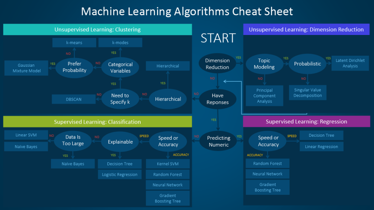

# Fundamental 12 사이킷런으로 구현해 보는 머신러닝

# 1. **다양한 머신러닝 알고리즘**

> 머신러닝의 알고리즘 종류 

지도학습 (Supervises Learning)
비지도학습 (Unsupervised Learning) 
강화학습 (Reinforcement Learning)
> 

상황이나 구현하고자 하는 Application에 따라 합쳐서 사용될 수 있다.

ex) 알파고의 경우 지도학습을 톨해 바둑 기보를 학습하고 강화학습으로 최적화하였다.

<머신러닝 알고리즘 치트 시트>



---

# 2. **사이킷런에서 가이드하는 머신러닝 알고리즘**


---

# 3. **Hello Scikit-learn**

### 설치

```bash
$ pip install scikit-learn
```

### 버전 확인

```python
import sklearn
print(sklearn.__version__)
```

---

# 4. **사이킷런의 주요 모듈**

### **데이터 표현법**

<aside>
💡 데이터 셋은 Numpy의 ndarry, Pandas의 DataFrame, SciPy의 Sparse Matrix로 표현할 수 있다.

</aside>

사이킷런의 주요 API


**특성 행렬(Feature Matrix)**

- **입력 데이터를 의미합니다.**
- **특성(feature): 데이터에서 수치 값, 이산 값, 불리언 값으로 표현되는 개별 관측치를 의미합니다. 행렬에서는 열에 해당하는 값입니다.**
- **표본(sample): 각 입력 데이터, 특성 행렬에서는 행에 해당하는 값입니다.**
- **`n_samples`: 행의 개수(표본의 개수)**
- **`n_features`: 열의 개수(특성의 개수)**
- **`X`: 통상 특성 행렬은 변수명 X로 표기합니다.**
- **`[n_samples, n_features]`은 [행, 열] 형태의 2차원 배열 구조를 사용하며 이는 *NumPy의 ndarray, Pandas의 DataFrame, SciPy의 Sparse Matrix*를 사용하여 나타낼 수 있습니다.**

**타겟 벡터 (Target Vector)**

- **입력 데이터의 라벨(정답) 을 의미합니다.**
- **목표(Target): 라벨, 타겟값, 목표값이라고도 부르며 특성 행렬(Feature Matrix)로부터 예측하고자 하는 것을 말합니다.**
- **`n_samples`: 벡터의 길이(라벨의 개수)**
- **타겟 벡터에서 `n_features`는 없습니다.**
- **`y`: 통상 타겟 벡터는 변수명 y로 표기합니다.**
- **타겟 벡터는 보통 1차원 벡터로 나타내며, 이는 *NumPy의 ndarray, Pandas의 Series*를 사용하여 나타낼 수 있습니다.**
- **(단, 타겟 벡터는 경우에 따라 1차원으로 나타내지 않을 수도 있습니다. 이 노드에서 사용되는 예제는 모두 1차원 벡터입니다.)**

### **회귀 모델 실습**

```python
# 데이터 생성
import numpy as np
import matplotlib.pyplot as plt
r = np.random.RandomState(10)
x = 10 * r.rand(100)
y = 2 * x - 3 * r.rand(100)
plt.scatter(x,y)

# 모델 생성
from sklearn.linear_model import LinearRegression
model = LinearRegression()
X = x.reshape(100,1)
y_new = model.predict(X)

#모델 분석
from sklearn.metrics import mean_squared_error

error = np.sqrt(mean_squared_error(y,y_new))
```

### **datasets 모듈**

사이킷런에서 제공하는 데이터 셋 살펴보기

```python
from sklearn.datasets import load_wine
data = load_wine()
type(data)
data.keys()
data.data
data.data.shape
data.data.ndim
data.target
data.target.shape
data.feature_names
data.target_names
print(data.DESCR)
```

### **사이킷런 데이터셋을 이용한 분류 문제 실습**

```python
import pandas as pd

pd.DataFrame(data.data, columns=data.feature_names)

X = data.data
y = data.target

from sklearn.ensemble import RandomForestClassifier
model = RandomForestClassifier()

model.fit(X, y)
y_pred = model.predict(X)

from sklearn.metrics import accuracy_score
from sklearn.metrics import classification_report

#타겟 벡터 즉 라벨인 변수명 y와 예측값 y_pred을 각각 인자로 넣습니다. 
print(classification_report(y, y_pred))
#정확도를 출력합니다. 
print("accuracy = ", accuracy_score(y, y_pred))
```

### **Estimator**

> Estimator → 데이터셋을 기반으로 머신러닝 모델의 파라미터를 추정하는 객체
> 

지도 학습 과정


비지도 학습 과정


---

# 5. **훈련 데이터와 테스트 데이터 분리하기**

> 훈련데이터와 예측데이터는 다른 것을 사용해야 한다.
> 

```python
from sklearn.model_selection import train_test_split

result = train_test_split(X, y, test_size=0.2, random_state=42)
# X_train, X_test, y_train, y_test = train_test_split(X, y, test_size=0.2, random_state=42)
```