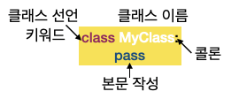

# Fundamental 13 당신의 행운의 숫자는? 나만의 n면체 주사위 위젯 만들기

# ****1. 객체 지향 프로그래밍****

## ****1) 객체란?****

파이썬에서는 정수, 실수, 문자열, 배열, 딕셔너리등등 모든것이 객체이다.

파이썬에서 object라 불리는 것들은 모두 변수에 할당될 수 있고, 함수의 인자로 넘겨질 수 있는 것들이다. 그러므로 파이썬에 나오는 모든 것들은 object이다.

> 요약
**• 파이썬에서는 모든 것(부울, 정수, 실수, 데이터구조(list,tuple,dict,set...), 함수, 프로그램, 모듈)이 객체다.
• 객체는 상태(state)를 나타내는 속성(attribute)과 동작(behavior)을 나타내는 메서드(method)가 있다.
• 객체의 속성은 변수로 구현된다. 객체의 메서드는 함수로 구현된다.**
> 

## ****2) 객체 지향 프로그래밍이란?****

**객체지향 프로그래밍(OOP: Object Oriented Programming)**

컴퓨터 언어 초창기에는 변수와 함수만을 표현해 왔다. 하지만 변수를 비슷한 변수를 여러개를 생성할 때 계속해서 다시 만들어야 하는 문제점이 발생하였다.

이를 해결하기 위해 일종의 ‘틀’ 역할을 하는 **class**라는 것을 만들었고 class로 찍어낸 것들을 **객체**라고 부르게 됬다.

# ****2. 클래스 기본 문법****

## ****1) 클래스 선언 및 인스턴스화****



기본 class문법

```python
class Car:
    pass

class Car():
    pass

#id(Car)는 여러번 호출해도 같은 값이 얻어집니다. 
print(id(Car))
print(id(Car))

#id(Car())는 Car()가 호출될 때마다 다른 값이 얻어집니다. 
print(id(Car()))
print(id(Car()))

# 두 객체의 type을 살펴봅니다. 
print(type(Car))
print(type(Car()))
```

class 사용 - 객체 인스턴스화

```python
mycar = Car()
mycar2 = Car()
print(id(mycar))
print(id(mycar2))
```

> 클래스명 표기법 : 카멜 케이스 
**예시: mycar —> MyCar

함수명 표기법 : 스네이크 케이스 
예시: mycar —> my_car**
> 

## ****2) 클래스 속성과 메서드****

클래스의 속성 : status를 의미하며, 속성은 변수로 나타낸다.

클래스의 메서드 : 동작을 의미하며, def 키워드로 나타낸다.

```python
# 클래스의 속성과 메서드 선언
class Car:
    color = 'red'
    category = 'sports car'
		
		# 클래스 메서드의 첫 번째 인자는 self값을 적어주어야 한다.
    def drive(self):
        print("I'm driving")

    def accel(self, speed_up, current_speed=10):
        self.speed_up = speed_up
        self.current_speed = current_speed + speed_up
        print("speed up", self.speed_up, "driving at", self.current_speed)
```

인스턴스 선언과 속성 & 메서드 접근

```python
# 인스턴스 만들기 
mycar = Car()

# 속성 접근
print(mycar.color)

# 메서드 호출
mycar.drive()
mycar.accel(5)

# 인스턴스에서 직접 메서드 물러오기 
Car.drive(mycar)

"""
>>>
red 
I'm driving
speed up 5 driving at 15
I'm driving
"""
```


**접두사 self** 

self는 인자를 통해 선언된 객체의 값이란 의미이다.

self는 클래스가 아닌 인스턴스화된 객체 자신의 속성이다.

> 요약
> 
> 
> **`self`는 자기 자신입니다.**
> 
> **클래스에 의해 생성된 객체(인스턴스)를 가리킵니다.**
> 
> **클래스의 메서드는 인자로 해당 인스턴스(`self`)를 받아야 합니다.**
> 
> **메서드를 호출할 때는 `self` 인자를 전달하지 않습니다. `self`의 값은 인터프리터가 제공합니다.**
> 
> **인스턴스 변수를 정의할 때에는 접두사 `self.`을 붙여줍니다.**
> 

## ****3) 생성자****

클래스에서 인스턴스 객체의 속성값을 초기화하는 방법은 생성자 (__**init**__)에서 초기화 하면 된다.

```python
class Car2:
    def __init__(self, color, category):
        self.color = color
        self.category = category

    def drive(self):
        print("I'm driving")

    def accel(self, speed_up, current_speed=10):
        self.speed_up = speed_up
        self.current_speed = current_speed + self.speed_up
        print("speed up", self.speed_up, "driving at", self.current_speed)
```

> 생성자 요약
> 
> 
> **`__init__`이라고 쓰고, "던더(Double Under) 이닛"이라고 발음합니다.**
> 
> **다른 객체 지향 언어를 알고 있는 독자라면 생성자라는 말을 들으면 객체 인스턴스화와 초기화 2가지 작업을 생각할 수 있습니다.**
> 
> **그러나 파이썬의 생성자는 초기화만 수행합니다. 그럼 객체 인스턴스화는 누가 할까요? 기억나시나요? 네, 바로 클래스 사용 시 변수 할당을 통해 이루어집니다.**
> 
> **그리고 이 `__init__`처럼 앞뒤에 언더바(_)가 두 개씩 있는 메서드를 매직 메서드 라고 합니다.**
> 
> **매직 메서드에 대해 더 알아보고 싶은 분은 [여기 링크](https://rszalski.github.io/magicmethods/)를 참고해 보세요.**
> 

## ****4) 클래스 변수와 인스턴스 변수****

클래스에서 변수를 선언하는 방법

- 보통 변수와 동일하겟 변수면을 쓰고 값을 할당하는 방법
- __**init**__메서드 안에 self.와 함께 설정하는 방법

```python
class Car:
    Manufacture = "India"

    def __init__(self, color, category='sedan'):
        self.color = color
        self.category = category
```

Manufacture : 클래스 변수

self.color : 인스턴스 변수

클래스 변수는 모든 객체에서 같은 값을 조회할 때 가능하다. 하지만 인스턴스  변수는 인스턴스 객체들 끼리 공유하지 않는다.

# ****3. 클래스, 조금 더 알아보기 - 상속****

```python
class Car:
    Manufacture = "India"

    def __init__(self, color='red', category='sedan'):
        self.color = color
        self.category = category

    def drive(self):
        print("I'm driving")

    def accel(self, speed_up, current_speed=10):
        self.speed_up = speed_up
        self.current_speed = current_speed + self.speed_up
        print("speed up", self.speed_up, "driving at", self.current_speed)

class NewCar(Car):
    pass

car = NewCar()
car.drive()
car.accel(10)
'''
>>>
I'm driving
speed up 10 driving at 20
'''
```

NewCar()클래스에 Car클래스를 넣어 Car클래스에서 사용할 수있는 변수와 메서드를 NewCar클래스에서 사용할 수 있다. 이러한 것을 상속이라고 한다.

```python
class NewCar(Car):
    maker = 'Porsche'

car = NewCar()
car.maker
```

또한 상속받은 클래스에서도 변수나 메서드를 만들어 사용할 수 있다.

> 자식 클래스, 부모 클래스
상속받은 클래스를 "자식 클래스", "서브 클래스(sub class)", "파생된 클래스(derived class)"라고 합니다.
기존 클래스를 "부모 클래스", "슈퍼 클래스(super class)", "베이스 클래스(base class)"라고 합니다.
> 

부모 메서드 호출하기 super()

부모 메서드 호출은 super()라는함수를 이용한다. 

# ****4. n면체 주사위 만들기****

```python
from random import randrange

class FunnyDice:
    def __init__(self, n=6):
        self.n = n
        self.options = list(range(1, n+1))
        self.index = randrange(0, self.n)
        self.val = self.options[self.index]
    
    def throw(self):
        self.index = randrange(0, self.n)
        self.val = self.options[self.index]
    
    def getval(self):
        return self.val
    
    def setval(self, val):
        if val <= self.n:
            self.val = val
        else:
            msg = "주사위에 없는 숫자입니다. 주사위는 1 ~ {0}까지 있습니다. ".format(self.n)
            raise ValueError(msg)

def get_inputs():
    n = int(input("주사위 면의 개수를 입력하세요: "))
    return n

def main():
    n = get_inputs()
    mydice = FunnyDice(n)
    mydice.throw()
    print("행운의 숫자는? {0}".format(mydice.getval()))

if __name__ == '__main__':
    main()
```