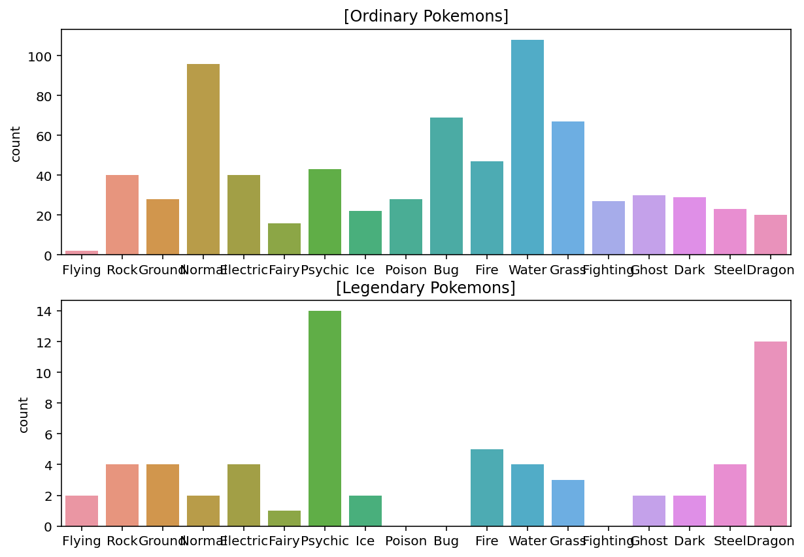

# Fundamental 15 가랏, 몬스터볼! 전설의 포켓몬 찾아 삼만리

# **포켓몬, 그 데이터는 어디서 구할까**

## **1) 안녕, 포켓몬과 인사해!**

오늘은 이상해씨, 피카츄, 파이리, 꼬부기 등 .. 일반 포켓몬이랑 칠색조와 같은 전설의 포켓몬을 공격력, 방어력 등의 스탯으로 분류해 볼 것이다. 이러한 과정을 **탐색적 데이터 분석 (Exploratory Data Analysis 이하 EDA)**이하고 한다.

## **2) 포켓몬, 그 데이터는 어디서 구할까\**

포켓몬 dataset은 케글에 업로드되어 있는 ‘’Pokemon with stats’’라는 데이터 셋이다. 

데이터의 구성은 다음과 같다.

- #: ID for each pokemon
- Name: Name of each pokemon
- Type 1: Each pokemon has a type, this determines weakness/resistance to attacks
- Type 2: Some pokemon are dual type and have 2
- Total: sum of all stats that come after this, a general guide to how strong a pokemon is
- HP: hit points, or health, defines how much damage a pokemon can withstand before fainting
- Attack: the base modifier for normal attacks (eg. Scratch, Punch)
- Defense: the base damage resistance against normal attacks
- SP Atk: special attack, the base modifier for special attacks (e.g. fire blast, bubble beam)
- SP Def: the base damage resistance against special attacks
- Speed: determines which pokemon attacks first each round

## **3) 포켓몬 데이터 불러오기**

### pandas로 데이터 불러오기

```python
import os
csv_path = os.getenv("HOME") +"/aiffel/pokemon_eda/data/Pokemon.csv"
original_data = pd.read_csv(csv_path)

pokemon = original_data.copy()
print(pokemon.shape)
pokemon.head()
```

### 전설의 포켓몬과 일반 포켓몬 분류

```python
# 전설의 포켓몬 데이터셋
legendary = pokemon[pokemon["Legendary"] == True].reset_index(drop=True)
print(legendary.shape)
legendary.head()
# >>> (65, 13)

# 일반 포켓몬 데이터셋
ordinary = pokemon[pokemon["Legendary"] == False].reset_index(drop=True)
print(ordinary.shape)
ordinary.head()
# >>> (735, 13)
```

# **전설의 포켓몬? 먼저 샅샅이 살펴보자!**

## **1) 결측치와 전체 칼럼**

### 빈 데이터 확인 하기

```python
pokemon.isnull().sum()
'''
>>>
#               0
Name            0
Type 1          0
Type 2        386
Total           0
HP              0
Attack          0
Defense         0
Sp. Atk         0
Sp. Def         0
Speed           0
Generation      0
Legendary       0
dtype: int64
'''
# 두 번째 속성이 없는 포켓몬이 많이 존재
```

### 전체 컬럼 이해하기

```python
print(len(pokemon.columns))
pokemon.columns
'''
>>>
13
Index(['#', 'Name', 'Type 1', 'Type 2', 'Total', 'HP', 'Attack', 'Defense',
       'Sp. Atk', 'Sp. Def', 'Speed', 'Generation', 'Legendary'],
      dtype='object')
'''
```

다시 한 번 col정리

- **# : 포켓몬 Id number. 성별이 다르지만 같은 포켓몬인 경우 등은 같은 #값을 가진다. `int`**
- **Name : 포켓몬 이름. 포켓몬 각각의 이름으로 저장되고, 800개의 포켓몬의 이름 데이터는 모두 다르다. (unique) `str`**
- **Type 1 : 첫 번째 속성. 속성을 하나만 가지는 경우 Type 1에 입력된다. `str`**
- **Type 2 : 두 번째 속성. 속성을 하나만 가지는 포켓몬의 경우 Type 2는 NaN(결측값)을 가진다. `str`**
- **Total : 전체 6가지 스탯의 총합. `int`**
- **HP : 포켓몬의 체력. `int`**
- **Attack : 물리 공격력. (scratch, punch 등) `int`**
- **Defense : 물리 공격에 대한 방어력. `int`**
- **Sp. Atk : 특수 공격력. (fire blast, bubble beam 등) `int`**
- **Sp. Def : 특수 공격에 대한 방어력. `int`**
- **Speed : 포켓몬 매치에 대해 어떤 포켓몬이 먼저 공격할지를 결정. (더 높은 포켓몬이 먼저 공격한다) `int`**

## **2) ID와 이름**

**`#` : ID number**

몇 종류의 # 값이 있는지 확인 

```python
# set함수는 중복을 가질 수 없기 때문에 항상 unique한 값이 나온다.
len(set(pokemon["#"]))
'''
>>> 721
'''
```

같은 #col을 가지는 포켓몬 확인 

```python
pokemon[pokemon["#"] == 6]
# 진화한 포켓몬과 성별을 나타내는 X,Y정보가 있음 
```

**`Name` : 이름**

```python
len(set(pokemon["Name"]))
'''
>>> 800
'''
# name 컬럼은 unique한 것을 볼 수 있다.
```

## **3) 포켓몬의 속성**

**`Type 1` & `Type 2` : 포켓몬의 속성**

무작위로 찾아보기 

```python
pokemon.loc[[6, 10]]
# 기본적으로 하나, 도는 최대 구개까지 가질 수 있다.
```

속성의 종류 확인

```python
len(list(set(pokemon["Type 1"]))), len(list(set(pokemon["Type 2"])))
# >>> (18, 19)

# type1과 type2의 차이 구하기
set(pokemon["Type 2"]) - set(pokemon["Type 1"])
# >>> {nan}

# 모든 type 저장
types = list(set(pokemon["Type 1"]))
print(len(types))
print(types)
'''
>>>
18
['Flying', 'Rock', 'Ground', 'Normal', 'Electric', 'Fairy', 'Psychic', 'Ice', 'Poison', 'Bug', 'Fire', 'Water', 'Grass', 'Fighting', 'Ghost', 'Dark', 'Steel', 'Dragon']
'''
```

속성값이 하나인 포켓몬 개수 확인하기

```python
# pandas의 isna()함수 이용
pokemon["Type 2"].isna().sum()
# >>> 386
```

**`Type 1` 데이터 분포 plot**

plt의 subplot과 sns(seaborn)의 countplot을 활용하여 속성분포 확인 

```python
plt.figure(figsize=(10, 7))  # 화면 해상도에 따라 그래프 크기를 조정해 주세요.

plt.subplot(211)
sns.countplot(data=ordinary, x="Type 1", order=types).set_xlabel('')
plt.title("[Ordinary Pokemons]")

plt.subplot(212)
sns.countplot(data=legendary, x="Type 1", order=types).set_xlabel('')
plt.title("[Legendary Pokemons]")

plt.show()
```



피벗 테이플로 각 속성의 legendary 포켓몬들이 몇 퍼센트씩 있는지 확인

```python
# Type1별로 Legendary 의 비율을 보여주는 피벗 테이블
pd.pivot_table(pokemon, index="Type 1", values="Legendary").sort_values(by=["Legendary"], ascending=False)
'''
>>>
Type 1	Legendary
Flying	0.500000
Dragon	0.375000
Psychic	0.245614
Steel	0.148148
Ground	0.125000
Fire	0.096154
Electric	0.090909
Rock	0.090909
Ice	0.083333
Dark	0.064516
Ghost	0.062500
Fairy	0.058824
Grass	0.042857
Water	0.035714
Normal	0.020408
Poison	0.000000
Fighting	0.000000
Bug	0.000000
'''
# flying 속성을 가진 포켓몬들중 전설의 포켓몬은 50%나 차지한다.
```

**`Type 2` 데이터 분포 plot**

```python
plt.figure(figsize=(12, 10))  # 화면 해상도에 따라 그래프 크기를 조정해 주세요.

plt.subplot(211)
sns.countplot(data=ordinary, x="Type 2", order=types).set_xlabel('')
plt.title("[Ordinary Pokemons]")

plt.subplot(212)
sns.countplot(data=legendary, x="Type 2", order=types).set_xlabel('')
plt.title("[Legendary Pokemons]")

plt.show()
```


피벗 테이플로 각 속성의 legendary 포켓몬들이 몇 퍼센트씩 있는지 확인

```python
# Type2별로 Legendary 의 비율을 보여주는 피벗 테이블
pd.pivot_table(pokemon, index="Type 2", values="Legendary").sort_values(by=["Legendary"], ascending=False)
'''
>>>
Type 2	Legendary
Fire	0.250000
Dragon	0.222222
Ice	0.214286
Electric	0.166667
Fighting	0.153846
Psychic	0.151515
Flying	0.134021
Fairy	0.086957
Water	0.071429
Ghost	0.071429
Dark	0.050000
Steel	0.045455
Ground	0.028571
Rock	0.000000
Bug	0.000000
Poison	0.000000
Normal	0.000000
Grass	0.000000
'''
```

## **4) 모든 스탯의 총합**

**`Total` : 모든 스탯의 총합**

```python
# 모든 스텟의 종류를 stats하는 변수에 저장
stats = ["HP", "Attack", "Defense", "Sp. Atk", "Sp. Def", "Speed"]

# stats의 총 합이 맞는지 확인 
print("#0 pokemon: ", pokemon.loc[0, "Name"])
print("total: ", int(pokemon.loc[0, "Total"]))
print("stats: ", list(pokemon.loc[0, stats]))
print("sum of all stats: ", sum(list(pokemon.loc[0, stats])))
'''
>>>
#0 pokemon:  Bulbasaur
total:  318
stats:  [45, 49, 49, 65, 65, 45]
sum of all stats:  318
'''

# 표본을 전체로 확장
sum(pokemon['Total'].values == pokemon[stats].values.sum(axis=1))
```

**`Total`값에 따른 분포 plot**

```python
# Total값과 Legendary의 상관관계 확인
fig, ax = plt.subplots()
fig.set_size_inches(12, 6)  # 화면 해상도에 따라 그래프 크기를 조정해 주세요.

sns.scatterplot(data=pokemon, x="Type 1", y="Total", hue="Legendary")
plt.show()
```


## **5) 세부 스탯**

**세부스탯: `HP`, `Attack`, `Defense`, `Sp. Atk`, `Sp. Def`, `Speed`**

```python
# 세부 스텟 확인
figure, ((ax1, ax2), (ax3, ax4), (ax5, ax6)) = plt.subplots(nrows=3, ncols=2)
figure.set_size_inches(12, 18)  # 화면 해상도에 따라 그래프 크기를 조정해 주세요.

sns.scatterplot(data=pokemon, y="Total", x="HP", hue="Legendary", ax=ax1)
sns.scatterplot(data=pokemon, y="Total", x="Attack", hue="Legendary", ax=ax2)
sns.scatterplot(data=pokemon, y="Total", x="Defense", hue="Legendary", ax=ax3)
sns.scatterplot(data=pokemon, y="Total", x="Sp. Atk", hue="Legendary", ax=ax4)
sns.scatterplot(data=pokemon, y="Total", x="Sp. Def", hue="Legendary", ax=ax5)
sns.scatterplot(data=pokemon, y="Total", x="Speed", hue="Legendary", ax=ax6)
plt.show()
```


분석

- **`HP`, `Defense`, `Sp. Def`
    ◦ 전설의 포켓몬은 주로 높은 스탯을 갖지만, 이 세 가지에서는 일반 포켓몬이 전설의 포켓몬보다 특히 높은몇몇 포켓몬이 있습니다.
    ◦ 그러나 그 포켓몬들도 `Total` 값은 특별히 높지 않은 것으로 보아 특정 스탯만 특별히 높은, 즉 특정 속성에 특화된 포켓몬들로 보입니다. (ex. 방어형, 공격형 등)**
- **`Attack`, `Sp. Atk`, `Speed`
    ◦ 이 세 가지 스탯은 `Total`과 거의 비례합니다.
    ◦ 전설의 포켓몬이 각 스탯의 최대치를 차지하고 있습니다.**

## **6) 세대**

**`Generation` : 포켓몬의 세대**

```python
# 각 세대에 대한 포켓몬 수 확인
plt.figure(figsize=(12, 10))   # 화면 해상도에 따라 그래프 크기를 조정해 주세요.

plt.subplot(211)
sns.countplot(data=ordinary, x="Generation").set_xlabel('')
plt.title("[All Pkemons]")
plt.subplot(212)
sns.countplot(data=legendary, x="Generation").set_xlabel('')
plt.title("[Legendary Pkemons]")
plt.show() 
```


# **전설의 포켓몬과 일반 포켓몬, 그 차이는?**

## **1) 전설의 포켓몬의 Total값**

```python
# 전설의 포켓몬들의 속성별 Total값 확인
fig, ax = plt.subplots()
fig.set_size_inches(8, 4)

sns.scatterplot(data=legendary, y="Type 1", x="Total")
plt.show()
```


```python
# 전설의 포켓몬의 Total값 종류 확인 
print(sorted(list(set(legendary["Total"]))))
'''
>>> [580, 600, 660, 670, 680, 700, 720, 770, 780]
'''
# Total값의 종류에 따른 전설의 포켓몬 수
fig, ax = plt.subplots()
fig.set_size_inches(8, 4)

sns.countplot(data=legendary, x="Total")
plt.show()
```


정리

- **`Total`값의 다양성은 일반 포켓몬이 전설의 포켓몬보다 두 배 가까이 됩니다. 즉 전설의 포켓몬의 `Total`값은 다양하지 않습니다.: 한 포켓몬의 `Total` 속성값이 전설의 포켓몬의 값들 집합에 포함되는지의 여부는 전설의 포켓몬임을 결정하는 데에 영향을 미칩니다.**
- **또한, 전설의 포켓몬의 `Total` 값 중에는 일반 포켓몬이 가지지 못하는 `Total`값이 존재합니다. ex) 680, 720, 770, 780: `Total`값은 전설의 포켓몬인지 아닌지를 결정하는 데에 이러한 방식으로도 영향을 미칠 수 있습니다.**

**즉, `Total`값은 `legendary`인지 아닌지를 예측하는 데에 중요한 컬럼일 것이라는 결론을 내릴 수 있습니다.**

## **2) 전설의 포켓몬의 이름**

```python
# 특정 단어가 들어가 있는 이름 확인 
n1, n2, n3, n4, n5 = legendary[3:6], legendary[14:24], legendary[25:29], legendary[46:50], legendary[52:57]
names = pd.concat([n1, n2, n3, n4, n5]).reset_index(drop=True)

# 결과를 확인해 보면 전설의 포켓몬은 "MewTwo", "Latias", "Latios", "Kyogre", "Groudon", "Rayquaza", "Kyurem"등의 이름에서부터  그 앞에 성이 붙는다.

# 긴 이름 분석
legendary["name_count"] = legendary["Name"].apply(lambda i: len(i))
ordinary["name_count"] = ordinary["Name"].apply(lambda i: len(i))

plt.figure(figsize=(12, 10))   # 화면 해상도에 따라 그래프 크기를 조정해 주세요.

plt.subplot(211)
sns.countplot(data=legendary, x="name_count").set_xlabel('')
plt.title("Legendary")
plt.subplot(212)
sns.countplot(data=ordinary, x="name_count").set_xlabel('')
plt.title("Ordinary")
plt.show() 
```


전설의 포켓몬은 16 이상의 긴 이름을 가진 포켓몬이 많은 반면, 일반 포켓몬은 10 이상의 길이를 가지는 이름의 빈도가 아주 낮다

정리

- **만약 "Latios"가 전설의 포켓몬이라면, "%%% Latios" 또한 전설의 포켓몬이다!**
- **적어도 전설의 포켓몬에서 높은 빈도를 보이는 이름들의 모임이 존재한다!**
- **전설의 포켓몬은 긴 이름을 가졌을 확률이 높다!**

# **모델에 넣기 위해! 데이터 전처리하기**

## **1) 이름의 길이가 10 이상인가?**

```python
# 이름의 길이를 확인할 수 있는 name_count컬럼을 생성
pokemon["name_count"] = pokemon["Name"].apply(lambda i: len(i))

# 이름의 길이가 10이상이면 True, 미만이면 False를 갖는 long_name컬럼 생성
pokemon["long_name"] = pokemon["name_count"] >= 10
```

## **2) 이름에 자주 쓰이는 토큰 추출**

포켓몬 이름의 타입

- **한 단어면 `ex. Venusaur`**
- **두 단어이고, 앞 단어는 두 개의 대문자를 가지며 대문자를 기준으로 두 부분으로 나뉘는 경우 `ex. VenusaurMega Venusaur`**
- **이름은 두 단어이고, 맨 뒤에 X, Y로 성별을 표시하는 경우 `ex. CharizardMega Charizard X`**
- **알파벳이 아닌 문자를 포함하는 경우 `ex. Zygarde50% Forme`**

```python
# 알파벳이 아닌 문자가 들어간 경우 전처리 
# 알파벳 체크를 위해 띄어쓰기가 없는 컬럼을 따로 만들기
pokemon["Name_nospace"] = pokemon["Name"].apply(lambda i: i.replace(" ", ""))

# 알파벳으로만 이루어 졌는지 여부를 표시하는 name_isalpha컬럼 만들기
pokemon["name_isalpha"] = pokemon["Name_nospace"].apply(lambda i: i.isalpha())
```

```python
# 토큰화 및 re 패키지로 정규표현식 적용
def tokenize(name):
    name_split = name.split(" ")
    
    tokens = []
    for part_name in name_split:
        a = re.findall('[A-Z][a-z]*', part_name)
        tokens.extend(a)
        
    return np.array(tokens)

all_tokens = list(legendary["Name"].apply(tokenize).values)

token_set = []
for token in all_tokens:
    token_set.extend(token)

print(len(set(token_set)))
print(token_set)
```

```python
# 전설의 포켓몬이름 토큰별 개수
most_common = Counter(token_set).most_common(10)
'''
>>>
[('Forme', 15),
 ('Mega', 6),
 ('Mewtwo', 5),
 ('Kyurem', 5),
 ('Deoxys', 4),
 ('Hoopa', 4),
 ('Latias', 3),
 ('Latios', 3),
 ('Kyogre', 3),
 ('Groudon', 3)]
'''

# 특정 토큰이 이름에 들어가 있는지 확인 (Pands의 str.contains()사용)
for token, _ in most_common:
    # pokemon[token] = ... 형식으로 사용하면 뒤에서 warning이 발생합니다
    pokemon[f"{token}"] = pokemon["Name"].str.contains(token)

pokemon.head(10)
'''
>>>
#	Name	Type 1	Type 2	Total	HP	Attack	Defense	Sp. Atk	Sp. Def	...	Forme	Mega	Mewtwo	Kyurem	Deoxys	Hoopa	Latias	Latios	Kyogre	Groudon
0	1	Bulbasaur	Grass	Poison	318	45	49	49	65	65	...	False	False	False	False	False	False	False	False	False	False
1	2	Ivysaur	Grass	Poison	405	60	62	63	80	80	...	False	False	False	False	False	False	False	False	False	False
2	3	Venusaur	Grass	Poison	525	80	82	83	100	100	...	False	False	False	False	False	False	False	False	False	False
3	3	VenusaurMega Venusaur	Grass	Poison	625	80	100	123	122	120	...	False	True	False	False	False	False	False	False	False	False
4	4	Charmander	Fire	NaN	309	39	52	43	60	50	...	False	False	False	False	False	False	False	False	False	False
5	5	Charmeleon	Fire	NaN	405	58	64	58	80	65	...	False	False	False	False	False	False	False	False	False	False
6	6	Charizard	Fire	Flying	534	78	84	78	109	85	...	False	False	False	False	False	False	False	False	False	False
7	6	CharizardMega Charizard X	Fire	Dragon	634	78	130	111	130	85	...	False	True	False	False	False	False	False	False	False	False
8	6	CharizardMega Charizard Y	Fire	Flying	634	78	104	78	159	115	...	False	True	False	False	False	False	False	False	False	False
9	7	Squirtle	Water	NaN	314	44	48	65	50	64	...	False	False	False	False	False	False	False	False	False	False
'''
```

## **3) Type 1 & 2! 범주형 데이터 전처리하기**

Type속성은 총 18개로 구성되어 있고 이것을 처리하기 위해 원-핫 인코딩 (One-Hot Encoding)처리를 한다.

예시)

 


```python
# Pandas의 == 문법을 사용해서 속성이 1개면 false, 2개면 true를 반환
for t in types:
    pokemon[t] = (pokemon["Type 1"] == t) | (pokemon["Type 2"] == t)
    
pokemon[[["Type 1", "Type 2"] + types][0]].head()
'''
>>>
Type 1	Type 2	Flying	Rock	Ground	Normal	Electric	Fairy	Psychic	Ice	Poison	Bug	Fire	Water	Grass	Fighting	Ghost	Dark	Steel	Dragon
0	Grass	Poison	False	False	False	False	False	False	False	False	True	False	False	False	True	False	False	False	False	False
1	Grass	Poison	False	False	False	False	False	False	False	False	True	False	False	False	True	False	False	False	False	False
2	Grass	Poison	False	False	False	False	False	False	False	False	True	False	False	False	True	False	False	False	False	False
3	Grass	Poison	False	False	False	False	False	False	False	False	True	False	False	False	True	False	False	False	False	False
4	Fire	NaN	False	False	False	False	False	False	False	False	False	False	True	False	False	False	False	False	False	False
'''
```

# **가랏, 몬스터볼!**

## **1) 가장 기본 데이터로 만드는 베이스라인**

> **베이스라인 모델이란?**
가장 기초적인 방법으로 만든 모델입니다. 베이스라인 모델은 성능은 안 좋을지 모르지만, 성능 하한선을 제공함으로써 우리가 새롭게 만들 모델이 맞는 방향으로 가고 있는지 확인할 수 있게 도와줍니다
> 

```python
# 베이스라인 모델에 넣기 위해 문자열 데이터 빼기 & 타겟 데이터 'Lengendary'빼기
features = ['Total', 'HP', 'Attack', 'Defense', 'Sp. Atk', 'Sp. Def', 'Speed', 'Generation']
target = 'Legendary'

# Source, Target 데이터 설정
X = original_data[features]
y = original_data[target]

# train, test 분류
from sklearn.model_selection import train_test_split

X_train, X_test, y_train, y_test = train_test_split(X, y, test_size=0.2, random_state=15)
```

## **2) 의사 결정 트리 모델 학습시키기**

### decision Tree사용

```python
from sklearn.tree import DecisionTreeClassifier

# 모델 불러오기 (random_state는 모델의 랜덤서을 제어)
model = DecisionTreeClassifier(random_state=25)
# 학습 및 에측
model.fit(X_train, y_train)
y_pred = model.predict(X_test)

# 결과 분석
from sklearn.metrics import confusion_matrix
confusion_matrix(y_test, y_pred)
'''
>>>
array([[144,   3],
       [  5,   8]])
'''

from sklearn.metrics import classification_report
print(classification_report(y_test, y_pred))
'''
>>>
precision    recall  f1-score   support

       False       0.97      0.98      0.97       147
        True       0.73      0.62      0.67        13

    accuracy                           0.95       160
   macro avg       0.85      0.80      0.82       160
weighted avg       0.95      0.95      0.95       160
'''
```

## **3) 피처 엔지니어링 데이터로 학습시키면 얼마나 차이가 날까?**

위에서는 학습을 아무런 처리를 하지않은 original data로 했다. 하지만 우리는 위에서 다양한 특징들을 만들고 전처리과정(피처 엔지니어링)을 진행하였다. 이러한 데이터를 가지고 다시 한 번 학습시키고 분석해보자.

```python
# feature data확인
print(len(pokemon.columns))
print(pokemon.columns)

# col담기
features = ['Total', 'HP', 'Attack', 'Defense', 'Sp. Atk', 'Sp. Def', 'Speed', 'Generation', 
            'name_count', 'long_name', 'Forme', 'Mega', 'Mewtwo', 'Kyurem', 'Deoxys', 'Hoopa', 
            'Latias', 'Latios', 'Kyogre', 'Groudon', 'Poison', 'Water', 'Steel', 'Grass', 
            'Bug', 'Normal', 'Fire', 'Fighting', 'Electric', 'Psychic', 'Ghost', 'Ice', 
            'Rock', 'Dark', 'Flying', 'Ground', 'Dragon', 'Fairy']
target = "Legendary"

# sorce, target설정
X = pokemon[features]
y = pokemon[target]

# train, test 분류
X_train, X_test, y_train, y_test = train_test_split(X, y, test_size=0.2, random_state=15)

# 모델 학습 및 예측
model = DecisionTreeClassifier(random_state=25)
model.fit(X_train, y_train)
y_pred = model.predict(X_test)

# 분석
confusion_matrix(y_test, y_pred)
'''
>>>
array([[141,   6],
       [  1,  12]])
'''
print(classification_report(y_test, y_pred))
'''
>>>
precision    recall  f1-score   support

       False       0.99      0.96      0.98       147
        True       0.67      0.92      0.77        13

    accuracy                           0.96       160
   macro avg       0.83      0.94      0.87       160
weighted avg       0.97      0.96      0.96       160
'''

```