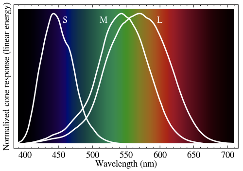

# Fundamental 16 파이썬으로 이미지 파일 다루기

# 1. 디지털 이미지

> 디지털 화면은 수많은 점들로 이루어져 있으며, 색상을 가지는 점 하나를 화소(pixel, picture element)라고 한다. 각 화소는 RGB(Red, Green, Blue) 세 개의 단일 색의 강도를 각각 조절하여 색상을 표현한다.
> 

### 왜 RGB 3개의 영역으로 이루어져 있을까?

그 이유는 인간의 눈의 망막에 있는 시세포가 인간의 경우 대부분 세 가지로 이루어져 있기 때문이다.



<aside>
💡 래스터(raster) or 비트맵(bitmap) 방식
빨강, 초록, 파랑 세 가지 색의 강도로 표현되는 점들로 구성된 디지털 화면에 표시될 이미지를 저장하는 방법, 보통 한 점마다 각 샛ㄱ상별로 8비트를 사용하여 0~255 사이의 값으로 해당 생의 감도를 표시한다.

</aside>

<aside>
💡 벡터(vector) 방식
상대적인 점과 선의 위치를 방정식으로써 기록해 두었다가, 확대 및 축소에 따라 디지털 화면의 각 화소에 어떻게 표현될지를 재계산한다.

</aside>


# 2. Pillow 사용법

<aside>
💡 Pillow란?
간단한 이미지 작업에 Pillow는 Numpy와 결합하여 간편하게 사용할 수 있는 도구

</aside>

```python
# Numpy배열을 만들고 PIL롤 이미지 객체 변환하기
import numpy as np
from PIL import Image

data = np.zeros([32, 32, 3], dtype=np.uint8)
image = Image.fromarray(data, 'RGB')
image
```

연습문제

```python
# 1. 가로 세로 각 128 픽셀짜리 흰색 이미지를 만들어 화면에 표시해 봅시다
data = np.ones([128, 128, 3], dtype=np.uint8)
data *= 255 
image = Image.fromarray(data, 'RGB')
image

# 2. 연습용 이미지를 열어 width와 height를 출력하고, .save()를 이용하여 jpg 파일 포맷으로 저장해 봅시다.
#- 문제 2 -#
from PIL import Image
import os

# 연습용 파일 경로
image_path = os.getenv('HOME')+'/aiffel/python_image_proc/data/pillow_practice.png'

# 이미지 열기
img = Image.open(image_path)
img

# width와 height 출력
print(img.width)
print(img.height)

# JPG 파일 형식으로 저장해보기
new_image_path = os.getenv('HOME')+'/aiffel/python_image_proc/data/jpg_pillow_practice.jpg'
img = img.convert('RGB')
img.save(new_image_path)

# 3. .resize()를 이용하여 이미지 크기를 100X200으로 변경하여 저장해봅시다.
resized_image = img.resize((100,200))

resized_image_path = os.getenv('HOME')+'/aiffel/python_image_proc/data/pillow_practice_resized.png'
resized_image.save(resized_image_path)
resized_image

# 4. .crop()을 이용하여 눈 부분만 잘라내어 저장해 봅시다.
box = (300, 100, 600, 400)
region = img.crop(box)

cropped_image_path = os.getenv('HOME')+'/aiffel/python_image_proc/data/pillow_practice_cropped.png'
region.save(cropped_image_path)
region
```

# 3. Pillow를 활용한 데이터 전처리

### CIFAR-100 데이터를 받아 개별 이미지 파일로 추출하기

CIFAR-100데이터

- 32 x 32화소 해상도
- 100개의 class 당 600장(각 학습용 500장, 테스트용 100장) 총 60000장

```python
import os
import pickle
from PIL import Image

dir_path = os.getenv('HOME')+'/aiffel/python_image_proc/data/cifar-100-python'
train_file_path = os.path.join(dir_path, 'train')

with open(train_file_path, 'rb') as f:
    train = pickle.load(f, encoding='bytes')
```

### 데이터 확인

```python
# dictionary의 key확인 
train.keys()
'''
dict_keys([b'filenames', b'batch_label', b'fine_labels', b'coarse_labels', b'data'])
'''
# filename확인 
train[b'filenames'][0:5]
'''
[b'bos_taurus_s_000507.png',
 b'stegosaurus_s_000125.png',
 b'mcintosh_s_000643.png',
 b'altar_boy_s_001435.png',
 b'cichlid_s_000031.png']
'''
# 데이터 확인 
train[b'data'][0:5]
'''
array([[255, 255, 255, ...,  10,  59,  79],
       [255, 253, 253, ..., 253, 253, 255],
       [250, 248, 247, ..., 194, 207, 228],
       [124, 131, 135, ..., 232, 236, 231],
       [ 43,  32,  87, ...,  60,  29,  37]], dtype=uint8)
'''
# 데이터의 shape확인
'''
(3072,) # 3072는 3channel x 1024(32x32)
'''
```

### 데이터 전처리

```python
# 데이터 reshape 
image_data = train[b'data'][0].reshape([32, 32, 3], order='F')   # order를 주의하세요!!
image = Image.fromarray(image_data)  

# 이미지의 축 바꾸기
image_data = image_data.swapaxes(0, 1)
image = Image.fromarray(image_data)

# 전체 데이터의 적용
import os
import pickle
from PIL import Image
import numpy
from tqdm import tqdm

dir_path = os.getenv('HOME')+'/aiffel/python_image_proc/data/cifar-100-python'
train_file_path = os.path.join(dir_path, 'train')

# image를 저장할 cifar-100-python의 하위 디렉토리(images)를 생성합니다. 
images_dir_path = os.getenv('HOME')+'/aiffel/python_image_proc/cifar-images'
if not os.path.exists(images_dir_path):
    os.mkdir(images_dir_path)  # images 디렉토리 생성

# 32X32의 이미지 파일 50000개를 생성합니다. 
with open(train_file_path, 'rb') as f:
    train = pickle.load(f, encoding='bytes')
    for i in tqdm(range(len(train[b'filenames']))):
        filename = train[b'filenames'][i].decode()
        data = train[b'data'][i].reshape([32, 32, 3], order='F')
        image = Image.fromarray(data.swapaxes(0, 1))
        image.save(os.path.join(images_dir_path, filename))
```

# 4. OpenCV

<aside>
💡 OpenCV는 오픈소스로 제공되는 컴퓨터 비전용 라이브러리이다. C++, Python, Java, MATLAB 등 다양한 언어에서 호출하여 사용할 수 있으며, 영상 처리에 대한 다양한 고급 기능들이 사용하기 쉽도록 구현되어 있다.

</aside>

```python
import os
import cv2 as cv
import numpy as np
from  matplotlib import pyplot as plt
%matplotlib inline

img_path = os.getenv('HOME')+'/aiffel/python_image_proc/data/cv_practice.png'
img = cv.imread(img_path)

# Convert BGR to HSV
hsv = cv.cvtColor(img, cv.COLOR_BGR2HSV)

# define range of blue color in HSV
lower_blue = np.array([100,100,100])
upper_blue = np.array([130,255,255])

# Threshold the HSV image to get only blue colors
mask = cv.inRange(hsv, lower_blue, upper_blue)

# Bitwise-AND mask and original image
res = cv.bitwise_and(img, img, mask=mask)

plt.imshow(cv.cvtColor(img, cv.COLOR_BGR2RGB))
plt.show()
plt.imshow(cv.cvtColor(mask, cv.COLOR_BGR2RGB))
plt.show()
plt.imshow(cv.cvtColor(res, cv.COLOR_BGR2RGB))
plt.show()
```


# 5. 실습

파일 load

```python
import os
import pickle
import cv2
import numpy as np
from matplotlib import pyplot as plt
from tqdm import tqdm
from PIL import Image

# 전처리 시 생성했던 디렉토리 구조
dir_path = os.getenv('HOME')+'/aiffel/python_image_proc/'
train_file_path = os.path.join(dir_path, 'train')
images_dir_path = os.path.join(dir_path, 'cifar-images')
```

histogram 

```python
# 파일명을 인자로 받아 해당 이미지 파일과 히스토그램을 출력해 주는 함수
def draw_color_histogram_from_image(file_name):
    image_path = os.path.join(images_dir_path, file_name)
    # 이미지 열기
    img = Image.open(image_path)
    cv_image = cv2.imread(image_path)

    # Image와 Histogram 그려보기
    f=plt.figure(figsize=(10,3))
    im1 = f.add_subplot(1,2,1)
    im1.imshow(img)
    im1.set_title("Image")

    im2 = f.add_subplot(1,2,2)
    color = ('b','g','r')
    for i,col in enumerate(color):
        # image에서 i번째 채널의 히스토그램을 뽑아서(0:blue, 1:green, 2:red)
        histr = cv2.calcHist([cv_image],[i],None,[256],[0,256])   
        im2.plot(histr,color = col)   # 그래프를 그릴 때 채널 색상과 맞춰서 그립니다.
    im2.set_title("Histogram")

draw_color_histogram_from_image('adriatic_s_001807.png')
```


### Idea step

- 프로그램이 실행된다.`build_histogram_db()`
    ◦ CIFAR-100 이미지들을 불러온다.
    ◦ CIFAR-100 이미지들을 하나하나 히스토그램으로 만든다.
    ◦ 이미지 이름을 키로 하고, 히스토그램을 값으로 하는 딕셔너리 `histogram_db`를 반환한다.
- CIFAR-100 히스토그램 중 입력된 이미지 이름에 해당하는 히스토그램을 입력 이미지로 선택하여 `target_histogram`이라는 변수명으로 지정한다.
- `search()`
    ◦ 입력 이미지 히스토그램 `target_histogram`와 전체 검색 대상 이미지들의 히스토그램을 가진 딕셔너리 `histogram_db`를 입력으로 받는다.
    ◦ OpenCV의 `compareHist()` 함수를 사용하여 입력 이미지와 검색 대상 이미지 하나하나의 히스토그램 간 유사도를 계산한다. 결과는 `result`라는 이름의 딕셔너리로, 키는 이미지 이름, 값은 유사도로 한다.
    ◦ 계산된 유사도를 기준으로 정렬하여 순서를 매긴다.
    ◦ 유사도 순서상으로 상위 5개 이미지만 골라서 `result`에 남긴다.
- 고른 이미지들을 표시한다.
- 프로그램이 종료된다.

### code

```python
def get_histogram(image):
    histogram = []

    # Create histograms per channels, in 4 bins each.
    for i in range(3):
        # [[YOUR CODE]]
				

    histogram = np.concatenate(histogram)
    histogram = cv2.normalize(histogram, histogram)

    return histogram
```

```python
import os
import pickle
import cv2
import numpy as np
from matplotlib import pyplot as plt
from tqdm import tqdm

def build_histogram_db():
    histogram_db = {}

    #디렉토리에 모아 둔 이미지 파일들을 전부 리스트업합니다. 
    path = images_dir_path
    file_list = os.listdir(images_dir_path)

    # [[YOUR CODE]]
		for file_name in tqdm(file_list):
	        file_path = os.path.join(images_dir_path, file_name)
	        image = cv2.imread(file_path)
	
	        histogram = get_histogram(image)
	
	        histogram_db[file_name] = histogram
    return histogram_db

histogram_db = build_histogram_db()
```

```python
def get_target_histogram():
    filename = input("이미지 파일명을 입력하세요: ")
    if filename not in histogram_db:
        print('유효하지 않은 이미지 파일명입니다.')
        return None
    return histogram_db[filename]

target_histogram = get_target_histogram()
```

```python
def search(histogram_db, target_histogram, top_k=5):
    results = {}

    # Calculate similarity distance by comparing histograms.
    # [[YOUR CODE]
    for file_name, histogram in tqdm(histogram_db.items()):
        distance = cv2.compareHist(H1=target_histogram,
                                       H2=histogram,
                                       method=cv2.HISTCMP_CHISQR)
        results[file_name] = distance
        
    results = dict(sorted(results.items(), key=lambda item: item[1])[:top_k])
    return results
```

```python
def show_result(result):
    f=plt.figure(figsize=(10,3))
    for idx, filename in enumerate(result.keys()):    
        # [[YOUR CODE]]
        img_path = os.path.join(images_dir_path, filename)
        im = f.add_subplot(1,len(result),idx+1)
        img = Image.open(img_path)
        im.imshow(img)
```

```python
target_histogram = get_target_histogram()
result = search(histogram_db, target_histogram)
show_result(result)
```