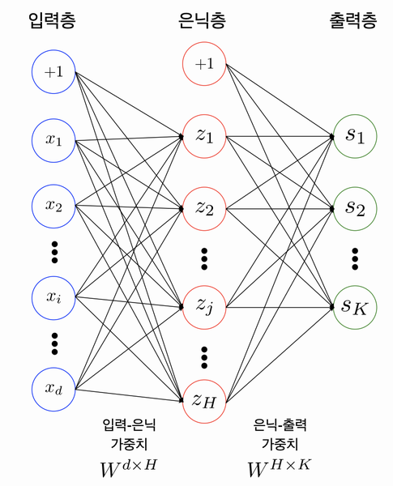

# Fundamental 18 딥러닝 들여다보기

# 신경망 구성

### 개요

<aside>
💡 **인공신경망이란?**
예전부터 인류는 자연의모습을 본떠 인공적인 물건을 만들려는 시도를 많이 해왔다. 머신러닝/딥러닝 과학자들도 자연에서 답을 찾으려 노력했고, 우리 뇌 속의 신경망 구조에 착안해서 **퍼셉트론(Perceptron)**이라는 형태를 제안하며 이를 연결한 형태를 인공신경망이라고 한다.

</aside>

### 다층 퍼셉트론



구성

- 입력층 (input layer)
- 출력층 (output layer)
- 은닉층 (hidden layer)

위의 이미지처럼 2개이강의 레이어를 쌓아서 만든 것을 보통 다층 퍼셉트론(Multi-Layer Perceptron)이라고 한다. 또한 은닉층의 layer가 많아 질 수록 인공신경망이 deep해졌다고 불르고 그것이 DNN(Deep Neural Network)라고 한다.

> 💡*Tips*
Fully-Connected Neural Network와 같은 단어를 들어보신 분들이 있으신가요? 이는 앞에서 설명드렸던 MLP의 다른 용어입니다. 이 Fully-Connnected Nerual Network는 서로 다른 층에 위치한 노드 간에는 연결 관계가 존재하지 않으며, 인접한 층에 위치한 노드들 간의 연결만 존재한다는 의미를 내포합니다.
> 

### Parameters / Weight

입력층-은닉층, 은닉층-출력층 사이에는 사싱 각각 행렬(Matrix)이 존재한다. 예를 들어 입력삽이 100개, 은닉 노드가 20개라면 사실 이 입력층-은닉층 사이에는 100x20의 형태를 가진 행렬이 존재한다는 것이다. 마찬가지로 출력층이 10개의 노드를 가진다면 은닉층-출력츨 사이에는 20x10의 형태를 가진 행렬이 존재하게 된다.

이러한 행렬들을 Parameter 혹은 Weight라고 부른다.

### numpy로 만드는 MLP모델

```python
# 입력층 데이터의 모양(shape)
print(x_train_reshaped.shape)

# 테스트를 위해 x_train_reshaped의 앞 5개의 데이터를 가져온다.
X = x_train_reshaped[:5]
print(X.shape)
'''
(60000, 784)
(5, 784)
'''

weight_init_std = 0.1
input_size = 784
hidden_size=50

# 인접 레이어간 관계를 나타내는 파라미터 W를 생성하고 random 초기화
W1 = weight_init_std * np.random.randn(input_size, hidden_size)  
# 바이어스 파라미터 b를 생성하고 Zero로 초기화
b1 = np.zeros(hidden_size)

a1 = np.dot(X, W1) + b1   # 은닉층 출력

print(W1.shape)
print(b1.shape)
print(a1.shape)
'''
(784, 50)
(50,)
(5, 50)
'''

# 첫 번째 데이터의 은닉층 출력 확인
a1[0]
'''
array([-0.23734931,  1.65478665, -0.2182634 ,  0.44888955, -0.4480305 ,
        1.25691672, -1.29050996, -0.1552436 , -0.87067784, -0.22153904,
       -0.90705497,  0.3893865 ,  1.35725949,  1.37878799,  0.88309716,
       -0.90536004,  1.16069321, -1.28082615,  1.07243803,  0.03762112,
        0.48137978,  0.05717249, -0.6428429 ,  0.85244788,  0.02305076,
        0.94099645, -1.5424941 ,  0.16855449, -0.8164589 ,  0.86070473,
        1.87577333, -0.07389681, -0.37071621, -0.27916456, -1.04235583,
       -1.82019979, -0.31306109,  1.71151189,  0.8364921 , -0.35559637,
       -0.75417167,  0.55394491,  0.0086589 ,  0.65574567,  0.46430357,
       -1.38029717,  0.47993031, -0.25378644,  0.78723898,  0.37219146])
'''
```

# 활성화 함수와 손실 함수

MLP안에 비선형 함수를 포함시키게되면 모델의 표현력이 좋아지게 된다.

### 활성화 함수

1. Sigmoid


```python
# 위 수식의 sigmoid 함수를 구현해 봅니다.
def sigmoid(x):
    return 1 / (1 + np.exp(-x))  

z1 = sigmoid(a1)
print(z1[0])  # sigmoid의 출력은 모든 element가 0에서 1사이
'''
[0.44093967 0.83953693 0.44564974 0.61037518 0.38982913 0.77849488
 0.21576651 0.46126686 0.29511328 0.44484066 0.28760286 0.596135
 0.79531393 0.79879628 0.70746362 0.28795025 0.76145865 0.21740963
 0.74506029 0.50940417 0.61807364 0.51428923 0.34460418 0.70108039
 0.50576244 0.71930089 0.176173   0.54203914 0.30651585 0.70280787
 0.86712489 0.4815342  0.40836797 0.43065861 0.26069569 0.1394099
 0.42236774 0.84703228 0.6977259  0.41202598 0.319913   0.63505036
 0.50216471 0.65830406 0.6140346  0.20096128 0.61773142 0.43689175
 0.68723818 0.59198841]
'''
```

Sigmoid vs ReLU

현재는 sigmoid 함수보다 ReLU 함수를 더 많이 사용한다. 그 이유는 다음과 같다.

- vanishing gradient현상이 발생한다.
- exp함수 상용 시 비용이 크다.

1. Tanh


- tanh 함수는 함수의 중심값을 0으로 옮겨 sigmoid의 최적화 과정이 느려지는 문제를 해결.
- vanishing gradient 문제 존재.

1. ReLU


- sigmoid, tanh 함수에 비해 학습이 빠름.
- 연산 비용이 크지 않고, 구현이 매우 간단하다.

실습 

```python
# 단일 레이어 구현 함수
def affine_layer_forward(X, W, b):
    y = np.dot(X, W) + b
    cache = (X, W, b)
    return y, cache

input_size = 784
hidden_size = 50
output_size = 10

W1 = weight_init_std * np.random.randn(input_size, hidden_size)
b1 = np.zeros(hidden_size)
W2 = weight_init_std * np.random.randn(hidden_size, output_size)
b2 = np.zeros(output_size)

a1, cache1 = affine_layer_forward(X, W1, b1)
z1 = sigmoid(a1)
a2, cache2 = affine_layer_forward(z1, W2, b2)    # z1이 다시 두번째 레이어의 입력이 됩니다. 

print(a2[0])  # 최종 출력이 output_size만큼의 벡터가 되었습니다.
'''
[ 0.0557946   0.19059432 -0.14301531 -0.56703624  0.44903196 -0.03293397
 -0.40378485  0.69334802  0.30879806  0.71558726]
'''
```

```python
def softmax(x):
    if x.ndim == 2:
        x = x.T
        x = x - np.max(x, axis=0)
        y = np.exp(x) / np.sum(np.exp(x), axis=0)
        return y.T 

    x = x - np.max(x) # 오버플로 대책
    return np.exp(x) / np.sum(np.exp(x))

y_hat = softmax(a2)
y_hat[0]  # 10개의 숫자 중 하나일 확률이 되었습니다.
'''
array([0.08588869, 0.09828309, 0.07040345, 0.04607274, 0.1272673 ,
       0.07859622, 0.05424294, 0.16248824, 0.110615  , 0.16614234])
'''
```

### 손실함수 (Loss Function)

딥러닝에서 우리가 원하는 것은 정답과 전달된 신호 정보들 사이의 차이를 계산하고, 이 차이를 줄이기 위해 각 파라미터들을 조정하는 것이다.

1. 평균제곱오차 (MSE: Mean Square Error)


1. 교차 엔트로피 (Cross Entropy)


실습

```python
# 정답 라벨을 One-hot 인코딩하는 함수
def _change_one_hot_label(X, num_category):
    T = np.zeros((X.size, num_category))
    for idx, row in enumerate(T):
        row[X[idx]] = 1
        
    return T

Y_digit = y_train[:5]
t = _change_one_hot_label(Y_digit, 10)
t     # 정답 라벨의 One-hot 인코딩
'''
array([[0., 0., 0., 0., 0., 1., 0., 0., 0., 0.],
       [1., 0., 0., 0., 0., 0., 0., 0., 0., 0.],
       [0., 0., 0., 0., 1., 0., 0., 0., 0., 0.],
       [0., 1., 0., 0., 0., 0., 0., 0., 0., 0.],
       [0., 0., 0., 0., 0., 0., 0., 0., 0., 1.]])
'''
```

```python
def cross_entropy_error(y, t):
    if y.ndim == 1:
        t = t.reshape(1, t.size)
        y = y.reshape(1, y.size)
        
    # 훈련 데이터가 원-핫 벡터라면 정답 레이블의 인덱스로 반환
    if t.size == y.size:
        t = t.argmax(axis=1)
             
    batch_size = y.shape[0]
    return -np.sum(np.log(y[np.arange(batch_size), t])) / batch_size

Loss = cross_entropy_error(y_hat, t)
Loss
'''
2.3141278223835013
'''
```

# 경사하강법

오차를 구한 뒤 우리의 다음 스텝은 오차를 줄이는 것이다. 이럴때 우리는 **경사하강법**이라는 방법을 사용할 수 있다.


우리는 경사하강법을 사용할 때 학습률이하느 개념을 도입해 기울기값과 이 **학습률**을 곱한 만큼만 발걸음을 내딛는다.

실습 

```python
batch_num = y_hat.shape[0]
dy = (y_hat - t) / batch_num
dy    # softmax값의 출력으로 Loss를 미분한 값
'''
array([[ 0.01717774,  0.01965662,  0.01408069,  0.00921455,  0.02545346,
        -0.18428076,  0.01084859,  0.03249765,  0.022123  ,  0.03322847],
       [-0.18833929,  0.02310421,  0.01057504,  0.00897538,  0.03168543,
         0.01622701,  0.01017295,  0.03483325,  0.02352373,  0.02924229],
       [ 0.01415667,  0.02155132,  0.0116604 ,  0.01031962, -0.17147356,
         0.01808198,  0.01181562,  0.03199438,  0.01869346,  0.0332001 ],
       [ 0.01871319, -0.18245161,  0.01215545,  0.00889183,  0.02890687,
         0.01675191,  0.01091953,  0.03006446,  0.02047914,  0.03556923],
       [ 0.01937839,  0.02118033,  0.01313097,  0.00920435,  0.02528338,
         0.01761324,  0.0107278 ,  0.03004982,  0.02051295, -0.16708124]])
'''

dW2 = np.dot(z1.T, dy)
db2 = np.sum(dy, axis=0)

def sigmoid_grad(x):
    return (1.0 - sigmoid(x)) * sigmoid(x)

dz1 = np.dot(dy, W2.T)
da1 = sigmoid_grad(a1) * dz1
dW1 = np.dot(X.T, da1)
db1 = np.sum(dz1, axis=0)

learning_rate = 0.1

def update_params(W1, b1, W2, b2, dW1, db1, dW2, db2, learning_rate):
    W1 = W1 - learning_rate*dW1
    b1 = b1 - learning_rate*db1
    W2 = W2 - learning_rate*dW2
    b2 = b2 - learning_rate*db2
    return W1, b1, W2, b2
```

# 오차역전파법

손실 함수를 통해 구해진 오차를 가지고 각 파라미터들을 조정하는 경사하강법에 대해 알게되었다. 그럼 이 기울기를 입력층까지 정달하며 파라미터들을 조정하는 방법인 **오차역전파법**을 알아보자


실습

```python
def affine_layer_backward(dy, cache):
    X, W, b = cache
    dX = np.dot(dy, W.T)
    dW = np.dot(X.T, dy)
    db = np.sum(dy, axis=0)
    return dX, dW, db
```

```python
# 파라미터 초기화
W1 = weight_init_std * np.random.randn(input_size, hidden_size)
b1 = np.zeros(hidden_size)
W2 = weight_init_std * np.random.randn(hidden_size, output_size)
b2 = np.zeros(output_size)

# Forward Propagation
a1, cache1 = affine_layer_forward(X, W1, b1)
z1 = sigmoid(a1)
a2, cache2 = affine_layer_forward(z1, W2, b2)

# 추론과 오차(Loss) 계산
y_hat = softmax(a2)
t = _change_one_hot_label(Y_digit, 10)   # 정답 One-hot 인코딩
Loss = cross_entropy_error(y_hat, t)

print(y_hat)
print(t)
print('Loss: ', Loss)
        
dy = (y_hat - t) / X.shape[0]
dz1, dW2, db2 = affine_layer_backward(dy, cache2)
da1 = sigmoid_grad(a1) * dz1
dX, dW1, db1 = affine_layer_backward(da1, cache1)

# 경사하강법을 통한 파라미터 업데이트    
learning_rate = 0.1
W1, b1, W2, b2 = update_params(W1, b1, W2, b2, dW1, db1, dW2, db2, learning_rate)
'''
[[0.09688116 0.05334608 0.05475559 0.09208361 0.1354448  0.0516866
  0.14628718 0.1484475  0.09959168 0.1214758 ]
 [0.11417181 0.05584326 0.04317825 0.07808546 0.15686632 0.04157256
  0.12903747 0.17606159 0.09450543 0.11067785]
 [0.10996614 0.05666408 0.05796541 0.08066901 0.14868363 0.0580455
  0.13589204 0.1358539  0.11212546 0.10413483]
 [0.11618595 0.05710042 0.05598822 0.12606291 0.136297   0.05653783
  0.11924269 0.11260417 0.11012173 0.10985907]
 [0.1248133  0.0516943  0.04644986 0.09305171 0.1448389  0.05173477
  0.13101774 0.15348564 0.10850265 0.09441113]]
[[0. 0. 0. 0. 0. 1. 0. 0. 0. 0.]
 [1. 0. 0. 0. 0. 0. 0. 0. 0. 0.]
 [0. 0. 0. 0. 1. 0. 0. 0. 0. 0.]
 [0. 1. 0. 0. 0. 0. 0. 0. 0. 0.]
 [0. 0. 0. 0. 0. 0. 0. 0. 0. 1.]]
Loss:  2.4523164568686275
'''
```

# 모델 학습 Step-by-Step

```python
W1 = weight_init_std * np.random.randn(input_size, hidden_size)
b1 = np.zeros(hidden_size)
W2 = weight_init_std * np.random.randn(hidden_size, output_size)
b2 = np.zeros(output_size)

def train_step(X, Y, W1, b1, W2, b2, learning_rate=0.1, verbose=False):
    a1, cache1 = affine_layer_forward(X, W1, b1)
    z1 = sigmoid(a1)
    a2, cache2 = affine_layer_forward(z1, W2, b2)
    y_hat = softmax(a2)
    t = _change_one_hot_label(Y, 10)
    Loss = cross_entropy_error(y_hat, t)

    if verbose:
        print('---------')
        print(y_hat)
        print(t)
        print('Loss: ', Loss)
        
    dy = (y_hat - t) / X.shape[0]
    dz1, dW2, db2 = affine_layer_backward(dy, cache2)
    da1 = sigmoid_grad(a1) * dz1
    dX, dW1, db1 = affine_layer_backward(da1, cache1)
    
    W1, b1, W2, b2 = update_params(W1, b1, W2, b2, dW1, db1, dW2, db2, learning_rate)
    
    return W1, b1, W2, b2, Loss
```

```python
X = x_train_reshaped[:5]
Y = y_train[:5]

# train_step을 다섯 번 반복 돌립니다.
for i in range(5):
    W1, b1, W2, b2, _ = train_step(X, Y, W1, b1, W2, b2, learning_rate=0.1, verbose=True)
'''
---------
[[0.05954067 0.09180239 0.12301855 0.12439791 0.10165579 0.05328301
  0.1066074  0.09575401 0.06194677 0.18199349]
 [0.06099077 0.08992154 0.11318835 0.10550997 0.10642946 0.06374236
  0.13025998 0.12053435 0.05198445 0.15743877]
 [0.0860812  0.11160447 0.09407451 0.12108545 0.09783312 0.06004636
  0.09914604 0.11848498 0.05112077 0.16052309]
 [0.05749895 0.07429749 0.10825865 0.13943971 0.09079906 0.06656055
  0.10457848 0.12601564 0.06812768 0.16442379]
 [0.07786481 0.07804692 0.1023948  0.12121677 0.07682946 0.06305928
  0.1454909  0.11990561 0.06899659 0.14619485]]
[[0. 0. 0. 0. 0. 1. 0. 0. 0. 0.]
 [1. 0. 0. 0. 0. 0. 0. 0. 0. 0.]
 [0. 0. 0. 0. 1. 0. 0. 0. 0. 0.]
 [0. 1. 0. 0. 0. 0. 0. 0. 0. 0.]
 [0. 0. 0. 0. 0. 0. 0. 0. 0. 1.]]
Loss:  2.5152310980824226
---------
[[0.0748251  0.11149984 0.10439209 0.10437418 0.11699375 0.06940275
  0.09035822 0.08090187 0.05725614 0.18999606]
 [0.08095685 0.11026326 0.09432189 0.08770675 0.12215958 0.07998814
  0.10936733 0.10078628 0.04775164 0.16669828]
 [0.10314732 0.13036284 0.08017617 0.10179785 0.11520692 0.07212535
  0.08405792 0.10005646 0.0465925  0.16647667]
 [0.07325629 0.09564378 0.09167034 0.11611547 0.10547913 0.08395899
  0.08818678 0.10644976 0.06269354 0.17654592]
 [0.09750519 0.09567998 0.08717984 0.10217325 0.08831858 0.07730599
  0.12334588 0.10216836 0.06380094 0.16252199]]
[[0. 0. 0. 0. 0. 1. 0. 0. 0. 0.]
 [1. 0. 0. 0. 0. 0. 0. 0. 0. 0.]
 [0. 0. 0. 0. 1. 0. 0. 0. 0. 0.]
 [0. 1. 0. 0. 0. 0. 0. 0. 0. 0.]
 [0. 0. 0. 0. 0. 0. 0. 0. 0. 1.]]
Loss:  2.3013519422452444
---------
[[0.08936664 0.1282678  0.08926228 0.08852838 0.12873059 0.08619845
  0.07715989 0.06887482 0.05219804 0.19141312]
 [0.10164521 0.12732203 0.07903328 0.0735343  0.13347338 0.09526513
  0.09228772 0.08476183 0.04313047 0.16954663]
 [0.11857273 0.14559886 0.06883079 0.0865383  0.13062916 0.08331584
  0.07184701 0.08521443 0.0420311  0.16742179]
 [0.08825588 0.11603899 0.07786071 0.097361   0.11657515 0.1005245
  0.07467098 0.09027872 0.05665835 0.18177572]
 [0.11604376 0.11108281 0.07448093 0.0866961  0.09699322 0.09038847
  0.1050033  0.08740236 0.05804633 0.17386272]]
[[0. 0. 0. 0. 0. 1. 0. 0. 0. 0.]
 [1. 0. 0. 0. 0. 0. 0. 0. 0. 0.]
 [0. 0. 0. 0. 1. 0. 0. 0. 0. 0.]
 [0. 1. 0. 0. 0. 0. 0. 0. 0. 0.]
 [0. 0. 0. 0. 0. 0. 0. 0. 0. 1.]]
Loss:  2.1352162004843307
---------
[[0.1025409  0.14165725 0.07704999 0.07593024 0.13730564 0.1032145
  0.06649098 0.05917464 0.04732093 0.18931494]
 [0.12220688 0.14060077 0.06681169 0.06229187 0.14104167 0.10905696
  0.07851577 0.071913   0.03868469 0.1688767 ]
 [0.13192857 0.15724577 0.05966291 0.07445451 0.14433591 0.09338735
  0.06203641 0.07333529 0.03781091 0.16580237]
 [0.10174812 0.13462058 0.06658297 0.08238908 0.12445948 0.11561518
  0.06369969 0.07712509 0.05079418 0.18296563]
 [0.13272066 0.12380036 0.06408248 0.07422043 0.10321406 0.10192606
  0.09005477 0.07530642 0.05245366 0.1822211 ]]
[[0. 0. 0. 0. 0. 1. 0. 0. 0. 0.]
 [1. 0. 0. 0. 0. 0. 0. 0. 0. 0.]
 [0. 0. 0. 0. 1. 0. 0. 0. 0. 0.]
 [0. 1. 0. 0. 0. 0. 0. 0. 0. 0.]
 [0. 0. 0. 0. 0. 0. 0. 0. 0. 1.]]
Loss:  2.003285457616422
---------
[[0.1139712  0.1517985  0.06717175 0.06583329 0.14337652 0.12011365
  0.05784424 0.05132736 0.04286532 0.18569819]
 [0.14201088 0.15029204 0.05706591 0.05335005 0.14578538 0.12110737
  0.06744717 0.06162966 0.03465956 0.16665199]
 [0.14303827 0.16569672 0.05225611 0.06482619 0.15676149 0.10223404
  0.05414314 0.06380673 0.0340659  0.1631714 ]
 [0.11330875 0.15112034 0.0574397  0.07044358 0.12981779 0.1288913
  0.05484107 0.06648556 0.04545752 0.18219438]
 [0.14711315 0.13389157 0.05562491 0.06417361 0.10752377 0.11175981
  0.07793687 0.06545056 0.04735208 0.18917366]]
[[0. 0. 0. 0. 0. 1. 0. 0. 0. 0.]
 [1. 0. 0. 0. 0. 0. 0. 0. 0. 0.]
 [0. 0. 0. 0. 1. 0. 0. 0. 0. 0.]
 [0. 1. 0. 0. 0. 0. 0. 0. 0. 0.]
 [0. 0. 0. 0. 0. 0. 0. 0. 0. 1.]]
Loss:  1.8957933931538573
'''
```

# 추론 과정 구현과 정확도(Accuracy) 계산

```python
def predict(W1, b1, W2, b2, X):
    a1 = np.dot(X, W1) + b1
    z1 = sigmoid(a1)
    a2 = np.dot(z1, W2) + b2
    y = softmax(a2)

    return y
```

```python
# X = x_train[:100] 에 대해 모델 추론을 시도합니다. 
X = x_train_reshaped[:100]
Y = y_test[:100]
result = predict(W1, b1, W2, b2, X)
result[0]
'''
array([0.12351305, 0.15914635, 0.0591323 , 0.05766372, 0.14757822,
       0.13667039, 0.05079296, 0.04493791, 0.03890568, 0.18165942])
'''
```

```python
def accuracy(W1, b1, W2, b2, x, y):
    y_hat = predict(W1, b1, W2, b2, x)
    y_hat = np.argmax(y_hat, axis=1)

    accuracy = np.sum(y_hat == y) / float(x.shape[0])
    return accuracy
```

```python
acc = accuracy(W1, b1, W2, b2, X, Y)

t = _change_one_hot_label(Y, 10)
print(result[0])
print(t[0])
print(acc)
'''
[0.12351305 0.15914635 0.0591323  0.05766372 0.14757822 0.13667039
 0.05079296 0.04493791 0.03890568 0.18165942]
[0. 0. 0. 0. 0. 0. 0. 1. 0. 0.]
0.09
'''
```

# 전체 학습 사이클 수행

파라미터 초기화

```python
def init_params(input_size, hidden_size, output_size, weight_init_std=0.01):

    W1 = weight_init_std * np.random.randn(input_size, hidden_size)
    b1 = np.zeros(hidden_size)
    W2 = weight_init_std * np.random.randn(hidden_size, output_size)
    b2 = np.zeros(output_size)

    print(W1.shape)
    print(b1.shape)
    print(W2.shape)
    print(b2.shape)
    
    return W1, b1, W2, b2
```

학습 진행

```python
# 하이퍼파라미터
iters_num = 50000  # 반복 횟수를 적절히 설정한다.
train_size = x_train.shape[0]
batch_size = 100   # 미니배치 크기
learning_rate = 0.1

train_loss_list = []
train_acc_list = []
test_acc_list = []

# 1에폭당 반복 수
iter_per_epoch = max(train_size / batch_size, 1)

W1, b1, W2, b2 = init_params(784, 50, 10)

for i in range(iters_num):
    # 미니배치 획득
    batch_mask = np.random.choice(train_size, batch_size)
    x_batch = x_train_reshaped[batch_mask]
    y_batch = y_train[batch_mask]
    
    W1, b1, W2, b2, Loss = train_step(x_batch, y_batch, W1, b1, W2, b2, learning_rate=0.1, verbose=False)

    # 학습 경과 기록
    train_loss_list.append(Loss)
    
    # 1에폭당 정확도 계산
    if i % iter_per_epoch == 0:
        print('Loss: ', Loss)
        train_acc = accuracy(W1, b1, W2, b2, x_train_reshaped, y_train)
        test_acc = accuracy(W1, b1, W2, b2, x_test_reshaped, y_test)
        train_acc_list.append(train_acc)
        test_acc_list.append(test_acc)
        print("train acc, test acc | " + str(train_acc) + ", " + str(test_acc))
```

Accuracy, Loss 시각화

```python
from matplotlib.pylab import rcParams
rcParams['figure.figsize'] = 12, 6 

# Accuracy 그래프 그리기
markers = {'train': 'o', 'test': 's'}
x = np.arange(len(train_acc_list))
plt.plot(x, train_acc_list, label='train acc')
plt.plot(x, test_acc_list, label='test acc', linestyle='--')
plt.xlabel("epochs")
plt.ylabel("accuracy")
plt.ylim(0, 1.0)
plt.legend(loc='lower right')
plt.show()
```


```python
# Loss 그래프 그리기
x = np.arange(len(train_loss_list))
plt.plot(x, train_loss_list, label='train acc')
plt.xlabel("epochs")
plt.ylabel("Loss")
plt.ylim(0, 3.0)
plt.legend(loc='best')
plt.show()
```

