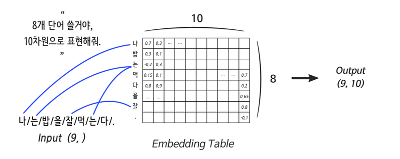

# Fundamental 24 딥러닝 레이어의 이해2 Embeding, Recurrent

# 분포 가설과 분산 표현

> **희소 표현(Sparse Representation)이란?**
벡터의 특정 차원에 단어 혹은 의미를 직접 매핑하는 방식
> 

### 단어의 분산 표현(Distributed Representation)

> **분포 가설(distribution hypothesis)이란?**
어떤 차원이 특정한 의미를 가진다고 가정하지 않고 유사한 맥락에서 나타나는 단어는 그 의미도 비슷하다.
> 

> **분산 표현(Distributed Representation)이란?**
유사한 맥락에 나타난 단어들끼리는 두 단어 벡터 사이의 거리를 가깝게 하고, 그렇지 않은 단어들끼리는 멀어지도록 조금씩 조정해 얻은 단어 벡터
> 
- 분산표현을 사용하면 **단어간의 유사도**를 계산할 수 있다.

# Embedding 레이어

> **Embedding layer란?**
간단하게 말하면 컴퓨터용 단어 사전이다.
> 
- 우리가 ‘단어를 n개 쓸거야'라고 전달만 해주면 컴퓨터는 알아서 사전을 만들고, 수많은 데이터를 거치며 각 단어의 의미(분산표현)를 차근차근 업데이트한다.



- Weight: 단어의 개수, Embedding size
- 단어를 분산 표현으로 연결해 주는 역할을 하는것이 Weight에서 특정 행을 읽어오는 것과 같아 이 레이어를 룩업 테이블(Lookup Table)이라고 부른다.

### 원-핫 인코딩에 Linear 레이어 적용하기

```python
import tensorflow as tf

vocab = {      # 사용할 단어 사전 정의
    "i": 0,
    "need": 1,
    "some": 2,
    "more": 3,
    "coffee": 4,
    "cake": 5,
    "cat": 6,
    "dog": 7
}

sentence = "i i i i need some more coffee coffee coffee"
# 위 sentence
_input = [vocab[w] for w in sentence.split()]  # [0, 0, 0, 0, 1, 2, 3, 4, 4, 4]

vocab_size = len(vocab)   # 8

one_hot = tf.one_hot(_input, vocab_size)
print(one_hot.numpy())    # 원-핫 인코딩 벡터를 출력해 봅시다.
'''
[[1. 0. 0. 0. 0. 0. 0. 0.]
 [1. 0. 0. 0. 0. 0. 0. 0.]
 [1. 0. 0. 0. 0. 0. 0. 0.]
 [1. 0. 0. 0. 0. 0. 0. 0.]
 [0. 1. 0. 0. 0. 0. 0. 0.]
 [0. 0. 1. 0. 0. 0. 0. 0.]
 [0. 0. 0. 1. 0. 0. 0. 0.]
 [0. 0. 0. 0. 1. 0. 0. 0.]
 [0. 0. 0. 0. 1. 0. 0. 0.]
 [0. 0. 0. 0. 1. 0. 0. 0.]]
'''
```

```python
distribution_size = 2   # 보기 좋게 2차원으로 분산 표현하도록 하죠!
linear = tf.keras.layers.Dense(units=distribution_size, use_bias=False)
one_hot_linear = linear(one_hot)

print("Linear Weight")
print(linear.weights[0].numpy())

print("\nOne-Hot Linear Result")
print(one_hot_linear.numpy())
'''
Linear Weight
[[-0.40304437 -0.73645216]
 [ 0.07056093  0.5196576 ]
 [-0.40075308 -0.27180612]
 [ 0.19121641  0.40055287]
 [ 0.5465456  -0.20786017]
 [ 0.6227102   0.35110307]
 [ 0.36306024  0.5061914 ]
 [ 0.46893024 -0.76387244]]

One-Hot Linear Result
[[-0.40304437 -0.73645216]
 [-0.40304437 -0.73645216]
 [-0.40304437 -0.73645216]
 [-0.40304437 -0.73645216]
 [ 0.07056093  0.5196576 ]
 [-0.40075308 -0.27180612]
 [ 0.19121641  0.40055287]
 [ 0.5465456  -0.20786017]
 [ 0.5465456  -0.20786017]
 [ 0.5465456  -0.20786017]]
'''
```

### Embedding layer 선언하는 법

```python
some_words = tf.constant([[3, 57, 35]])
# 3번 단어 / 57번 단어 / 35번 단어로 이루어진 한 문장입니다.

print("Embedding을 진행할 문장:", some_words.shape)
embedding_layer = tf.keras.layers.Embedding(input_dim=64, output_dim=100)
# 총 64개의 단어를 포함한 Embedding 레이어를 선언할 것이고,
# 각 단어는 100차원으로 분산 표현 할 것입니다.

print("Embedding된 문장:", embedding_layer(some_words).shape)
print("Embedding Layer의 Weight 형태:", embedding_layer.weights[0].shape)
'''
Embedding을 진행할 문장: (1, 3)
Embedding된 문장: (1, 3, 100)
Embedding Layer의 Weight 형태: (64, 100)
'''
```

- 기본적으로 딥러닝은 미분을 기반으로 동작하는데, Embedding 레이어는 그저 단어를 대응 시켜 줄 뿐이니 미분이 불가능하다.
- 따라서 신경망 설계를 할 때, 어떤 연산 결과를 Embedding 레이어에 연결시키는 것은 불가능하다.

# RNN

- 문장이나 영상, 음성 등의 데이터는 한 장의 이미지 데이터와는 사뭇 다른 특성을 가진다. 바로 순차적인(Sequential)특성이다.

RNN의 입력으로 들어가는 모든 단어만큼 Weight를 만드는 게 아니다. (입력의 차원, 출력의 차원)에 해당하는 단 하나의 weight를 순차적으로 업데이트하는 것이 RNN이다. 그렇다 보니 한 문장을 읽고 처리하는 데에도 여러 번의 연산이 필요해 다른 레이어에 비해 느리다는 단점이 있다.


- 입력의 앞부분이 뒤로 갈수록 옅어져 손실이 발생하는 기울기 소실(Vanishing Gradient)문제가 발생한다.

```python
sentence = "What time is it ?"
dic = {
    "is": 0,
    "it": 1,
    "What": 2,
    "time": 3,
    "?": 4
}

print("RNN에 입력할 문장:", sentence)

sentence_tensor = tf.constant([[dic[word] for word in sentence.split()]])

print("Embedding을 위해 단어 매핑:", sentence_tensor.numpy())
print("입력 문장 데이터 형태:", sentence_tensor.shape)

embedding_layer = tf.keras.layers.Embedding(input_dim=len(dic), output_dim=100)
emb_out = embedding_layer(sentence_tensor)

print("\nEmbedding 결과:", emb_out.shape)
print("Embedding Layer의 Weight 형태:", embedding_layer.weights[0].shape)

rnn_seq_layer = \
tf.keras.layers.SimpleRNN(units=64, return_sequences=True, use_bias=False)
rnn_seq_out = rnn_seq_layer(emb_out)

print("\nRNN 결과 (모든 Step Output):", rnn_seq_out.shape)
print("RNN Layer의 Weight 형태:", rnn_seq_layer.weights[0].shape)

rnn_fin_layer = tf.keras.layers.SimpleRNN(units=64, use_bias=False)
rnn_fin_out = rnn_fin_layer(emb_out)

print("\nRNN 결과 (최종 Step Output):", rnn_fin_out.shape)
print("RNN Layer의 Weight 형태:", rnn_fin_layer.weights[0].shape)
'''
RNN에 입력할 문장: What time is it ?
Embedding을 위해 단어 매핑: [[2 3 0 1 4]]
입력 문장 데이터 형태: (1, 5)

Embedding 결과: (1, 5, 100)
Embedding Layer의 Weight 형태: (5, 100)

RNN 결과 (모든 Step Output): (1, 5, 64)
RNN Layer의 Weight 형태: (100, 64)

RNN 결과 (최종 Step Output): (1, 64)
RNN Layer의 Weight 형태: (100, 64)
'''
```

이전 단어를 입력으로 받아 생성된 모든 다음 단어, 즉 모든 Step에 대한 Output


```python
lstm_seq_layer = tf.keras.layers.LSTM(units=64, return_sequences=True, use_bias=False)
lstm_seq_out = lstm_seq_layer(emb_out)

print("\nLSTM 결과 (모든 Step Output):", lstm_seq_out.shape)
print("LSTM Layer의 Weight 형태:", lstm_seq_layer.weights[0].shape)

lstm_fin_layer = tf.keras.layers.LSTM(units=64, use_bias=False)
lstm_fin_out = lstm_fin_layer(emb_out)

print("\nLSTM 결과 (최종 Step Output):", lstm_fin_out.shape)
print("LSTM Layer의 Weight 형태:", lstm_fin_layer.weights[0].shape)
'''
LSTM 결과 (모든 Step Output): (1, 5, 64)
LSTM Layer의 Weight 형태: (100, 256)
WARNING:tensorflow:Layer lstm_1 will not use cuDNN kernels since it doesn't meet the criteria. It will use a generic GPU kernel as fallback when running on GPU.

LSTM 결과 (최종 Step Output): (1, 64)
LSTM Layer의 Weight 형태: (100, 256)
'''
```

# LSTM

- 기울기 소실 문제를 해결하기 위해 고한된 RNN 레이어

LSTM의 3개의 Gate Layer

- Forget Gate Layer : cell state의 기존 정보를 얼마나 잊어버릴지를 결정하는 gate
- Input Gate Layer : 새롭게 만들어진 cell state를 기존 cell state에 얼마나 반영할지를 결정하는 gate
- Output Gate Layer : 새롭게 만들어진 cell state를 새로운 hidden state에 얼마나 반영할지를 결정하는 gate

### 양방향(Bidirectional) RNN


```python
import tensorflow as tf

sentence = "What time is it ?"
dic = {
    "is": 0,
    "it": 1,
    "What": 2,
    "time": 3,
    "?": 4
}

sentence_tensor = tf.constant([[dic[word] for word in sentence.split()]])

embedding_layer = tf.keras.layers.Embedding(input_dim=len(dic), output_dim=100)
emb_out = embedding_layer(sentence_tensor)

print("입력 문장 데이터 형태:", emb_out.shape)

bi_rnn = \
tf.keras.layers.Bidirectional(
    tf.keras.layers.SimpleRNN(units=64, use_bias=False, return_sequences=True)
)
bi_out = bi_rnn(emb_out)

print("Bidirectional RNN 결과 (최종 Step Output):", bi_out.shape)
'''
입력 문장 데이터 형태: (1, 5, 100)
Bidirectional RNN 결과 (최종 Step Output): (1, 5, 128)
'''
```