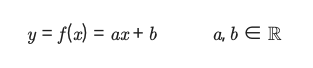

# Fundamental 27 Likelihood(MLE와 MAP)

# 확률 변수로서의 모델 파라미터

간단한 예시의 일차함수 모델



- 위 식에서 실수 a,b는 f라는 함수로 표현되는 모델의 형태를 결정하는 파라미터이다.

> **파라미터 공간(Parameter space)**
(a, b)가 위치하는 R공간
> 


- 위 그림에서 파라미터 공간에 주어진 확률 분포는 평균이 (1,0)인 정규분포이므로 y = ax + b에서 a와b의 값이 각각 1과 0에 가까울 확률, 그러니까 모델이 y = x에 가까울 확률이 크다고 보는 것이다.

# posterior와 prior, likelihood 사이의 관계

- 베이지안 머신러닝의 학심 아이디어는 모델 파라미터를 고정된 값이 아닌 불확실성(uncertaionty)을 가진 확률 변수로 보는 것, 데이터를 관찰하면서 업데이트되는 값으로 보는 것이다.

### 사전 확률, 가능도, 사후 확률(prior, likelihood, posterior)

- 데이터의 집합 X가 주어졌다. 그러면 데이터가 따르는 어떤 확률 분포 p(x)도 있을 것이다. 우리의 목표는 p(x)를 가장 잘 나타낸는 일차함수 모델를 찾는 것이다.


데이터르 관찰하기 전 파라미터 공간에 주어진 확률 분포 p(𝜽)를 **prior(prior probability, 사전 확률)**이라고 한다.

만약 prior분포를 고정시킨다면, 주어진 파라미터 분포에 대해서 우리가 갖고 있는 데이터가 얼마나 ‘그럴듯한지’계산할 수 있다. 이것을 나타낸는 값이 **likelihood(가능도, 우도)이다.**


즉, 파라미터의 분포 p(𝜽)가 정해졌을 때 x라는 데이터가 관찰될 확률이다.

Likeihood가 높다는 것은 곷 우리가 지정한 파라미터 조건에서 데이터가 관찰될 확률이 높다는 것이고, 데이터의 분포를 모델이 잘 표현하는 것이라고 생각할수 있다.

이렇게 데이터들의 likelihood값을 최대화하는 방향으로 모델을 학습시키는 방법을 최대 가능도 추정(maximum likelihood estimation, MLE)이라고 한다.

반대로, 데이터 집합 X가 주어졌을 때 파라미터 𝜽의 분포 p(𝜽|X)를 생각해 볼 수 있다. 이 때 이 값을 ‘데이터를 관찰한 후 계산되는 확률’이라는 뜻에서 posterior(posterior probability, 사후 확률)이라고 부른다.

실제로는 데이터 포인트의 개수는 유한하기 때문데 데이터가 따르는 확률 분포 p(x)는 우리가 정확하게 알 수 없다. 따라서 머신러닝의 목표가 p(x)를 직접 구할 수가 없으니까 모델 파라미터 𝜽를 조절해가면서 간접적으로 근사하는 것이다.

따라서 posterior를 직접 계산해서 최적의 𝜽값을 찾는 것이 아니라 prior와 likelihood에 관한 식으로 변형한 다음, 그 식을 최대화하는 파라미터 𝜽를 찾는다.

이렇게 posterior를 최대화하는 방향으로 모델을 학습시키는 방법을 최대 사후 확률 추정(maximum aposteriori estimation, MAP)라고 한다.

### posterior와 prior, likelihood 사이의 관계


- 정확한 p(x)를 알 수 없기 때문에 posterior p(𝜽|X)의 값도 직접 구할 수 없다. 하지만 p(x)는 고정된 값이고 likehood와 prior는 계산이 가능하기 때문에 우변을 최대화하는 파라미터 값은 구할 수 있다.

# likelihood와 머신러닝

- 머신러닝 모델은 데이터의 실제 분포를 근사한는 역할을 하기 때문에, 데이터가 들어와도 100%의 정확도를 내는 모델을 만들기는 불가능하다.
- 따라서 데이터로부터 예측한 prediction과 우리가 알고 있는 데이터의 label 사이에는 오차가 생기게된는데, 우리에게 관찰되는 데이터에는 이미 노이즈가 섞여있어서 이런 오차가 발생한다고 해석한다.


지도 학습의 예시에서는, 파라미터 분포 𝜽와 입력 데이터 $x_n$이 주어졌을 때 라벨 $y_n$을 예측하는 문제가 된다. 입력 데이터의 집합을 X, 라벨들의 집합을 Y라고 할때, likelihood는 파라미너와 입력 데이터가 주어졌을 때 출력값(라벨)의 확률 분포, 즉 p(Y|𝜽, X)가 된다.


# likelihood 감 잡기

랜덤한 데이터 포인트를 생성하고 좌표평면 위에 표시해 주는 코드

```python
import math
import numpy as np
import matplotlib.pyplot as plt

np.random.seed(321)

input_data = np.linspace(-2, 2, 5)
label = input_data + 1 + np.random.normal(0, 1, size=5)

plt.scatter(input_data, label)
plt.show()
```


```python
# model: y = ax + b
# a, b 값을 바꾸면서 실행해보세요
#-------------------------------#
a = 1
b = 1
#-------------------------------#

# 모델 예측값
model_output = a*input_data + b
likelihood = []

# x: 입력데이터, y: 데이터라벨
# 예측값과 라벨의 차이를 제곱해 exp에 사용
for x, y, output in zip(input_data, label, model_output):
    likelihood.append(1/(math.sqrt(2*math.pi*0.1*0.1))*math.exp(-pow(y-output,2)/(2*0.1*0.1)))

model_x = np.linspace(-2, 2, 50)
model_y = a*model_x + b

fig, ax = plt.subplots()
ax.scatter(input_data, label)
ax.plot(model_x, model_y)

for i, text in enumerate(likelihood):
    ax.annotate('%.3e'%text, (input_data[i], label[i]))

plt.show()
```


### likelihood가 왜 중요한가?

- 위에 예제에서 보이듯, 데이터 포인트가 모델 함수에서 멀어질수록 데이터의 liokelihood는 기하급수적으로 감소한다.

# MLE: 최대 가능도 추론

### 데이터셋 전체의 likelihood

모델 파라미터 𝜽가 주어졌을 때, 데이터 포인트$(x_n, y_n)$의 likelihood는 다음과 같다.


전제 데이터셋의 대하여 likelihood구하기

- 우리가 가지고 있는 데이터 포인트$(x_1, y_1),...,(x_n, y_n)$은 서로 독립이고(independent) 같은 확률분포를 따른다고(identicallu distributed) 가정한다.
- 이 조건을 줄여서 i.i.d라고 부르는 데, 머신러닝 문제에서꼭 필요한 전제조건이다.
- 데이터 포인트들이 서로 독립이므로, 데이터셋 전체의 likelihood p(Y|𝜽, X)는 데이터 포인트 각각의 likelihood를 모두 곱한 값과 같다.


로그를 씌우면 곱셈 연산이 덧셈 연산으로 바뀌면서 미분 계산이 편리해 지기때문에 MLE를 실제로 적용할 때는 likelihood 대신 log likelihood를 최대화하는 파라미터를 구한다.

또한 로그 함수는 단조 증가(monotonically increasing)하므로 likelihood를 최대화하는 파라미터와 log likelihood를 최대화하는 파라미터 값이 같아서 학습 결과에 영향을 주지 않는다.


또한 손실함수를 최소화하는 관저에서, log likelihood를 최대화하는 대신 negative log likelihood (-log p(Y|𝜽. X))를 최소화하는 식으로 나타내기도 한다.


유도과정


# MLE 최적해 구하기

### 데이터셋 생성

- y = x + 1
- 데이터 포인트 20개
- 평균 0, 표준편차 0.5

```python
import math
import numpy as np
import matplotlib.pyplot as plt

np.random.seed(0)
num_samples = 20

input_data = np.linspace(-2, 2, num_samples)
labels = input_data + 1 + np.random.normal(0, 0.5, size=num_samples)

plt.scatter(input_data, labels)
plt.show()
```


```python
def likelihood(labels, preds):
    result = 1/(np.sqrt(2*math.pi*0.1*0.1))*np.exp(-np.power(labels-preds,2)/(2*0.1*0.1))
    
    return np.prod(result)

def neg_log_likelihood(labels, preds):
    const_term = len(labels)*math.log(1/math.sqrt(2*math.pi*0.1*0.1))

    return (-1)*(const_term + 1/(2*0.1*0.1)*np.sum(-np.power(labels-preds,2)))
```

```python
# X: 20x2 matrix, y: 20x1 matrix
# input_data 리스트를 column vector로 바꾼 다음 np.append 함수로 상수항을 추가합니다.
X = np.append(input_data.reshape((-1, 1)), np.ones((num_samples, 1)), axis=1)
y = labels

theta_1, theta_0 = np.dot(np.dot(np.linalg.inv(np.dot(X.T, X)), X.T), y)

print('slope: '+'%.4f'%theta_1+' bias: '+'%.4f'%theta_0)

predictions = theta_1 * input_data + theta_0
print('likelihood: '+'%.4e'%likelihood(labels, predictions))
print('negative log likelihood: '+'%.4e'%neg_log_likelihood(labels, predictions))

model_x = np.linspace(-2, 2, 50)
model_y = theta_1 * model_x + theta_0

plt.scatter(input_data, labels)
plt.plot(model_x, model_y)
plt.show()
```


# MAP: 최대 사후 확률 추정

MLE로 구한 처적의 파라미터 식: $**\mathbf{\theta}_{ML} = (X^\top X)^{-1}X^\top\mathbf{y}X**$

MLE의 최적해는 오로지 관측된 데이터 값에만 의존한다. 따라서 관측된 데이터에 노이즈가 많이 섞여 있는 경우, 이상치데이터가 존재하는 경우에는 모델의 안정성이 떨어진다는 단점이 있다.

MAP는 데이터가 있을 때 파라미터의 값이 무엇일 확률이 제일 높은가?의 문제이다.

지도 학습의 경우 posterior는 p(𝜽|X, Y)로 나타낼 수 있는데 이 식을 prior p(𝜽)와 likelihood p(Y|𝜽, X)에 관한 식으로 변형하면 다음과 같다.


MLE에서 negative log likelihood를 최소화했던 것과 같이, MAP에서도 실제로는 posterior를 최대화하는 파라미터 대신 negative log posterior를 최소화하는 파라미터 값을 구한다. 식을 정리하면 다음과 같다.


또한 log p(Y|X)부분은 𝜽에 의한 식이 아니므로 제외하면 다음과 같다.


MLE에서 했던것처럼 MAP에서도 미분을 하여 최소화하는 방법을 사용한다.


따라서 MAP의 최적 파라미터 𝜽는 다음과 같다.


# MLE와 MAP의 비교

### 데이터셋

```python
import math
import numpy as np
import matplotlib.pyplot as plt

np.random.seed(0)
num_samples = 10

input_data = np.linspace(-2, 2, num_samples)
labels = input_data + 1 + np.random.normal(0, 0.5, size=num_samples)

input_data = np.append(input_data, [0.5, 1.5])
labels = np.append(labels, [9.0, 10.0])

plt.scatter(input_data, labels)
plt.show()
```


### 파라미터 계산

```python
def likelihood(labels, preds):
    result = 1/(np.sqrt(2*math.pi*0.1*0.1))*np.exp(-np.power(labels-preds,2)/(2*0.1*0.1))
    
    return np.prod(result)

def neg_log_likelihood(labels, preds):
    const_term = len(labels)*math.log(1/math.sqrt(2*math.pi*0.1*0.1))

    return (-1)*(const_term + 1/(2*0.1*0.1)*np.sum(-np.power(labels-preds,2)))
```

```python
# X: 21x2 matrix, y: 21x1 matrix
# input_data 리스트를 column vector로 바꾼 다음 np.append 함수로 상수항을 추가합니다.
X = np.append(input_data.reshape((-1, 1)), np.ones((num_samples+2, 1)), axis=1)
y = labels

# MLE 파라미터 계산식
mle_theta_1, mle_theta_0 = np.dot(np.dot(np.linalg.inv(np.dot(X.T, X)), X.T), y)
# MAP 파라미터 계산식
map_theta_1, map_theta_0 = np.dot(np.dot(np.linalg.inv(np.dot(X.T, X)+(0.1*0.1)/(0.04*0.04)*np.eye(2)), X.T), y)

print('[MLE result] (blue)')
print('slope: '+'%.4f'%mle_theta_1+' bias: '+'%.4f'%mle_theta_0)

mle_preds = mle_theta_1 * input_data + mle_theta_0
print('likelihood: '+'%.4e'%likelihood(labels, mle_preds))
print('negative log likelihood: '+'%.4e\n'%neg_log_likelihood(labels, mle_preds))

print('[MAP result] (orange)')
print('slope: '+'%.4f'%map_theta_1+' bias: '+'%.4f'%map_theta_0)

map_preds = map_theta_1 * input_data + map_theta_0
print('likelihood: '+'%.4e'%likelihood(labels, map_preds))
print('negative log likelihood: '+'%.4e'%neg_log_likelihood(labels, map_preds))

model_x = np.linspace(-2, 2, 50)
mle_model_y = mle_theta_1 * model_x + mle_theta_0
map_model_y = map_theta_1 * model_x + map_theta_0

plt.scatter(input_data, labels)
plt.plot(model_x, mle_model_y)
plt.plot(model_x, map_model_y)
plt.show()
'''
[MLE result] (blue)
slope: 1.4748 bias: 2.4784
likelihood: 0.0000e+00
negative log likelihood: 4.1298e+03

[MAP result] (orange)
slope: 1.1719 bias: 1.6628
likelihood: 0.0000e+00
negative log likelihood: 4.6645e+03
'''
```

