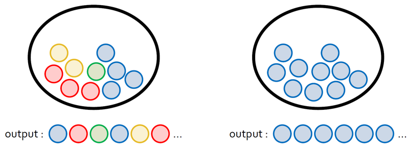

# Fundamental 28 정보이론 톺아보기

# Information Content

> **정보 이론(information theory)이란?**
추상적인 정보라는 개념을 정량화하고 정보의 저장과 통신을 연구하는 분야이다.
> 



- 왼쪽과 오른쪽 주머니에서 공을 하나씩 뽑아 나열한다고 가정할때 오른쪽보다 왼쪽이 더 정보량이 많다.

그렇다면 만약 파란색공999개와 빨간색공 1개가 들어있는 주머니가 있고 공을 하나거내고 다시 넣는 실험을 반복할때 처음의 파란공은 정보량이 높지만 수십, 수백번의 반복뒤에 파란공은 확률이 1에 가깝기 때문에 정보량이 매우 낮다. 반면에 빨간공은 정보량이 매우 높을 것이다.

정보를 정량적으로 표현하기 위해 필요한 세 가지 조건

- 일어날 가능성이 높은 사건은 정보량이 낮고, 반드시 일어나는 사건에는 정보가 없는 것이나 마찬가지이다.
- 일어날 가능성이 낮은 사건은 정보량이 높다.
- 두 개의 독립적인 사건이 있을 때, 전체 정보량은 각각의 정보량을 더한 것과 같다.

사건 x가 일어날 확률을 P(X=x)라고 할 때, 사건의 정보량(information content) I(x)는 다음과같이 정의된다.


파란공 n개와 빨간 공 1개가 있을 때 빨간색 공을 뽑는 사건의 정보량

```python
import numpy as np
import math
import random

# 주머니 속에 들어있는 공의 개수입니다. 숫자를 바꾸면서 실험해보세요!
total = 1000

#---------------#

count = 1   # 실험이 끝날 때까지 꺼낸 공의 개수

# 1부터 total까지의 정수 중에서 하나를 뽑고 total과 같으면 실험 종료
# total=1000인 경우 1~999: blue / 1000: red
while True:
    sample = random.randrange(1,total+1)
    if sample == total:
        break
    count += 1

print('number of blue samples: '+str(count-1))
print('information content: '+str(-math.log(1/count)))
'''
number of blue samples: 595
information content: 6.39024066706535
'''
```

# Entropy

- 정보량은 한 가지 사건에 대한 값이다.
- 특정 확률분포를 따르는 사건들의 정보량 기댓값을 **엔트로피(entropy)**라고 한다.

### For Discrete Random Variables

- 이산 확률 변수 X가 $x_1,x_2,...,x_n$중 하나의 값을 가진다고 가정할 때 **엔트로피는 각각의 경우의 수가 가지는 정보량에 확률을 곱한 후, 그 값을 모두 더한 값**이다.


- 여러 가지 색깡의 공이 들어있을때 엔트로피가 높고, 같은 색깔의 공이 많이 들어있을 때 엔트로피가 낮다.
- 이러한 엔트로피의 직관적인 개념은 무질서도 또는 불확실성과도 비슷하다.


- 사건들의 확률이 균등할수록 엔트로피 값은 증가한다.

동전을 던질 때 앞면이 나올 확률에 따른 엔트로피를 나타낸 그래프 (균등분포)


- 앞면이 나올 확률이 90%인 동전을 던질 때보다 앞면과 뒷면의 확률이 같은 동전을 던질 때 결과를 에측하기가 더 어렵기 때문에 불확실성이 크다고 할수 있다.

### For Contiuous Random Variables

- X가 이산 확률 변후 일때 엔트로피는 위와 같이 정보량에 확률을 각각 곱해서 모두 더한 값으로 정의된다.
- X가 연속적인 값을 갖는 연속 확률 변수 일때는 유한합 대신 적분의 형태로 정의 한다.

확률 변수 X의 확률 밀도 함수가 p(x)일 때 엔트로피는 다음과 같다.


- 연속 확률 변수의 엔트로피를 이산 확률 변수와 구분하여 **미분 엔트로피**하고 부른다.

# Kullback Leibler Divergence

머신러닝의 목표는 새로운 입력 데이터가 들어와도 예측이 잘 되도록, 모델의 확률 분포를 데이터의 실제 확률 분포에 가깝게 만드는 것이다.

머신러닝의 모델은 크게 두 가지가 있다. 

- 결정 모델(discriminative model): 데이터의 실제 분포를 모델링 하지 않고 결정 경계(dicision boundary)만을 학습한다. ex) 모델의 결과값이 0보다 작을 경우 데이터를 1번 클래스로 분류하고, 0보다 클 경우 2번 클래스로 분류한다.
- 생성 모델(generative model): 데이터와 모델로부터 도출할 수 있는 여러 확률 분포와 베이즈 이론을 이용해서 데이터의 실제 분포를 간접적으로 모델링한다.

생성 모델을 학습시킬 때는 두 확률 분포의 차이를 나타낸는 지표가 필요하다. 지표중 대표적인 예가 **쿨백-라이블러 발산(Kullback-Leibler divergence, KL divergence)**이다.

### KL divergence

데이터가 다르는 실제 확률 분포를 P(x), 모델이 나타내는 확률 분포를 Q(x)라고 할 때, 두 확률 분포의 KL divergence는 P(x)를 기준으로 계산된 Q(x)의 평균 정보량과, P(x)를 기준으로 계산된 P(x)의 평균 정보량의 차이로 정의할 수 있다.

이산 확률 변수


연속 확률 변수


특징 

- $D_{KL}(P||Q)$ ≥ 0
- $D_{KL}(P||Q) = 0$ if and only if P = Q
- non-symmetric: $D_{KL}(P||Q)$ ≠ $D_{KL}(Q||P)$

머신러닝 문제에서는 두 확률 분포의 차이를 줄여랴 하므로 $D_{KL}(P||Q)$를 최소화하는 방향으로 모델을 학습시킨다.


- 여기서 P(x)는 데이터의 실제 분포이므로 우리가 바꿀 수 없는 고정된 값이다. 따라서 KL divergence를 최소화하는 문제는 곧 빨간색 부분을 최소화하는 문제이다.
- 이 부분은 P(x)를 기준으로 계산한 Q(x)의 엔트로피, 즉 P(x)에 대한 Q(x)의 **교차 엔트로피(Cross Entropy)**이다.

### Cross Entropy

엔트로피, 교차 엔트로피, KL divergence사이의 관계식


# Cross Entropy Loss

> **손실 함수(loss function)이란?**
머신러닝에서 모델이 나타내는 확률 분포와 데이터가 따르는 실제 확률 분포 사이의 차이를 나타내는 함수를 손실 함수라고 한다.
> 

데이터가 연속적인 값을 가지는 회귀(regression)문제와는 다르게, 이산적인 값을 가지는 분류(classification)문제에서는 모델의 출력 결과가 로지스틱 함수(logistic function)로 표현된다. 분류 클래스가 2개인 로지스틱 함수를 클래스가 n개일 때로 확장한 것이 딥러닝에서도 자주 사용된느 소프트맥스 함수(softmax function)이다.

### example

분류 문제에서 데이터의 라벨은 one-hot encoding을 통해 표현된다.

3개의 클래스 $c_1, c_2, c_3$가 존재하는 분류 문제에서 어떤 데이터의 출력ㄱ밧이 다음과 같다고 가정하자.


이 결과는 곧 다음 식을 나타낸다.


또한 정답라벨의 확률분포는 다음과같다.


이것들을 cross entropy로 계산하면 다음과 같다.


### code

```python
import numpy as np
import random

# generate random output
#-----------------#
# can be modified
class_num = 4
#-----------------#
q_vector = []
total = 1

for i in range(class_num-1):
    q = random.uniform(0,total)
    q_vector.append(round(q,3))
    total = total - q

q_vector.append(total)
softmax_output = np.array(q_vector)

print(softmax_output)
'''
[0.801      0.14       0.055      0.00317765]
'''
```

```python
#-----------------#
# can be modified
class_index = 1
#-----------------#

p_vector = np.zeros(class_num)
p_vector[class_index-1] = 1

cross_entropy = -np.sum(np.multiply(p_vector, np.log(softmax_output)))

print('model prediction: '+str(softmax_output))
print('data label: '+str(p_vector))
print('cross entropy: '+str(round(cross_entropy,4)))
'''
model prediction: [0.801      0.14       0.055      0.00317765]
data label: [1. 0. 0. 0.]
cross entropy: 0.2219
'''
```

### Cross Entropy와 Likelihood의 관계

모델의 파라미터를 𝜽로 놓으면, 모델이 표현하는 확률 분포는 $Q(y|X,\theta)$로, 데이터의 실제 분포는 $P(y|X)$로 나타낼 수 있다. 그런데 $Q(y|X,\theta)$는 데이터셋과 파라미터가 주어졌을 때 예측값의 분포를 나타내므로 모델의 likelihood와 같다.


- 따라서 cross entropy를 최소화하는 파라미터 값을 구하는 것은 결국 negative log likelihood를 최소화하는 파라미터를 구하는 것과 같다.

# Decision Tree와 Entropy

엔트로피 개념이 활발하게 쓰이는 분야를 하나만 더 짚어 보면 의사결정나무(Decision Tree)계열의 모델이다.

아래 그림은 날씨에 따른 운동경기 여부를 기록한 데이터입니다. Day를 제외하고, 다음과 같은 4개의 데이터 컬럼이 있으며, Play(Yes/No) 컬럼이 라벨 역할을 하게 된다.

- Outlook : 전반적 날씨 (Sunny(맑은), Overcast(구름 낀), Rainy(비 오는))
- Temperature : 기온 정보(섭씨온도)
- Humidity : 습도 정보 (수치형 변수(%), 범주형으로 변환된 경우 (high, normal))
- Wind : 풍량 정보 (TRUE(바람 붊), FALSE(바람 안 붊) )


의사결정 트리는 가지고 있는 데이터에서 어떤 기준으로 전체 데이터를 나눴을 때 나누기 전보다 엔트로피가 감소하는지를 따져서, 엔트로피가 감소하면 그만큼 모델 내부에 정보 이득(information Gain)을 얻었다고 보는 관점이다.  엔트로피 증가가 정보 손실량이라고 정의하는 것의 반대 관점이다.


e(S) 구하는 수식


F가 Outlook일 때, 즉 Sunny, Overcast, Rainy중 하나일 때의 엔트로피


따라서 정보 이득은 다음과 같다.


### code

```python
import pandas as pd
import numpy as np
from sklearn.tree import DecisionTreeClassifier 
from sklearn.model_selection import train_test_split 
from sklearn import metrics
```

```python
import os
csv_path = os.getenv('HOME')+'/aiffel/information_theory/diabetes.csv'

col_names = ['pregnant', 'glucose', 'bp', 'skin', 'insulin', 'bmi', 'pedigree', 'age', 'label']
# load dataset
df = pd.read_csv(csv_path, header=0, names=col_names)
df.head()
```

```python
# 데이터셋 준비
feature_cols = ['pregnant', 'insulin', 'bmi', 'age', 'glucose', 'bp', 'pedigree']
X = df[feature_cols] # Features
y = df.label # Target variable

# Split dataset into training set and test set
X_train, X_test, y_train, y_test = train_test_split(X, y, test_size=0.3, random_state=1)
```

```python
# Decision Tree  모델 학습
# Create Decision Tree classifer object
clf = DecisionTreeClassifier()

# Train Decision Tree Classifer
clf = clf.fit(X_train,y_train)

#Predict the response for test dataset
y_pred = clf.predict(X_test)

print("Accuracy:",metrics.accuracy_score(y_test, y_pred))
'''
Accuracy: 0.6753246753246753
'''
```

시각화

```python
from sklearn.tree import export_graphviz
from six import StringIO  
from IPython.display import Image  
import pydotplus

dot_data = StringIO()
export_graphviz(clf, 
                out_file=dot_data,  
                filled=True, 
                rounded=True,
                special_characters=True, 
                feature_names=feature_cols, 
                class_names=['0','1'])
graph = pydotplus.graph_from_dot_data(dot_data.getvalue())  
graph.write_png('diabetes1.png')
Image(graph.create_png(), retina=True)
```


Impurity 측정

```python
# 정보 이득이 되지 않고 남은 Impurity  총량 측정
ccp_path1 = clf.cost_complexity_pruning_path(X_train,y_train)
ccp_path2 = clf.cost_complexity_pruning_path(X_test,y_test)
print(np.mean(ccp_path1.impurities))
print(np.mean(ccp_path2.impurities))
'''
0.15300447927425634
0.14770796419696539
'''
```

Decision Tree 3 depth까지만 발전

```python
clf = DecisionTreeClassifier(criterion="entropy", max_depth=3)

# Train Decision Tree Classifer
clf = clf.fit(X_train, y_train)

#Predict the response for test dataset
y_pred = clf.predict(X_test)

# Model Accuracy, how often is the classifier correct?
print("Accuracy:",metrics.accuracy_score(y_test, y_pred))
'''
Accuracy: 0.7705627705627706
'''
```

남은 엔트로피의 총량

```python
dot_data = StringIO()
export_graphviz(clf, 
                out_file=dot_data,  
                filled=True, 
                rounded=True,
                special_characters=True,
                feature_names = feature_cols,
                class_names=['0','1'])
graph = pydotplus.graph_from_dot_data(dot_data.getvalue())  
graph.write_png('diabetes2.png')
Image(graph.create_png(), retina=True)
```


```python
# 정보이득이 되지 않고 남은 Impurity  총량 측정
ccp_path1 = clf.cost_complexity_pruning_path(X_train,y_train)
ccp_path2 = clf.cost_complexity_pruning_path(X_test,y_test)
print(np.mean(ccp_path1.impurities))
print(np.mean(ccp_path2.impurities))
'''
0.7474881472739515
0.6878691771636323
'''
```