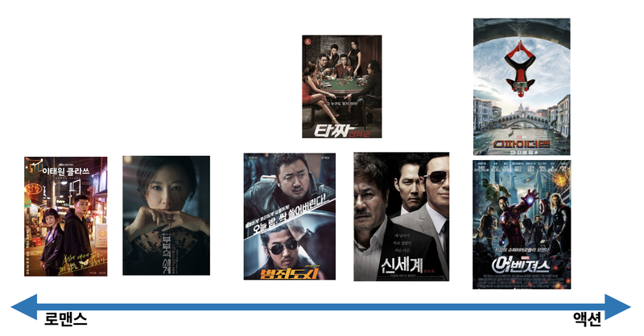

# Fundamental 29 사이킷런을 활용한 추천 시스템 입문

# 추천 시스템이란?

> **추천 시스템이란?**
사용자(user)에게 관련된 아이템(item)을 추천해 주는 것
> 

ex. 영화 추천

- A: 한국 드라마/영화, 로맨스물
- B: 미국 드라마/영화, 액션물

부부의 세계, 스파이더맨 파 프롬 홈, 타짜가 상영중일 때, 어떤 걸 추천해 주면 좋아할까?

A에게는 부부의 세계, B에게는 스파이더맨 파 프롬 홈



이렇게 영화들을 좌표평면에 놓았을 때, 거리가 좁으면 유사도가 높다고 생각할 수 있다.

그럼 만약 (C:21살, 여성, 대한민국, 학생, 서울)이라는 새로운 개인정보가 들어왔을 때는 어떻게 추천해 줄까?

- A: 32살/여성/대한민국/마케팅/인천
- B: 41살/남성/미국/군인/용산

위에 A,B의 개인정보가 다음과 같다면 유사도가 큰 A처럼 부부의 세계를 추천하는 것이 좋을 것이다.

추천 로직 

- 범주형, 이산적인 데이터를 숫자로 변환한다.
- 이 숫자 벡터의 유사도를 계산하여 유사도가 가까운 (혹은 높은)제품을 추천해 준다.

# 코사인 유사도

> **코사인 유사도란?**
두 벡터 간의 코사인 값을 이용해 두 벡터의 유사도를 계산하는 방법이다.
> 


- 두 벡터의 방향이 완전히 동일한 경우 1
- 90의 각을 이루면 0
- 반대 방향, 즉 각이 180이면 -1

따라서 코사인 유사도는 -1 ~ 1사이의 값을 갖고, 1에 가까울 수록 유사도가 높다고 할 수 있다.

### 코사인 유사도 수식


### Numpy 활용 코드

```python
import numpy as np

t1 = np.array([1, 1, 1])
t2 = np.array([2, 0, 1])
```

```python
from numpy import dot
from numpy.linalg import norm
def cos_sim(A, B):
	return dot(A, B)/(norm(A)*norm(B))

cos_sim(t1, t2)
'''
0.7745966692414834
'''
```

### 사이킷런 활용 코드

```python
from sklearn.metrics.pairwise import cosine_similarity

t1 = np.array([[1, 1, 1]])
t2 = np.array([[2, 0, 1]])
cosine_similarity(t1,t2)
'''
array([[0.77459667]])
'''
```

기타 다른 유사도 계산법

- 유클리드 거리
- 자카드 유사도
- 피어슨 상관계수

# 추천시스템의 종류


- 콘텐츠 기반 필터링(Content Based Filtering)
- 협업 필터링(Collaborative Filtering)
    - 사용자 기반
    - 아이템 기반
    - 잠재요인 협업 필터링 (latent factor collaborative filtering) → 행렬 인수분해(matrix factorization)
- Deep Learning 적용 or Hybrid 방식

# 콘텐츠 기반 필터링

콘텐츠 기반은 순수하게 콘텐츠의 내용만을 비교해서 추천하는 방식이다.

### 콘텐츠 기반 필터일 실습

1. import

```python
import pandas as pd
import numpy as np
from sklearn.feature_extraction.text import CountVectorizer
from sklearn.metrics.pairwise import cosine_similarity
```

1. Load data

```python
import os
csv_path = os.getenv('HOME')+'/aiffel/movie_recommendation/movie_dataset.csv'
df = pd.read_csv(csv_path)
df.head()
```

1. 특성 선택

```python
df.columns
'''
Index(['index', 'budget', 'genres', 'homepage', 'id', 'keywords',
       'original_language', 'original_title', 'overview', 'popularity',
       'production_companies', 'production_countries', 'release_date',
       'revenue', 'runtime', 'spoken_languages', 'status', 'tagline', 'title',
       'vote_average', 'vote_count', 'cast', 'crew', 'director'],
      dtype='object')
'''
```

```python
features = ['keywords','cast','genres','director']
features
```

```python
def combine_features(row):
    return row['keywords']+" "+row['cast']+" "+row['genres']+" "+row['director']

combine_features(df[:5])
'''
0    culture clash future space war space colony so...
1    ocean drug abuse exotic island east india trad...
2    spy based on novel secret agent sequel mi6 Dan...
3    dc comics crime fighter terrorist secret ident...
4    based on novel mars medallion space travel pri...
dtype: object
'''
```

```python
for feature in features:
    df[feature] = df[feature].fillna('')

df["combined_features"] = df.apply(combine_features,axis=1)
df["combined_features"]
'''
0       culture clash future space war space colony so...
1       ocean drug abuse exotic island east india trad...
2       spy based on novel secret agent sequel mi6 Dan...
3       dc comics crime fighter terrorist secret ident...
4       based on novel mars medallion space travel pri...
                              ...                        
4798    united states\u2013mexico barrier legs arms pa...
4799     Edward Burns Kerry Bish\u00e9 Marsha Dietlein...
4800    date love at first sight narration investigati...
4801     Daniel Henney Eliza Coupe Bill Paxton Alan Ru...
4802    obsession camcorder crush dream girl Drew Barr...
Name: combined_features, Length: 4803, dtype: object
'''
```

1. 벡터화, 코사인 유사도 

```python
cv = CountVectorizer()
count_matrix = cv.fit_transform(df["combined_features"])
print(type(count_matrix))
print(count_matrix.shape)
print(count_matrix)
```

```python
cosine_sim = cosine_similarity(count_matrix)
print(cosine_sim)
print(cosine_sim.shape)
'''
[[1.         0.10540926 0.12038585 ... 0.         0.         0.        ]
 [0.10540926 1.         0.0761387  ... 0.03651484 0.         0.        ]
 [0.12038585 0.0761387  1.         ... 0.         0.11145564 0.        ]
 ...
 [0.         0.03651484 0.         ... 1.         0.         0.04264014]
 [0.         0.         0.11145564 ... 0.         1.         0.        ]
 [0.         0.         0.         ... 0.04264014 0.         1.        ]]
(4803, 4803)
'''
```

1. 추천

```python
def get_title_from_index(index):
    return df[df.index == index]["title"].values[0]
def get_index_from_title(title):
    return df[df.title == title]["index"].values[0]

movie_user_likes = "Avatar"
movie_index = get_index_from_title(movie_user_likes)
similar_movies = list(enumerate(cosine_sim[movie_index]))

sorted_similar_movies = sorted(similar_movies,key=lambda x:x[1],reverse=True)[1:]

i=0
print(movie_user_likes+"와 비슷한 영화 3편은 "+"\n")
for item in sorted_similar_movies:
    print(get_title_from_index(item[0]))
    i=i+1
    if i==3:
        break

'''
Avatar와 비슷한 영화 3편은 

Guardians of the Galaxy
Aliens
Star Wars: Clone Wars: Volume 1
'''
```

# 협업 필터링

> 협업 필터링이란?
과거의 사용자 행동 양식(User Behavior)를 기반으로 추천하는 방식이다.
> 

협업 필터링의 기본원리 

- id: 사용자들의 정보
- item_id: 영화 정보
- rating: 평점
- timestamp: 평점을 매긴 시간


위 데이터를 사용자와 아이템 간 interaction matrix로 변환한다. 이를 평점행렬이라고 부르기도 한다.


### 협업 필터링의 종류

- 사용자 기반
- 아이템 기반
- 잠재요인(latent factor)

### 사용자 기반

- 동일한제품에 대해 평점을 매긴 데이터를 분석하여 추천을 하는 방식

만약 아래와 같은 평점행렬이 있을 대 User4가 item1을 구매하였다. 그리고 User4와 가장 유사한 User2는item1 ~ 4까지 다음과 같은 평점을 매겼다.


이때 User2가 선호한 제품인 item3을 User4에세 추천해 주는 방식이다.

### 아이템 기반

- 아이템 간의 유사도를 측정하여 해당 아이템을 추천하는 방식이다.

일반적으로 사용자 기반보다는 아이템 기반 방식이 정확도가 더 높다고 한다.

User2는 item1을 선호한다.


그 item에 대해 다은 User들의 선호도를 조사한다.


item1을 좋아한 사람은 user4다. 그 user4에게 user2가 좋아한 상품인 item3을 추천해 준다.


정리 

- **사용자 기반**: 당신과 비슷한 고객들이 다음 상품을 구매했습니다.
- **아이템 기반**: 이 상품을 선택한 다른 고객들은 다음 상품을 구매했습니다.

### 행렬 인수분해

잠재요인 협업 필터일은 평점행렬을 행렬 인수분해(matrix factorization)를 통해 잠재요인(latent factor)을 분석한다.

행렬 인수분해 종류

- SVD(Singular Vector Decomposition)
- ALS(Alteranating Least Squares)
- NMF(Non-Negagtive Factorization)

행렬인수분해를 함녀 추천 알고리즘의 파라미터 수가 줄어든다.

SVD

우리말로 변환하면 특잇갑 분해이다.


```python
import numpy as np
from numpy.linalg import svd

np.random.seed(30)
A = np.random.randint(0, 100, size=(4, 4))
A
'''
array([[37, 37, 45, 45],
       [12, 23,  2, 53],
       [17, 46,  3, 41],
       [ 7, 65, 49, 45]])
'''
```

```python
svd(A)
'''
(array([[-0.54937068, -0.2803037 , -0.76767503, -0.1740596 ],
        [-0.3581157 ,  0.69569442, -0.13554741,  0.60777407],
        [-0.41727183,  0.47142296,  0.28991733, -0.72082768],
        [-0.6291496 , -0.46389601,  0.55520257,  0.28411509]]),
 array([142.88131188,  39.87683209,  28.97701433,  14.97002405]),
 array([[-0.25280963, -0.62046326, -0.4025583 , -0.6237463 ],
        [ 0.06881225, -0.07117038, -0.8159854 ,  0.56953268],
        [-0.73215039,  0.61782756, -0.23266002, -0.16767299],
        [-0.62873522, -0.47775436,  0.34348792,  0.50838848]]))
'''
```

```python
U, Sigma, VT = svd(A)

print('U matrix: {}\n'.format(U.shape),U)
print('Sigma: {}\n'.format(Sigma.shape),Sigma)
print('V Transpose matrix: {}\n'.format(VT.shape),VT)
'''
U matrix: (4, 4)
 [[-0.54937068 -0.2803037  -0.76767503 -0.1740596 ]
 [-0.3581157   0.69569442 -0.13554741  0.60777407]
 [-0.41727183  0.47142296  0.28991733 -0.72082768]
 [-0.6291496  -0.46389601  0.55520257  0.28411509]]
Sigma: (4,)
 [142.88131188  39.87683209  28.97701433  14.97002405]
V Transpose matrix: (4, 4)
 [[-0.25280963 -0.62046326 -0.4025583  -0.6237463 ]
 [ 0.06881225 -0.07117038 -0.8159854   0.56953268]
 [-0.73215039  0.61782756 -0.23266002 -0.16767299]
 [-0.62873522 -0.47775436  0.34348792  0.50838848]]
'''
```

```python
Sigma_mat = np.diag(Sigma)

A_ = np.dot(np.dot(U, Sigma_mat), VT)
A_
'''
array([[37., 37., 45., 45.],
       [12., 23.,  2., 53.],
       [17., 46.,  3., 41.],
       [ 7., 65., 49., 45.]])
'''
```

Truncated SVD

Truncated SVD는 LSA(Latent semactic analysis), 잠재 의미 분석이라고 한다. Truncated SVD는 차원을 축소한다음 행렬을 분해하기 때문에 완벽히 같은 행렬이 나오지 않는다.

SVD(특이값 분해) 도식화


표기법

- R: 사용자와 아이템 사이의 행렬
- P: 사용자와 잠재요인 사이의 행렬
- Q: 아이템과 잠재요인 사이의 행렬 —> 전치 행렬 형태로 나타냄


# 실제 추천 시스템

실제 추천 시스템의 가장 중요한 지표는 클릭률이다. 전문용어로는 CTR(Click Through Rate)이라고 한다.