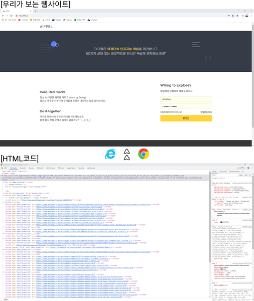

# Fundamental 31 뉴스기사 크롤링 및 분류

# HTML과 태그

> **크롤링(crawling)이란?**
웹 페이지로부터 데이터를 추출하는 행위를 말한다. 크롤링하는 소프트웨어는 크롤러(crawler)라고 부른다.
> 



우리는 인터넷 익스플로러, 크롬등과 같은 인터넷 브라우저를 사용하여 인터넷 세상으 돌아다닌다. 이 웝 사이트들은 실은 HTML(HyperText Markup Language)이라는 마크업 언어롤 작성된 문서로 구성되어 있다.

### HTML과 태그(Tag)

```html
<!DOCTYPE html>
<html>
  <head>
    <title> HTML 문서 </title>
  </head>
  <body>
    <h1> 이것은 HTML 문서입니다! </h1>
  </body>
</html>
```

- HTML 문서는 기본적으로 정해진 문법을 지키며 작성되어 있다.

네이버 HTML 소스코드의 일부

```html
<div class="direct_area">
    <a href="http://news.naver.com/" class="link_news" data-clk="newshome">네이버뉴스</a>
    <a href="http://entertain.naver.com/home" class="link_direct" data-clk="entertainment">연예</a>
    <a href="http://sports.news.naver.com/" class="link_direct" data-clk="sports">스포츠</a>
</div>
```

# 선택자

### 선택자(Selector)

원활한 크롤링을 위해서는 HTML 문서 내의 선택자(Selector)를 이해해야 한다. 

> **선택자란?**
어떤 특정 태그들에 그룹이나 번호를 주는 기능
> 

```html
<html> 
    <head> 
    </head> 
    <body> 
        <h1> 장바구니
            <p> 라운드티
                <span> 25 </span> 
                <span> 29000 </span> 
                <span> 의류</span> 
                <a href = 'http://www.naver.com'> 이동 </a> 
            </p> 
            <p> 시계
                <span> 28 </span>
                <span> 32000 </span> 
                <span> 악세서리 </span> 
                <a href = 'http://www.facebook.com'> 이동 </a> 
            </p> 
        </h1> 
    </body> 
</html>
```

- 위 문서에서 p 태그 span 태그, a 태그 등 아무런 추가 정보 없이 반복되면 가독성도 안 좋아 지고 서오 관계를 가지는 태그들이나 특정 태그만 선택해서 효과를 주고 싶을 땓도 일일히 찾아야 하는 번거로움이 있다.

```html
<html> 
    <head> 
    </head> 
    <body> 
        <h1> 장바구니
            <p id='clothes' class='name' title='라운드티'> 라운드티
                <span class = 'number'> 25 </span> 
                <span class = 'price'> 29000 </span> 
                <span class = 'menu'> 의류</span> 
                <a href = 'http://www.naver.com'> 바로가기 </a> 
            </p> 
            <p id='watch' class='name' title='시계'> 시계
                <span class = 'number'> 28 </span>
                <span class = 'price'> 32000 </span> 
                <span class = 'menu'> 악세서리 </span> 
                <a href = 'http://www.facebook.com'> 바로가기 </a> 
            </p> 
        </h1> 
    </body> 
</html>
```

- 따라서 id, class를 기존코드의 추가하여 비슷한 성격을 가지는 그룹을 정의해서 함께 관리하고 싶을 때 사용한다.

# BeautifulSoup 패키지

### BeautifulSoup의 사용법

```python
from bs4 import BeautifulSoup

#- HTML 문서를 문자열 html로 저장합니다.
html = '''
<html> 
    <head> 
    </head> 
    <body> 
        <h1> 장바구니
            <p id='clothes' class='name' title='라운드티'> 라운드티
                <span class = 'number'> 25 </span> 
                <span class = 'price'> 29000 </span> 
                <span class = 'menu'> 의류</span> 
                <a href = 'http://www.naver.com'> 바로가기 </a> 
            </p> 
            <p id='watch' class='name' title='시계'> 시계
                <span class = 'number'> 28 </span>
                <span class = 'price'> 32000 </span> 
                <span class = 'menu'> 악세서리 </span> 
                <a href = 'http://www.facebook.com'> 바로가기 </a> 
            </p> 
        </h1> 
    </body> 
</html>
'''

#- BeautifulSoup 인스턴스를 생성합니다.
#- 두번째 매개변수는 분석할 분석기(parser)의 종류입니다.
soup = BeautifulSoup(html, 'html.parser')
```

- BeautifulSoup(html, 'html.parser'): 입력은 HTML 문법으로 작성되어져 있으니 HTML문법을 기반으로 파싱하라는 의미

soup의 body

```python
print(soup.select('body'))
'''
[<body>
<h1> 장바구니
            <p class="name" id="clothes" title="라운드티"> 라운드티
                <span class="number"> 25 </span>
<span class="price"> 29000 </span>
<span class="menu"> 의류</span>
<a href="http://www.naver.com"> 바로가기 </a>
</p>
<p class="name" id="watch" title="시계"> 시계
                <span class="number"> 28 </span>
<span class="price"> 32000 </span>
<span class="menu"> 악세서리 </span>
<a href="http://www.facebook.com"> 바로가기 </a>
</p>
</h1>
</body>]
'''
```

- 현재 인스턴스의 이름은 soup이므로 soup.select()를 통해서 정보를 사져온다.

soup의 p

```python
print(soup.select('p'))
'''
[<p class="name" id="clothes" title="라운드티"> 라운드티
                <span class="number"> 25 </span>
<span class="price"> 29000 </span>
<span class="menu"> 의류</span>
<a href="http://www.naver.com"> 바로가기 </a>
</p>, <p class="name" id="watch" title="시계"> 시계
                <span class="number"> 28 </span>
<span class="price"> 32000 </span>
<span class="menu"> 악세서리 </span>
<a href="http://www.facebook.com"> 바로가기 </a>
</p>]
'''
```

soup의 menu

```python
print(soup.select('h1 .name .menu'))
'''
[<span class="menu"> 의류</span>, <span class="menu"> 악세서리 </span>]
'''
```

# newspaper3k 패키지

- newspaper3k는 뉴스 데이터를 크롤링하기 위해 만들어진 패키지이다.
- 사용자가 뉴스 기사의 URL을 전달해주면, 이로부터 뉴스 기사의 제목과 텍스트를 추출할 수 있다.

임의의 뉴스를 선정하여 뉴스의 제목과 텍스트 뽑기

```python
from newspaper import Article

#- 파싱할 뉴스 기사 주소입니다.
url = 'https://news.naver.com/main/read.nhn?mode=LSD&mid=sec&sid1=101&oid=030&aid=0002881076'

#- 언어가 한국어이므로 language='ko'로 설정해줍니다.
article = Article(url, language='ko')
article.download()
article.parse()
```

```python
#- 기사 제목을 출력합니다.
print('기사 제목 :')
print(article.title)
print('')

#- 기사 내용을 출력합니다.
print('기사 내용 :')
print(article.text)
'''
기사 제목 :
[AI 사피엔스 시대]자연어처리 기술, 컴퓨팅 파워 경쟁 시대로

기사 내용 :
[Copyright ⓒ 전자신문 & 전자신문인터넷, 무단전재 및 재배포 금지]

주로 아이디어와 기술력으로 경쟁했던 자연어처리 인공지능(AI) 분야는 점차 컴퓨팅 파워 싸움으로 무게 추가 이동하고 있다. 모델이 대형화되면서 향상된 퍼포먼스 확보에 필요한 자금 규모도 커지고 있다. 자칫 대기업 자본력에 휘둘릴 수 있다는 우려도 함께 나온다.자연어처리(NLP)는 인간이 사용하는 언어 체계를 기계가 인식하도록 알고리즘을 디자인하는 기술이다. 흔히 말하는 컴퓨터 혹은 인간과 대화하는 컴퓨터 관련 기술이 포함된다.목적에 따라 세 가지 카테고리로 나뉜다. 인간이 제기한 질문에 자동으로 적절한 답을 찾아주는 '질의응답(QA)', 원하는 업무를 지시했을 때 작업을 수행하는 '테스크 컴플리션', 그리고 특별한 목적이 없는 대화를 의미하는 '오픈도메인 컨버세이션(비목적성 대화)'이 있다. 각기 발전해왔던 세 가지 기술은 지난 2018년 구글의 인공지능 언어모델 '버트(BERT)'의 등장으로 패러다임이 전환됐다. 압도적인 성능으로 대량의 프리트레이닝(사전학습)이 가능해지면서 굳이 셋을 구분할 필요가 없어진 것이다.기계학습 연구에서 모델을 학습할 때는 지도학습과 비지도학습, 강화학습 중 하나를 골라 활용한다. 지도학습은 사람이 적절한 입력과 출력을 부여하는 방식이다. 정답이 정해져 있고 기계의 정답률도 쉽게 측정할 수 있다. 반면에 비지도학습은 정답이 정해지지 않은 데이터에 대해서도 기계가 스스로 클러스터링 등을 통해 학습한다. 체계화되지 않은 대량의 데이터를 학습 가능하지만 학습이 맞게 됐는지 확인하기 어렵다.버트는 기존 AI 학습 방법을 혁신적으로 바꿔놨다는 평가를 받는다. 자연어처리를 교사 없이 양방향으로 사전 학습하는 최초의 시스템이다. 비지도학습 방식을 사용하면서도 기존 존재했던 어떤 기술보다 뛰어난 성능을 보여준다. 최근 1년 반 동안 버트를 필두로 AI 모델은 급격히 대형화되는 추세다.이는 기존의 빅데이터 개념을 훨씬 상회하는 초 대규모 데이터를 프리트레이닝 단계에서 학습 가능하게 만드는 결과로 이어졌다. 성능도 비약적으로 상승했다. 가장 최근 구글이 선보인 제너레이션 모델은 제시된 문장에 대해 인간의 80~90% 수준으로 답변 문장을 만들어 낸다.문제는 모델이 대형화되면서 기술을 구성하는 요소 중 알고리즘 대비 대량의 데이터셋과 컴퓨팅 파워 중요성이 더 커졌다는 점이다. 버트 자체는 '파인튜닝' 방식으로 다양한 분야에 확대 적용이 가능하지만 버트 성능에 준하는 최신 대형 모델을 만들어내려면 현존 최신 텐서처리장치(TPU)로도 학습에 수십 일이 걸린다.국내 한 AI 스타트업 대표는 “국내 상황은 데이터셋·인력·자금 인프라 모두 중국이나 영어권에 비해 떨어지는 게 사실이다. 자연어처리 모델 하나 만드는 데 10억~20억원씩 비용이 들어 고민이 많다”면서 “지금 글로벌 시장에서 격차가 나기 시작하면 이후에는 따라잡기 어려워진다. 정부 차원의 관심과 지원이 필요하다”고 말했다.이형두기자 dudu@etnews.com
'''
```

# 뉴스 URL, 페이지 이해하기

### 네이버 뉴스 URL 구조 이해하기


URL 분석

- &sid1=: 뉴스가 속한 카테고리의 번호
- &date=: 해당 뉴스들이 속한 날짜
- &page=: 몇 페이지인지를 의미

카테고리 번호

- 100 : 정치
- 101 : 경제
- 102 : 사회
- 103 : 생활/문화
- 104 : 세계
- 105 : IT/과학
- 110 : 오피니언

### 네이버 뉴스 HTML 문서 구조 이해하기


# BeautifulSoup와 newspaper3k를 통해 크롤러 만들기

make_urllist()는 BeautifulSoup라는 도구를 이용해서 URL 리스트를 리턴하는 함수이다.

```python
# 크롤러를 만들기 전 필요한 도구들을 임포트합니다.
import requests
import pandas as pd
from bs4 import BeautifulSoup

# 페이지 수, 카테고리, 날짜를 입력값으로 받습니다.
def make_urllist(page_num, code, date): 
  urllist= []
  for i in range(1, page_num + 1):
    url = 'https://news.naver.com/main/list.nhn?mode=LSD&mid=sec&sid1='+str(code)+'&date='+str(date)+'&page='+str(i)
    headers = {'User-Agent': 'Mozilla/5.0 (X11; Linux x86_64) AppleWebKit/537.36 (KHTML, like Gecko) Chrome/54.0.2840.90 Safari/537.36'}
    news = requests.get(url, headers=headers)

    # BeautifulSoup의 인스턴스 생성합니다. 파서는 html.parser를 사용합니다.
    soup = BeautifulSoup(news.content, 'html.parser')

    # CASE 1
    news_list = soup.select('.newsflash_body .type06_headline li dl')
    # CASE 2
    news_list.extend(soup.select('.newsflash_body .type06 li dl'))
        
    # 각 뉴스로부터 a 태그인 <a href ='주소'> 에서 '주소'만을 가져옵니다.
    for line in news_list:
        urllist.append(line.a.get('href'))
  return urllist
```

함수 적용

```python
url_list = make_urllist(2, 101, 20200506)
print('뉴스 기사의 개수: ',len(url_list))
'''
뉴스 기사의 개수:  40
'''
```

```python
url_list[:5]
'''
['https://news.naver.com/main/read.naver?mode=LSD&mid=sec&sid1=101&oid=057&aid=0001451723',
 'https://news.naver.com/main/read.naver?mode=LSD&mid=sec&sid1=101&oid=057&aid=0001451721',
 'https://news.naver.com/main/read.naver?mode=LSD&mid=sec&sid1=101&oid=057&aid=0001451718',
 'https://news.naver.com/main/read.naver?mode=LSD&mid=sec&sid1=101&oid=003&aid=0009849190',
 'https://news.naver.com/main/read.naver?mode=LSD&mid=sec&sid1=101&oid=057&aid=0001451717']
'''
```

newspaper3k를 잉용해서 뉴스 기사들을 파이썬에 저장하기

```python
idx2word = {'101' : '경제', '102' : '사회', '103' : '생활/문화', '105' : 'IT/과학'}
```

```python
from newspaper import Article

#- 데이터프레임을 생성하는 함수입니다.
def make_data(urllist, code):
  text_list = []
  for url in urllist:
    article = Article(url, language='ko')
    article.download()
    article.parse()
    text_list.append(article.text)

  #- 데이터프레임의 'news' 키 아래 파싱한 텍스트를 밸류로 붙여줍니다.
  df = pd.DataFrame({'news': text_list})

  #- 데이터프레임의 'code' 키 아래 한글 카테고리명을 붙여줍니다.
  df['code'] = idx2word[str(code)]
  return df
```

```python
data = make_data(url_list, 101)
#- 상위 10개만 출력해봅니다.
data[:10]
```


# 데이터 수집 및 전처리

원하는 카테고리 저장

```python
code_list = [102, 103, 105]

code_list
'''
[102, 103, 105]
'''
```

리스트, 날짜, 페이지 수를 입력으로 받는 make_total_data()함수

```python
from multiprocessing import Pool
import random
import time, os

def make_total_data(page_num, code_list, date):
  start = int(time.time())  
  num_cores = 4  
  df = None
  for code in code_list:
    pool = Pool(num_cores)
    url_list = make_urllist(page_num, code, date)
    df_temp = make_data(url_list, code)
    print(str(code)+'번 코드에 대한 데이터를 만들었습니다.')
    pool.close()
    pool.join()
    time.sleep(random.randint(0,1))
    if df is not None:
      df = pd.concat([df, df_temp])
    else:
      df = df_temp

  print("***run time(sec) :", int(time.time()) - start)
  return df
```

2020년 5월 6일 기사에 대해서 1페이지까지만 크롤링을 하되, 102번, 103번, 105번 코드를 가지는 카테고리의 뉴스들을 수집해서 데이터 프레임으로 저장

```python
df = make_total_data(1, code_list, 20200506)
'''
102번 코드에 대한 데이터를 만들었습니다.
103번 코드에 대한 데이터를 만들었습니다.
105번 코드에 대한 데이터를 만들었습니다.
***run time(sec) : 39
'''
```

```python
print('뉴스 기사의 개수: ',len(df))
'''
뉴스 기사의 개수:  60
'''
```

sample 추출

```python
df.sample(10)
```


### 크롤링

- 수집한 데이터롤 머신 러닝 모델을 통해 카테고리를 예측하는 모델
- 3개의 카테고리에 대해서 총 10개의 페이지에 대해서 크롤링

```python
# 아래 주석처리된 코드의 주석을 해제하고 실행을 하면 대량 크롤링이 진행됩니다. 
# 위에서 수행했던 크롤링의 10배 분량이 수행될 것입니다. 한꺼번에 너무 많은 크롤링 요청이 서버에 전달되지 않도록 주의해 주세요. 
# 기사 일자를 바꿔보면서 데이터를 모으면 더욱 다양한 데이터를 얻을 수 있게 됩니다. 

df = make_total_data(10, code_list, 20200506)
```

수집한 데이터 csv파일로 별도 저장

```python
import os

# 데이터프레임 파일을 csv 파일로 저장합니다.
# 저장경로는 이번 프로젝트를 위해 만든 폴더로 지정해 주세요.
csv_path = os.getenv("HOME") + "/aiffel/news_crawler/news_data.csv"
df.to_csv(csv_path, index=False)

if os.path.exists(csv_path):
  print('{} File Saved!'.format(csv_path))
```

# 데이터 전처리

### 데이터 정재

저장해둔 csv파일을 읽어서 데이터프레임으로 저장

```python
csv_path = os.getenv("HOME") + "/aiffel/news_crawler/news_data.csv"
df = pd.read_table(csv_path, sep=',')
df.head()
```


각종 숫자, 영어, \n등 정규표현식을 이용하여 전처리 수행

```python
# 정규 표현식을 이용해서 한글 외의 문자는 전부 제거합니다.
df['news'] = df['news'].str.replace("[^ㄱ-ㅎㅏ-ㅣ가-힣 ]","")
df['news']
'''
/tmp/ipykernel_13/3649439000.py:2: FutureWarning: The default value of regex will change from True to False in a future version.
  df['news'] = df['news'].str.replace("[^ㄱ-ㅎㅏ-ㅣ가-힣 ]","")
0      파주시청 사진제공파주시 파주시청 사진제공파주시파주파이낸셜뉴스 강근주 기자 파주시는 ...
1      동영상 뉴스이천 물류창고 화재 발화지점으로 지목된 지하 층에서 산소절단기의 산소 공...
2      황범순 의정부시 부시장 을지대학교 의정부캠퍼스 및 부속병원 공사현장 안전점검 사진제...
3      귀갓길 여성을 쫓아가 성범죄를 시도한 대 남성이 구속됐습니다서울 강남경찰서는 강간상...
4      서울연합뉴스 대한약사회가 일부터 코로나바이러스 감염증 대응 체계를 사회적 거리두기에...
                             ...                        
595    지디넷코리아이도원 기자스마일게이트알피지대표 지원길는 블록버스터 핵앤슬래시 다중접속역...
596    모두의셔틀 로고 모두의셔틀 제공  뉴스 모두의셔틀 로고 모두의셔틀 제공  뉴스서울뉴...
597    휴온스의 신종 코로나바이러스 감염증코로나 관련 방역용품이 미국 수출길에 오른다휴온스...
598    코로나 치료제백신 개발 범정부 지원단은 오늘일부터 이틀 동안 관련 기업들을 대상으로...
599      전자신문  전자신문인터넷 무단전재 및 재배포 금지이재용 삼성전자 부회장이 세 경...
Name: news, Length: 600, dtype: object
'''
```

데이터 Null값 확인(결측치 확인)

```python
print(df.isnull().sum())
'''
news    0
code    0
dtype: int64
'''
```

중복된 샘플 확인

```python
# 중복된 샘플들을 제거합니다.
df.drop_duplicates(subset=['news'], inplace=True)

print('뉴스 기사의 개수: ',len(df))
'''
뉴스 기사의 개수:  552
'''
```

### 데이터 탐색

Matplotlib 한글 폰트 설정

```python
import matplotlib.pyplot as plt
plt.rcParams["font.family"] = "NanumGothic"

df['code'].value_counts().plot(kind = 'bar')
```


카테고리별 실제 개수

```python
print(df.groupby('code').size().reset_index(name = 'count'))
'''
    code  count
0  IT/과학    179
1     사회    192
2  생활/문화    181
'''
```

### 토큰화

- 한국어 형태 분석기 사용: Mecab

Mecab사용 예시

```python
from konlpy.tag import Mecab
tokenizer = Mecab()

kor_text = '밤에 귀가하던 여성에게 범죄를 시도한 대 남성이 구속됐다서울 제주경찰서는 \
            상해 혐의로 씨를 구속해 수사하고 있다고 일 밝혔다씨는 지난달 일 피해 여성을 \
            인근 지하철 역에서부터 따라가 폭행을 시도하려다가 도망간 혐의를 받는다피해 \
            여성이 저항하자 놀란 씨는 도망갔으며 신고를 받고 주변을 수색하던 경찰에 \
            체포됐다피해 여성은 이 과정에서 경미한 부상을 입은 것으로 전해졌다'

#- 형태소 분석, 즉 토큰화(tokenization)를 합니다.
print(tokenizer.morphs(kor_text))
'''
['밤', '에', '귀가', '하', '던', '여성', '에게', '범죄', '를', '시도', '한', '대', '남성', '이', '구속', '됐', '다', '서울', '제주', '경찰서', '는', '상해', '혐의', '로', '씨', '를', '구속', '해', '수사', '하', '고', '있', '다고', '일', '밝혔', '다', '씨', '는', '지난달', '일', '피해', '여성', '을', '인근', '지하철', '역', '에서부터', '따라가', '폭행', '을', '시도', '하', '려다가', '도망간', '혐의', '를', '받', '는다', '피해', '여성', '이', '저항', '하', '자', '놀란', '씨', '는', '도망갔으며', '신고', '를', '받', '고', '주변', '을', '수색', '하', '던', '경찰', '에', '체포', '됐', '다', '피해', '여성', '은', '이', '과정', '에서', '경미', '한', '부상', '을', '입', '은', '것', '으로', '전해졌', '다']
'''
```

### 불용어(stopwords) 제거

```python
stopwords = ['에','는','은','을','했','에게','있','이','의','하','한','다','과','때문','할','수','무단','따른','및','금지','전재','경향신문','기자','는데','가','등','들','파이낸셜','저작','등','뉴스']
```

```python
# 토큰화 및 토큰화 과정에서 불용어를 제거하는 함수입니다.
def preprocessing(data):
  text_data = []

  for sentence in data:
    temp_data = []
    #- 토큰화
    temp_data = tokenizer.morphs(sentence) 
    #- 불용어 제거
    temp_data = [word for word in temp_data if not word in stopwords] 
    text_data.append(temp_data)

  text_data = list(map(' '.join, text_data))

  return text_data
```

sample 출력

```python
text_data = preprocessing(df['news'])
print(text_data[0])
'''
파주 시청 사진제 공파 주시 파주 시청 사진 제공 파주시 파주 강근주 파 주 시 일 관내 취약 계층 만 가구 대해 정부 긴급 재난 지원금 입금 완료 다파 주 시민 받 긴급 재난 지원금 인 이상 가구 기준 으로 만 원 받 게 되 며 인 가구 만 원 인 가구 만 원 인 가구 만 원 정부 발표 긴급 재난 지원금 파주 시민 지급 금액 다른 이유 국비 지방비 부담 비율 다파 주 시 이미 모든 시민 경기도 파주시 재난 기본 소득 인 당 각 만 원 지급 고 어 시민 국비 지원금 만 지급 며 인 가구 기준 으로 총 지원 금액 파주시 재난 기본소득 만 원 경기도 재난 기본소득 만 원 정부 긴급 재난 지원금 만 원 총 만 원 받 게 된다 취약 계층 아닌 시민 오 월일 부터 소지 고 신용 체크카드 사 홈페이지 에서 긴급 재난 지원금 지원 신청 세대주 가족 지원금 일괄 신청 해야 한다 한편 파 주 시 일 김정기 부시장 단장 으로 긴급 재난 지원금 추진 태 스 크 포스 를 구성 해 긴급 재난 지원금 원활 게 지급 될 도록 지원 한다 권 자 재 배포
'''
```

# 머신 러닝 사용하기

모델: 나이브 베이즈 분류기

import

```python
from sklearn.model_selection import train_test_split
from sklearn.feature_extraction.text import CountVectorizer
from sklearn.feature_extraction.text import TfidfTransformer
from sklearn.naive_bayes import MultinomialNB
from sklearn import metrics
```

train, test나누기

```python
#- 훈련 데이터와 테스트 데이터를 분리합니다.
X_train, X_test, y_train, y_test = train_test_split(text_data, df['code'], random_state = 0)
```

분리된 데이터의 개수 확인

```python
print('훈련용 뉴스 기사의 개수 :', len(X_train))
print('테스트용 뉴스 기사의 개수 : ', len(X_test))
print('훈련용 레이블의 개수 : ', len(y_train))
print('테스트용 레이블의 개수 : ', len(y_test))
'''
훈련용 뉴스 기사의 개수 : 414
테스트용 뉴스 기사의 개수 :  138
훈련용 레이블의 개수 :  414
테스트용 레이블의 개수 :  138
'''
```

나이브 베이즈 부류기를 사용하기 위해서는 각 뉴스의 텍스트 데이터를 벡터로 변환할 필요가 있다.

이를 위한 전처리로 TF-IDF라는 방법을 사용

- fit_transform(): fit과 transform을 연이어 수행하는 함수
- CountVectorizer.fir_transform(): 단어 데이터를 학습하고 문서 데이터를 document-form matrix로 변환하는 두 가지 작업을 수행

```python
#- 단어의 수를 카운트하는 사이킷런의 카운트벡터라이저입니다.
count_vect = CountVectorizer()
X_train_counts = count_vect.fit_transform(X_train)

#- 카운트벡터라이저의 결과로부터 TF-IDF 결과를 얻습니다.
tfidf_transformer = TfidfTransformer()
X_train_tfidf = tfidf_transformer.fit_transform(X_train_counts)

#- 나이브 베이즈 분류기를 수행합니다.
#- X_train은 TF-IDF 벡터, y_train은 레이블입니다.
clf = MultinomialNB().fit(X_train_tfidf, y_train)
```

텍스트를 입력하면 자동으로 TF-IDF벡터로 바꾸는 전처리 함수

```python
def tfidf_vectorizer(data):
  data_counts = count_vect.transform(data)
  data_tfidf = tfidf_transformer.transform(data_counts)
  return data_tfidf
```

clf.predict()는 임의의 입력에 대해서 나이브 베이즈 분류기가 예측한 값을 리턴

```python
new_sent = preprocessing(["민주당 일각에서 법사위의 체계·자구 심사 기능을 없애야 한다는 \
                           주장이 나오는 데 대해 “체계·자구 심사가 법안 지연의 수단으로 \
                          쓰이는 것은 바람직하지 않다”면서도 “국회를 통과하는 법안 중 위헌\
                          법률이 1년에 10건 넘게 나온다. 그런데 체계·자구 심사까지 없애면 매우 위험하다”고 반박했다."])
print(clf.predict(tfidf_vectorizer(new_sent)))
'''
['IT/과학']
'''
```

테스트 데이터에 대해서 모델을 예측하고 실제값과 비교하여 점수를 측정

```python
y_pred = clf.predict(tfidf_vectorizer(X_test))
print(metrics.classification_report(y_test, y_pred))
'''
              precision    recall  f1-score   support

       IT/과학       0.78      0.84      0.81        51
          사회       0.80      0.93      0.86        42
       생활/문화       0.85      0.64      0.73        45

    accuracy                           0.80       138
   macro avg       0.81      0.81      0.80       138
weighted avg       0.81      0.80      0.80       138
'''
```