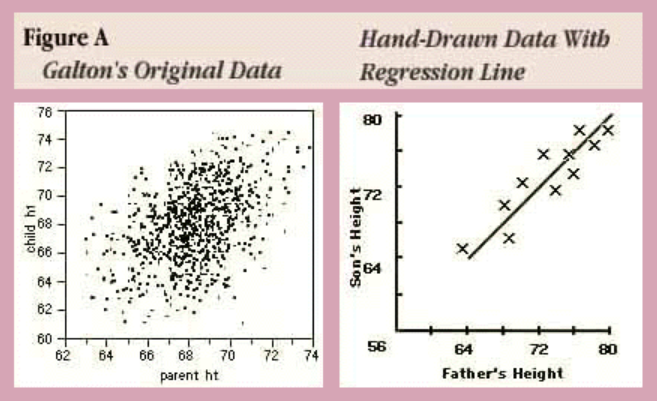

# Fundamental 19 선형회귀와 로지스틱 회귀

# 회귀(Regression)에 대하여

> **회귀분석이란?**
통계학에서 전통적으로 많이 사용되던 분석방법으로, 관팔된 영러 데이터를 기반으로 각 연속형 변수 산의 관계를 모델링하고 이에 대한 적합도를 측정하는 분석
> 



오늘날의 회귀분석이한 단순히 평균으로 수렴하는 현상을 넘어서서, 두 개 이상의 변수 사이의 함수관계를 추구하는 통계적 방법을 의미한다.

두 변수 사이의 관계를 직선 형태로 가정하고 분석하는 것을 선형 회귀분석(Linear regression)이라고 한다.

선형 회귀분석의 4가지 기본가정

- 선형성 → 예측하고자 하는 종속변수 y와 독립변수 x간에 선형성을 만족하는 특성
- 독립성 → 독립변수 x간에 상관관게가 없이 독립성을 만족하는 특성(다중 o, 단순 x)
- 등분산성 → 분산이 같다는 말, 분산이 같다는 것은 특정한 패턴 없이 고르게 분포되었다는 의미
- 정규성 → 정규부포를 띄는지 여부를 의미

지도학습의 두 종류

- 분류: 데이터 x의 여러 feature값들을 이용하여 해당 데이터의 클래스 y를 추론하는 것
- 회귀: 데이터 x의 여러 feature값들을 이용하여 연관된 다른 데이터 y의 정확한 값을 추론하는 것

# 선형 회귀 분석(Linear Refression)

> **선형 회귀란?**
종속변수 Y와 한 개 이상의 독립변수 X와의 선형 상관관계를 모델링하는 회귀분석 기법
> 

### 선형 회귀 모델링


- ℬ: **회귀 계수**
- ℇ: 종속 변수와 독립 변수 사이에 **오차**

위에 두 개의 변수는 데이터로부터 추정해야 하는 파라미터이다. 따라서 **선형회귀 모델울 찾는 다는 것은 주어진 데이터에 우리의 선형식이 잘 맞도록 회귀계수 및 오차를 구하는 것**이다.

### 머신러닝에서의 선형회귀모델 표기법


- H: 가정(Hypothesis)
- W: 가중치(Weight)
- b: 편향(bias)

W,b는 단순 스칼라 값이 아닌 고차원의 행렬(matrix)형태를 띄고 있는 경우가 많고, 이 파라미터의 개수가 많을수록 모델의 크기가 커지고 학습하는 것도 어렵다.

### 용어 설명

> **잔차(Residuals)란?**
회귀모델을 이용해 추정한 값과 실제 데이터의 차이
> 

최소제곱법


n개의 점 제이터에 대하여 잔차의 제곱의 합을 최소로 하는 W, b를 구하는 방법

> **결정계수란?**
회귀모델이 잘 경정되었는지 확인할 때 참고하는 지표
> 

### 데이터셋 준비하기

데이터셋: scikit-learn에서 제공하는 Boston house price dataset

```python
from sklearn.datasets import load_boston
from sklearn import model_selection
import pandas as pd
import numpy as np

# 데이터 로드
boston = load_boston()
data, price = boston['data'], boston['target']
x_train, x_test, y_train, y_test = model_selection.train_test_split(data, price, test_size=0.2)

df = pd.DataFrame(x_train, columns=boston['feature_names'])
print("boston dataset의 차원: ", data.shape)
print("price의 차원", price.shape)
print("boston train dataset의 차원: ", x_train.shape)
print("boston test dataset의 차원: ", x_test.shape)

print("Boston dataset의 예시")
df.head() # data 요약
'''
boston dataset의 차원:  (506, 13)
price의 차원 (506,)
boston train dataset의 차원:  (404, 13)
boston test dataset의 차원:  (102, 13)
Boston dataset의 예시
/opt/conda/lib/python3.9/site-packages/sklearn/utils/deprecation.py:87: FutureWarning: Function load_boston is deprecated; `load_boston` is deprecated in 1.0 and will be removed in 1.2.

    The Boston housing prices dataset has an ethical problem. You can refer to
    the documentation of this function for further details.

    The scikit-learn maintainers therefore strongly discourage the use of this
    dataset unless the purpose of the code is to study and educate about
    ethical issues in data science and machine learning.

    In this case special case, you can fetch the dataset from the original
    source::

        import pandas as pd
        import numpy as np

        data_url = "http://lib.stat.cmu.edu/datasets/boston"
        raw_df = pd.read_csv(data_url, sep="\s+", skiprows=22, header=None)
        data = np.hstack([raw_df.values[::2, :], raw_df.values[1::2, :2]])
        target = raw_df.values[1::2, 2]

    Alternative datasets include the California housing dataset (i.e.
    func:`~sklearn.datasets.fetch_california_housing`) and the Ames housing
    dataset. You can load the datasets as follows:

        from sklearn.datasets import fetch_california_housing
        housing = fetch_california_housing()

    for the California housing dataset and:

        from sklearn.datasets import fetch_openml
        housing = fetch_openml(name="house_prices", as_frame=True)

    for the Ames housing dataset.
    
  warnings.warn(msg, category=FutureWarning)
'''
```

```
:Attribute Information (in order):
        - CRIM     per capita crime rate by town
        - ZN       proportion of residential land zoned for lots over 25,000 sq.ft.
        - INDUS    proportion of non-retail business acres per town
        - CHAS     Charles River dummy variable (= 1 if tract bounds river; 0 otherwise)
        - NOX      nitric oxides concentration (parts per 10 million)
        - RM       average number of rooms per dwelling
        - AGE      proportion of owner-occupied units built prior to 1940
        - DIS      weighted distances to five Boston employment centres
        - RAD      index of accessibility to radial highways
        - TAX      full-value property-tax rate per $10,000
        - PTRATIO  pupil-teacher ratio by town
        - B        1000(Bk - 0.63)^2 where Bk is the proportion of black people by town
        - LSTAT    % lower status of the population
        - MEDV     Median value of owner-occupied homes in $1000's
```

### Boston Dataset에 Linear Regression 적용해보기

```python
# Boston dataset의 각 attribute에 선형회귀 적용하는 예제
import pandas as pd
from sklearn import datasets
from sklearn import model_selection
from sklearn.linear_model import LinearRegression
from sklearn import metrics
from sklearn import datasets
import matplotlib.pyplot as plt

fig = plt.figure(figsize=(10,35))
fig.suptitle('Boston dataset - (X:Y = each attr: price) with R2', fontsize=16, y=0.9)

for i in range(data.shape[1]): # boston dataset에서 i번째 attribute(column)을 살펴볼 거에요.

    single_attr, attr_name = data[:, i].reshape(-1, 1), boston['feature_names'][i] # i번째 attribute에 대한 data 및 이름
    estimator = LinearRegression() # 선형 회귀 모델이에요.

    #x에는 single_attr, y에는 price에 해당하는 데이터를 대입해서 최소제곱법을 이용하여 모델 내에서 W, b를 구하는 과정이에요
    estimator.fit(single_attr, price) 

    #위 fit() 과정을 통해 구한 회귀계수를 기반으로 회귀모델에 X값을 대입했을 때의 예측 Y 값이에요. 
    pred_price = estimator.predict(single_attr)

    score = metrics.r2_score(price, pred_price) # 결정계수를 구하는 함수에요. 

    # 캔버스 생성
    ax = fig.add_subplot(7, 2, i+1)
    ax.scatter(single_attr, price) # 실제 데이터에 대한 산포도
    ax.plot(single_attr, pred_price, color='red') # 선형회귀모델의 추세선
    ax.set_title("{} x price, R2 score={:.3f}".format(attr_name ,score)) #subplot의 제목이에요
    ax.set_xlabel(attr_name) # x축
    ax.set_ylabel('price') # y축
```


### 경사 하강법(Gradient Descent Algorithm)

머신러닝에서는 가중치의 gradient가 최소가 되는 지점이 손실함수를 최소로 하는 지점일 것이라는 가정을 한다.


손실함수를 최소로 하는 가중치를 한 번에 알아낼 수 있으면 좋겠지만, 갖우치 파라미터의 개수가 많을 경우에는 어마어마한 시간이 걸리는 경우가 많기도 하고 무조건 최적의 가중치를 찾아낼 수 있는 것도 아니다. 따라서 아래와 같은 식으로 gradient값을 업데이트 한다.


learning rate가 너무 크면 최적의 W값을 건너뛰며 진행하는 경우가 생겨서 오히려 수렴하지 못하는 경우도 생기기 때문에 적절한 learning rate를 선정하는 것이 중요하다.

# 로지스틱 회귀분석(Logistic Regression)

> **로지스틱 회귀분석이란?**
데이터가 어떤 범주에 속할 확률을 0에서 1사이의 값으로 예측하고 그 확률에 따라 가능성이 더 높은 범주에 속하는 것으로 분류햐ㅐ 주는 지도 학습 알고리즘
> 

로지스틱 회귀분석은 **이진 분류 문제(binary classification)**를 풀때 많이 사용한다.

### 정의 및 용어 설명

만일 종속변수가 0일 확률을 P라고 한다면 로지스틱 회귀식은 다음과 같이 나타낼 수 있다.


→ log(값이 0일 확률/ 0이 아닐 확률)

P에 대해서 다시 정리하면 다음과 같다.


이 식의 형태는 Sigmoid Function의 형태이다.


정리 

- 실제 데이터를 대입하여 Odds 및 회귀계수를 구한다.
- Log-odds를 계산한 후, 이를 sigmoid function의 입력으로 넣어서 특정 범주에 속할 확률 값을 계산한다.
- 설정한 threshold에 맞추어 설정값 이상이면 1, 이하면 0으로 이진 분류를 수행한다.

### 데이터 개요

```python
# 로지스틱 회귀분석 예제: 유방암 데이터셋
from sklearn.datasets import load_breast_cancer
from sklearn.model_selection import train_test_split

# 데이터 로드
cancer=load_breast_cancer()

# y = 0(Malignant - 악성 종양), y=1(Benign - 양성 종양)
cancer_X, cancer_y= cancer.data, cancer['target']
train_X, test_X, train_y, test_y = train_test_split(cancer_X, cancer_y, test_size=0.1, random_state=10) # train 데이터셋과 test 데이터셋으로 나눔
print("전체 검사자 수: {}".format(len(cancer_X)))
print("Attribute 수: {}".format(len(cancer_X[0])))
print("Train dataset에 사용되는 검사자 수: {}".format(len(train_X)))
print("Test dataset에 사용되는 검사자 수: {}".format(len(test_X)))
cancer_df = pd.DataFrame(cancer_X, columns=cancer['feature_names'])
cancer_df.head()
'''
전체 검사자 수: 569
Attribute 수: 30
Train dataset에 사용되는 검사자 수: 512
Test dataset에 사용되는 검사자 수: 57
'''
```

### 로지스틱 회귀분석 예제

```python
from sklearn.linear_model import LogisticRegression
from sklearn.metrics import classification_report

LR = LogisticRegression() #로지스틱 회귀분석
LR.fit(train_X, train_y) # 유방암 train data를 이용하여 로지스틱 회귀분석 모델 학습
pred = LR.predict(test_X) # 학습된 로지스틱 회귀분석 모델을 이용한 예측값 출력

# 로지스틱 회귀분석 모델의 예측값과 실제값 비교결과를 나타낸 통계표
print(classification_report(test_y, pred))
'''
              precision    recall  f1-score   support

           0       0.91      0.95      0.93        21
           1       0.97      0.94      0.96        36

    accuracy                           0.95        57
   macro avg       0.94      0.95      0.94        57
weighted avg       0.95      0.95      0.95        57
'''
```

> **로지스틱 회귀는 과연 회귀모델일까? 아니면 분류 모델일까?**
로지스틱 회귀는 '회귀' 모델이 맞다. 모델이 리턴하는 값이 연속적인 변수라는 점에서 로지스틱 회귀는 회귀 모델의 정의에 부합하다.
> 

# Softmax 함수와 Cross Entropy

### Softmax 함수

로지스틱 회귀는 이진 분류뿐 아니라 여러 범주로 분류하는 다중 로지스틱 회귀(Multinomial Logistic Regression)으로 확장될 수 있다. 이때 softmax 함수가 쓰인다.

Softmax 함수는 2가지가 아닌 여러 범주로 분류하는 함수이다. 


특징

- 모든 범주에 해달하는 softmax ㄱ밧을 전부 더했을 때 그 합이 1이된다.
- log-odds와 작은 log-odds의 차이르 극대화 시켜준다.
- 가장 큰 값을 1, 그 외 나머지 값들을 0으로 인코딜하는 one-hot encoding을 통해 표현

### Cross Entropy

Cross entropy 함수는 softmax 함수의 손실함수로 쓰인다.


선형회귀에서의 손실함수는 잔차(resdual)의 제곱의 합이었다. 잔차의 제곱은 L2 distance와는 다소 다르지만, 회귀 모델의 추정치와 실제 값의 종속변수 좌표축 방향으로의 차이, 즉 거리를 측정하기에 적절한 형태를 가지고 있다.

정보이론(Imformation Theory)

### 유방암 데이터셋을 이용한 softmax 및 cross entropy 예제

```python
import tensorflow as tf
from tensorflow import keras

n_dense=30
n_train_epoch=20
num_classes = 2 # 악성, 양성

model=keras.models.Sequential()
model.add(keras.layers.Dense(num_classes, use_bias=True, activation='softmax', input_shape=(30,)))

model.summary()
model.compile(optimizer='adam',
             loss='sparse_categorical_crossentropy',
             metrics=['accuracy'])

# 모델 훈련
model.fit(train_X, train_y, epochs=n_train_epoch)

# 모델 시험
test_loss, test_accuracy = model.evaluate(test_X, test_y, verbose=1)
print("test_loss: {} ".format(test_loss))
print("test_accuracy: {}".format(test_accuracy))
'''
Model: "sequential"
_________________________________________________________________
Layer (type)                 Output Shape              Param #   
=================================================================
dense (Dense)                (None, 2)                 62        
=================================================================
Total params: 62
Trainable params: 62
Non-trainable params: 0
_________________________________________________________________
16/16 [==============================] - 0s 1ms/step - loss: 2.0850 - accuracy: 0.8965
2/2 [==============================] - 0s 6ms/step - loss: 3.6718 - accuracy: 0.8772
test_loss: 3.6717865467071533 
test_accuracy: 0.8771929740905762
'''
```

```python
import tensorflow as tf
from tensorflow import keras

n_dense=30
n_train_epoch=20
num_classes = 2 # 악성, 양성

model=keras.models.Sequential()

#레이어 3장을 추가
model.add(keras.layers.Dense(n_dense, input_shape=(30,), use_bias=True))
model.add(keras.layers.Dense(n_dense,  use_bias=True))
model.add(keras.layers.Dense(n_dense,  use_bias=True))

model.add(keras.layers.Dense(num_classes, use_bias=True, activation='softmax'))

model.summary()
model.compile(optimizer='adam',
             loss='sparse_categorical_crossentropy',
             metrics=['accuracy'])

# 모델 훈련
model.fit(train_X, train_y, epochs=n_train_epoch)

# 모델 시험
test_loss, test_accuracy = model.evaluate(test_X, test_y, verbose=1)
print("test_loss: {} ".format(test_loss))
print("test_accuracy: {}".format(test_accuracy))
'''
Model: "sequential_1"
_________________________________________________________________
Layer (type)                 Output Shape              Param #   
=================================================================
dense_1 (Dense)              (None, 30)                930       
_________________________________________________________________
dense_2 (Dense)              (None, 30)                930       
_________________________________________________________________
dense_3 (Dense)              (None, 30)                930       
_________________________________________________________________
dense_4 (Dense)              (None, 2)                 62        
=================================================================
Total params: 2,852
Trainable params: 2,852
Non-trainable params: 0
_________________________________________________________________
Epoch 20/20
16/16 [==============================] - 0s 2ms/step - loss: 0.5951 - accuracy: 0.8809
2/2 [==============================] - 0s 3ms/step - loss: 0.8782 - accuracy: 0.9123
test_loss: 0.8782353401184082 
test_accuracy: 0.9122806787490845
'''
```

# 정리

